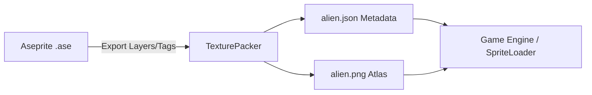

# assets — animations

# Assets — Animations

This module serves as the central repository for sprite-based animation data. It contains both raw source art (Aseprite projects) and optimized runtime metadata (TexturePacker JSON) used to drive character movement and effects within the game engine.

## Overview

The animation system uses two primary data formats:
1.  **Aseprite Project Files (`.ase`)**: These are the source-of-truth files for pixel art. They contain multi-layer compositions and tagged animation sequences.
2.  **Texture Atlas Metadata (`.json`)**: Exported from TexturePacker, these files map logical animation frames to coordinates on a compressed sprite sheet.

---

## 1. Runtime Metadata: The Alien Atlas (`alien.json`)

The alien character uses a **JSON Array** format optimized for sprite sheet loaders. It defines how a single texture (`alien.png`) is partitioned into individual frames.

### Key Data Structures
*   **`frames`**: An array of frame objects. Each frame corresponds to a specific point in a sequence (e.g., `03_Walk_005`).
    *   **`frame`**: The rectangle on the texture sheet `(x, y, w, h)`.
    *   **`spriteSourceSize`**: Maps the trimmed sprite back to its original uncropped dimensions. This is critical for maintaining pivot points and preventing "jitter" during playback.
    *   **`sourceSize`**: The canvas size used by the animator.
*   **`meta`**: Contains global properties like the `scale` factor (currently `0.3`) and the texture format (`RGBA8888`).

### Animation Sequences
The Alien asset defines three main states based on filename prefixes:
*   `01_Idle`: Stationary breathing/standing cycles.
*   `02_Turn_to_walk`: Transitionary frames used when changing direction.
*   `03_Walk`: Standard locomotion cycle.

---

## 2. Source Assets: Eadal Paladin (`02_Char_Eadal_Paladin.ase`)

The Paladin asset is managed directly in **Aseprite** format. This allows for complex layer management and detailed state-machine tagging.

### Layer Composition
The Paladin is built using a modular layer stack, allowing for dynamic equipment or color swapping if supported by the renderer:
*   **Base**: `med woman body`, `med woman leg`, `med woman face`.
*   **Equipment**: `armor`, `escudo superior` (Shield Upper), `escudo inferior` (Shield Lower), `lanca` (Spear).
*   **Vanity**: `med woman capa` (Cape), `med woman cinto` (Belt).
*   **Utility**: `shadow` (for ground projection), `linhas` (Line art).

### Tagged Sequences (State Machine Keys)
The `.ase` file defines specific frame ranges (Tags) that map to game logic states. Developers should refer to these tags when triggering animations via code:

| Tag Name | Usage |
| :--- | :--- |
| `idle defesa` | Combat-ready idle stance with shield raised. |
| `run front` / `run back` | Directional movement. |
| `Skill 1 - Trust-dash` | Multi-phase offensive ability (Wind-up -> Dash -> Impact). |
| `Hurt` | Universal damage reaction. |
| `War Cry` | Buff/Aura activation animation. |
| `Magnum Break` | Heavy AOE attack sequence. |

---

## Animation Pipeline

The following diagram illustrates how assets in this module transition from design to runtime:

## Contribution Guidelines

### Adding New Animations
1.  **Preserve Pivot Points**: When exporting `.ase` to JSON, ensure "Trim" is enabled but "Crop" does not shift the sprite's relative center.
2.  **Naming Convention**: Use the `Prefix_SequenceName_FrameNumber` format (e.g., `01_Idle_000`). This ensures proper alphabetical sorting in loaders.
3.  **Layer Integrity**: Keep background layers ("shadow") and foreground layers ("lines") consistent across all frames in a `.ase` file to prevent flickering.

### Modifying Existing Assets
*   **Metadata Updates**: If you modify `alien.json`, ensure the `version` and `smartupdate` hash in the `meta` block are updated via the TexturePacker CLI to prevent cache-miss issues in the build pipeline.
*   **Paladin Layers**: Do not rename layers in `02_Char_Eadal_Paladin.ase` unless the sprite-batching code is updated, as some shaders may rely on specific layer indices.