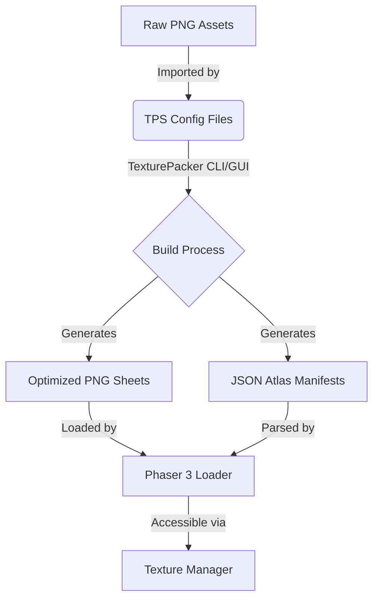

# assets — atlas

# Assets — Atlas Module

This module contains **TexturePacker** project files (`.tps`) used to bundle raw images into optimized texture atlases. These files define the build-time configuration for how sprites, UI elements, and fonts are packed, trimmed, and exported for use in the Phaser 3 runtime.

## Overview

Instead of loading hundreds of individual image files, this project uses texture atlases to reduce HTTP requests and improve GPU performance via batching. The `.tps` files in this directory are the source of truth for the generation of:
1.  **Sprite Sheets** (.png files containing multiple sub-images).
2.  **JSON Manifests** (describing the coordinates and dimensions of each sprite).

## Core Atlas Configurations

### 1. MegaSet (`MegaSetTexturePacker.tps`)
This is the primary asset collection. It is configured as a **Multi-Pack** atlas, meaning if the total size of the images exceeds 1024x1024, TexturePacker will automatically generate multiple image files (e.g., `megaset-0.png`, `megaset-1.png`).

*   **Data Format**: `json-array`.
*   **Algorithms**: Uses `MaxRects` for high-density packing.
*   **Source Paths**: Aggregates files from `../sprites/`, `../pics/`, `../fonts/bitmap/`, and `../fonts/retro/`.
*   **Key Settings**: 
    *   `trimMode`: `Trim` (removes transparent pixels to save space).
    *   `allowRotation`: `false` (disabled for compatibility with standard Phaser 3 loaders).

### 2. Nine-Slice UI (`NineSlice.tps`)
This atlas is specifically configured for UI components that require 3x3 grid scaling (Nine-Slice).

*   **Data Format**: `phaser`.
*   **Scale Settings**: Specifically defines `scale9Borders` for components like `button-bg.png` and `healthbar.png`.
*   **Borders Example**:
    *   `button-bg.png`: Borders are set at `[42, 32, 216, 42]`, defining the unscaled corners of the button sprite.
*   **Extrude**: Uses `extrude: 1` to prevent "pixel bleeding" at the edges of UI slices during scaling.

### 3. Bitmap Fonts (`Bitmap Fonts.tps`)
Manages the textures used for font rendering. Unlike standard sprites, these textures are often used in conjunction with `.xml` or `.fnt` descriptors.

*   **Included Fonts**: `atari-classic`, `atari-sunset`, `azo-fire`, `hyperdrive`, and `topaz-fill`.
*   **Data Format**: `json`.

## Asset Pipeline Flow

The following diagram illustrates how these files interact with the development environment and the final game build:



## Integration in Code

To use the output of these atlases in a Phaser 3 Scene, the generated files are typically loaded in the `preload` function:

```javascript
function preload() {
    // Loading a Multi-Atlas (Megaset)
    this.load.multiatlas('megaset', 'assets/atlas/megaset.json', 'assets/atlas/');

    // Loading the Nine-Slice Atlas
    this.load.atlas('ui', 'assets/atlas/nine-slice.png', 'assets/atlas/nine-slice.json');
}

function create() {
    // Accessing a sprite from the megaset
    this.add.image(100, 100, 'megaset', 'phaser-dude');

    // Creating a Nine-Slice object
    this.add.nineslice(200, 200, 'ui', 'button-bg', 300, 100, 42, 42, 32, 32);
}
```

## Maintenance Notes

- **Adding Sprites**: To add new assets, drag the raw images into the corresponding `.tps` file using the TexturePacker GUI and click "Publish Sprite Sheet".
- **Pathing**: The `.tps` files use absolute paths for the `fileName` key but relative paths for the `fileList`. Ensure the relative structure between this directory and the `../sprites` or `../pics` directories is maintained.
- **Trimming**: If a sprite appears "shrunken" or off-center in-game unexpectedly, check if `trimMode` is enabled in the TPS file; Phaser usually handles trimmed sprites automatically by applying an offset, but custom shaders or physics bodies might require the original dimensions.