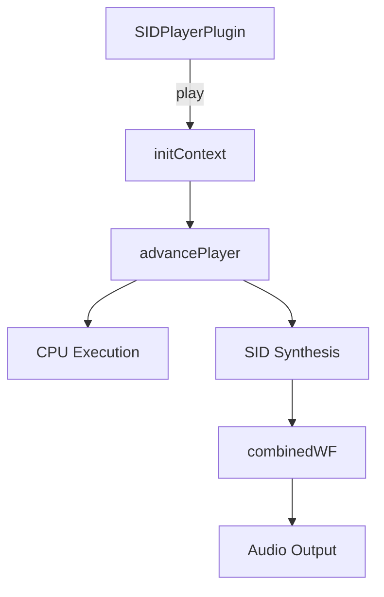

# assets — audio

# Audio Assets Module

This module manages the storage, definition, and playback mechanisms for audio assets within the application. It supports traditional sampled audio spritemaps (via JSON definitions), Modular music (Protracker `.mod`), and emulated Commodore 64 audio (SID).

## Audio Asset Structures

### 1. Spritemaps (JSON)
The module uses JSON files to define spritemaps, allowing multiple sound effects or music sections to be stored in a single audio file. This is highly efficient for web loading.

**Example Structure (`kyobi.json`):**
*   **`resources`**: An array of file paths (usually multiple formats like `.ogg`, `.mp3`, `.m4a` for cross-browser compatibility).
*   **`spritemap`**: A map of named keys defining audio segments.
    *   `start`: The starting point in seconds.
    *   `end`: The ending point in seconds.
    *   `loop`: Boolean indicating if the sprite should loop.
*   **`autoplay`**: (Optional) A key from the spritemap to play immediately on load.

### 2. Tracker Music (.mod)
The directory contains Protracker module files (e.g., `act_of_impulse.mod`, `chinese_dream.mod`). These are pattern-based audio files that store both the notation data and the digital samples used to play it.

### 3. SID Emulation
The module includes a specialized player for Commodore 64 SID files.

## Technical Architechture: SID Player Plugin

The audio module integrates a SID emulation engine, primarily handled by `SIDPlayerPlugin.js` and `jsSID.js`. This engine emulates both the MOS 6510 CPU and the MOS 6581/8580 SID chip.

### Core Execution Flow
The following diagram illustrates how the SID playback engine processes audio:

### Key Components

*   **`SIDPlayerPlugin.js`**: Orchestrates the high-level life cycle. It uses `initContext` to set up the Web Audio API and `advancePlayer` to tick the emulation state forward.
*   **`jsSID.js`**: The core emulation library.
    *   **`initCPU` / `CPU`**: Emulates the 6510 microprocessor to process the music player requirements of the SID file.
    *   **`initSID` / `SID`**: Emulates the sound interface device.
    *   **`combinedWF`**: A specific function inside the SID emulation responsible for generating combined waveforms (e.g., Pulse + Sawtooth), standard in advanced SID compositions.

### Functions and Lifecycle

| Function | Location | Description |
| :--- | :--- | :--- |
| `parseBinaryData` | `SIDPlayerPlugin.js` | Extracts metadata and machine code from raw SID files. |
| `createCombinedWF` | `jsSID.js` | Pre-calculates tables for mixed oscillator output to improve performance. |
| `pause` | `SIDPlayerPlugin.js` | Halts the `advancePlayer` cycle and suspends the audio context. |
| `advancePlayer` | `SIDPlayerPlugin.js` | The main heart-beat of the engine that synchronizes the CPU clock with the Audio Context sample rate. |

## Integration Notes

*   **HTML5 vs. Web Audio**: The codebase supports multiple transport layers. The `SIDPlayerPlugin` specifically requires a Web Audio context to handle the real-time synthesis of the MOS 6581 emulation.
*   **External Control**: Playback can be influenced by external systems such as GSAP (for volume tweening or pausing) or game state managers (calling `pause` during `gameOver` states).
*   **Cross-Browser Support**: Spritemaps should always include both `.mp3` and `.ogg` versions in the `resources` array to ensure coverage across iOS and Desktop browsers.