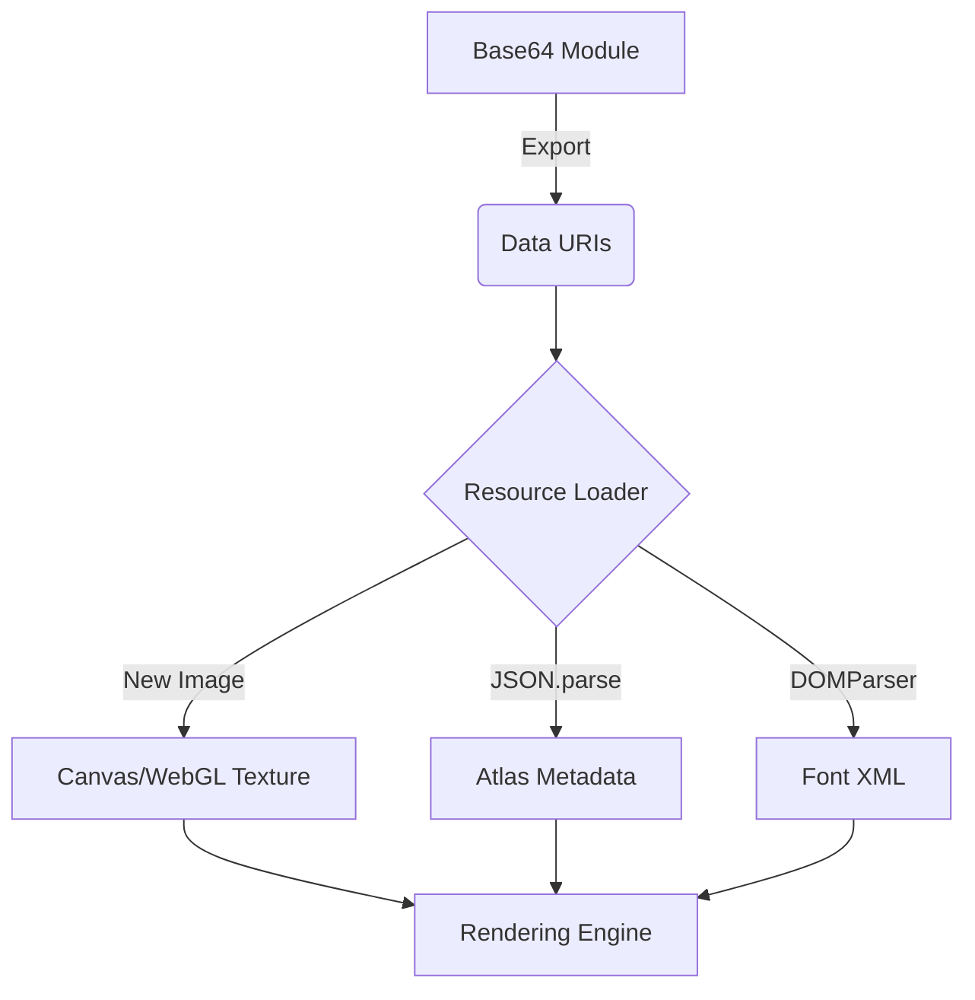

# assets — base64

# Assets — Base64

The **Base64 Assets** module serves as a static library of binary data encoded as JavaScript strings. By embedding images, fonts, and metadata directly into the codebase as [Data URIs](https://developer.mozilla.org/en-US/docs/Web/HTTP/Basics_of_Data_URIs), the application eliminates additional HTTP requests and ensures that critical UI components are available immediately upon script execution.

## Core Purpose
In high-performance or real-time environments (such as canvas-based games or specialized UI tools), loading external assets via network calls can lead to "flashes of unstyled content" or delayed execution. This module solves that by:
- Bundling small-to-medium binary files into the JS bundle.
- Providing standardized exports for images, specialized fonts, and sprite atlases.

---

## Module Breakdown

### 1. Simple Images (`block-image.js`)
This file contains standalone graphical primitives.
- **`blockPNG`**: A Base64-encoded PNG string. It is typically used for default textures, placeholders, or UI blocks.

### 2. Bitmap Typography (`carrier-command-font.js`)
This sub-module provides the necessary data to render a custom bitmap font, specifically the "Carrier Command" typeface.
- **`carrierCommandFont`**: The texture sheet containing all alphanumeric characters.
- **`carrierCommandXML`**: A Base64-encoded XML string. This XML follows the standard **BMFont** format, defining the `x`, `y`, `width`, and `height` of every character on the texture sheet.

### 3. Sprite Atlas (`spooky-atlas.js`)
The "Spooky" atlas is a bundled sprite sheet used for themed animations or objects.
- **`spookyPNG`**: The master texture containing multiple sub-images.
- **`spookyJSON`**: A Base64-encoded JSON string containing the atlas metadata. It defines frames for specific sprites:
    - `tombstone`
    - `crystalball`
    - `zombie`
    - `spider`
    - `bat`
    - Various `ice` states and a `balloon`.

---

## Architecture and Data Flow

The following diagram illustrates how these encoded strings are typically processed by a rendering engine:



---

## Technical Implementation Details

### Data Format
All assets are exported as `const` strings using the `data:[<mediatype>][;base64],<data>` scheme. 

| Asset Property | Media Type | Encoding |
| :--- | :--- | :--- |
| `blockPNG` | `image/png` | Base64 |
| `carrierCommandXML` | `text/xml` | Base64 |
| `spookyJSON` | `application/json` | Base64 |

### Decoding Metadata
To use the JSON and XML metadata strings, they must first be passed through the browser's decoding utilities:

```javascript
import { spookyJSON } from './assets/base64/spooky-atlas.js';

// Convert Base64 Data URI to a readable string, then parse
const jsonBase64 = spookyJSON.split(',')[1];
const decodedData = JSON.parse(atob(jsonBase64));

console.log(decodedData.textures[0].frames); // Access sprite coordinates
```

---

## Maintenance for Developers

### Adding New Assets
If you need to add or update an asset in this module:
1. Generate the Base64 version of your file (e.g., using `openssl base64` or an online converter).
2. Wrap the resulting string in the appropriate Data URI prefix (e.g., `data:image/png;base64,`).
3. Export the string as a named `const`.

### Updating Atlases
The `spooky-atlas.js` JSON and PNG are tightly coupled. If you change the `spookyPNG` layout, you **must** update the `spookyJSON` metadata to reflect the new `frame` coordinates, otherwise, the rendering engine will crop sprites incorrectly.