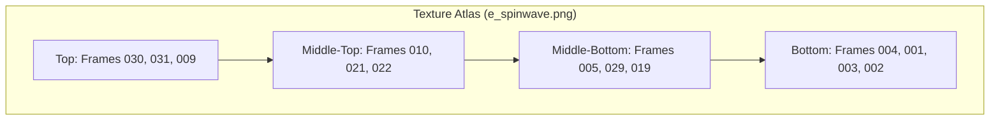

# assets — bugs

# Spinwave Bug Asset Documentation

The `assets/bugs/e_spinwave.json` file is a texture atlas manifest for the "Spinwave" entity or effect. It defines how a single large sprite sheet (`e_spinwave.png`) is partitioned into individual frames for use in animation.

## Purpose
This module provides the metadata necessary for a game engine or rendering pipeline to:
1.  **Locate frames** within the master texture atlas.
2.  **Reconstruct original sizes** from trimmed sprites to ensure animation alignment.
3.  **Sequencing** individual image files into a cohesive "Spinwave" animation.

## Asset Specifications
*   **Format**: TexturePacker JSON Hash (v3.0)
*   **Image Source**: `e_spinwave.png`
*   **Color Space**: RGBA8888
*   **Master Dimensions**: 929 x 2974 px
*   **Global Scale**: 0.25 (Indicates the assets were authored at a higher resolution and downsampled for the engine).

## Animation Data Structure
The animation consists of 32 frames, indexed from `e_spinwave_000.png` to `e_spinwave_031.png`.

### Frame Properties
Each frame entry in the `frames` array contains the following key attributes:

| Attribute | Description |
| :--- | :--- |
| `filename` | The logical name of the frame (used for lookups). |
| `frame` | The `{x, y, w, h}` coordinates of the sprite within the atlas. |
| `rotated` | Boolean; indicating if the sprite was rotated to save space (currently all `false`). |
| `trimmed` | Boolean; indicates if transparent whitespace was removed from the edges. |
| `spriteSourceSize` | The offset `{x, y}` and dimensions `{w, h}` of the sprite relative to the original un-trimmed size. |
| `sourceSize` | The original canonical size of the frame (325 x 325 px for this module). |

### Animation Sequence Reference
While the JSON lists frames non-sequentially, they follow a logical progression:
*   **Initial State (`000`)**: A small 3x3 placeholder frame.
*   **Growth Phase (`001`–`005`)**: The effect scales up rapidly from 59px to 285px.
*   **Loop/Stable Phase (`006`–`031`)**: Frames oscillating between ~297px and ~311px, representing the active "spin" or "wave" effect.

## Technical Integration

### Loading the Asset
When creating a sprite in the engine, the developer should reference the `filename` string rather than the index, as the indices in the array do not strictly match the animation sequence.

```javascript
// Example conceptual usage
const spinwaveAtlas = await Assets.load('e_spinwave.json');
const frame015 = spinwaveAtlas.frames['e_spinwave_015.png'];

// Use spriteSourceSize to prevent "jittering" during animation
sprite.anchor.set(
    frame015.spriteSourceSize.x / frame015.sourceSize.w,
    frame015.spriteSourceSize.y / frame015.sourceSize.h
);
```

### Atlas Mapping Diagram
This small-scale representation shows how the 929x2974 atlas is roughly organized to optimize vertical space:



## Maintenance Notes
*   **Trimming**: If the source images are updated, ensure the "Trim" feature is enabled in the atlas generator to maintain the 325x325 `sourceSize` alignment.
*   **Scaling**: Assets are set to 0.25 scale. If high-DPI support is required, new atlases should be generated at 0.5 or 1.0 scale and the manifest updated accordingly.