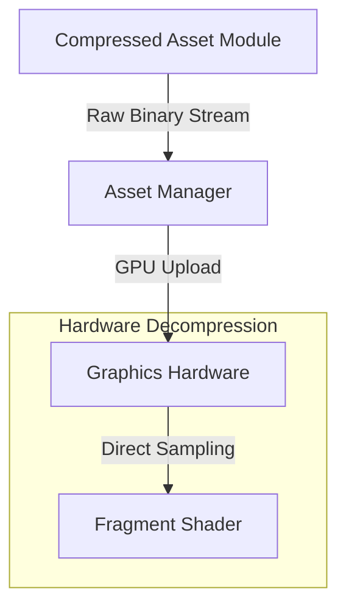

# assets — compressed

# Assets — Compressed

The **assets — compressed** module serves as the storage layer for hardware-optimized texture data. Unlike raw image formats (PNG/JPG), this module provides textures in formats that can be directly consumed by the GPU without CPU-side decompression, significantly reducing memory bandwidth and load times.

## Module Overview

This module currently contains performance-critical texture assets encoded using modern compression standards. The primary asset is:

*   **`labs-astc-4x4.pvr`**: A high-fidelity texture container using Adaptive Scalable Texture Compression (ASTC).

## Technical Specifications: labs-astc-4x4.pvr

The asset utilizes the **PVR (PowerVR)** container and the **ASTC** compression algorithm. ASTC is the industry standard for cross-platform GPU compression due to its high quality-to-size ratio.

| Feature | Specification | Description |
| :--- | :--- | :--- |
| **Container Format** | PVR Version 3 | Supports comprehensive metadata including color space and mipmap counts. |
| **Compression Codec** | ASTC | Adaptive Scalable Texture Compression. |
| **Block Size** | 4x4 | Represents a bit rate of **8 bits per pixel (bpp)**. |
| **Color Space** | Linear/sRGB | Defined within the PVR header metadata. |

### Block Size Significance
The `4x4` block size is the highest quality setting for ASTC. While it offers the lowest compression ratio compared to larger blocks (like 12x12), it is used in this module specifically for textures requiring high per-pixel accuracy, such as normal maps, detailed UI elements, or laboratory environment textures.

## Asset Architecture

The following diagram illustrates how the `compressed` asset module fits into the rendering pipeline:



## Developer Integration

### Loading the Assets
This module is intended to be accessed via the project's internal Asset Loader. Because these files contain hardware-specific headers (PVR), they should not be parsed as standard bitmaps.

```typescript
// Example conceptual usage
import { TextureLoader } from 'engine/loaders';

const labTexture = await TextureLoader.loadCompressed('assets/compressed/labs-astc-4x4.pvr');
// The result is a GPU-ready texture pointer
```

### Memory Impact
Using the `4x4` compressed assets provides a fixed memory footprint. A 1024x1024 texture in this module will occupy exactly 1MB of VRAM (plus mipmaps), compared to 4MB for an uncompressed RGBA8888 texture.

## Maintenance Notes
*   **Updating Assets**: To regenerate these files, use the `PVRTexTool` or `astcenc` command-line utilities.
*   **Target Hardware**: ASTC 4x4 is supported on OpenGL ES 3.2+, Vulkan, and Metal (iOS/macOS). For legacy hardware support, a fallback to ETC2 or BC7 may be required in a separate asset module.
*   **Call Graph Information**: As a data-only module, it contains no internal execution flows or function callbacks. It is a passive provider of binary data.