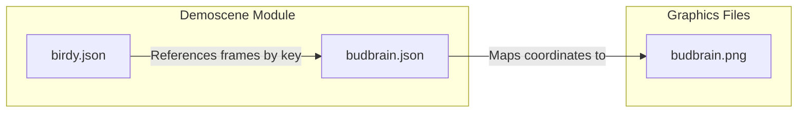

# assets — demoscene

# Assets — Demoscene Module

The `assets/demoscene` module contains configuration data and sprite metadata for the "Birdy" character, used in demoscene-style animations. It defines how a single texture atlas is sliced into frames and how those frames are sequenced into complex animations.

## Module Overview

This module consists of two primary JSON files that work in tandem:
1.  **`budbrain.json`**: A texture atlas definition (TexturePacker format) mapping logical frame names (e.g., `front`, `hatch1`) to coordinates on the `budbrain.png` image.
2.  **`birdy.json`**: A Phaser-compatible animation configuration that defines timing, sequencing, and looping behavior for the bird's actions.



---

## Texture Atlas: `budbrain.json`

This file defines the sub-textures for the bird character. It uses the `RGBA8888` format and includes metadata for trimming (removing whitespace) and pivoting.

### Key Frames
*   **Neutral States:** `front`, `left`, `right`.
*   **Hatching Sequence:** `hatch1` through `hatch4`, plus `egg-small`.
*   **Action States:** `sing1` through `sing3` (mouth open/shut variations).
*   **Laying Sequence:** `lay0` through `lay19` (a detailed 20-frame sequence for the bird squatting/laying).

### Data Structure Pattern
Each frame entry follows this pattern:
```json
{
    "filename": "hatch1",
    "frame": {"x":127, "y":733, "w":122, "h":173},
    "spriteSourceSize": {"x":0, "y":71, "w":122, "h":173},
    "sourceSize": {"w":122, "h":244}
}
```
The `spriteSourceSize` and `sourceSize` are used by the renderer to reconstruct the frame's position relative to its original, untrimmed dimensions (222x244).

---

## Animation Definitions: `birdy.json`

This file defines four specific animation sequences. All animations reference the `birdy` texture key.

### 1. `hatch`
A simple 5-frame transition from an egg to a standing bird.
*   **Frames:** `hatch1` → `hatch2` → `hatch3` → `hatch4` → `front`.
*   **Rate:** 12 FPS.

### 2. `lookLeft` / `lookRight`
These are "boredom" or ambient animations. They use variable frame durations to simulate realistic head movement.
*   **Pattern:** Holds the `front` frame for 1000ms, glances for 6500ms, then performs a series of quick "double-takes" (500ms-900ms toggles between `front` and the direction).

### 3. `checkDisOut`
A long, synchronized performance animation, likely timed to a music track.
*   **Frame Rate:** 6.5 FPS.
*   **Behavior:** A complex sequence of `sing1`, `sing2`, and `sing3` frames interspersed with `front`. 
*   **Distinctive Feature:** Includes a 5000ms pause on a `front` frame in the middle of the sequence, suggesting a transition or drop in an accompanying audio track.

---

## Integration Guide

### Loading in Phaser
To use these assets in a codebase, they are typically loaded in the `preload` phase of a scene:

```javascript
// Load the atlas (image + coordinates)
this.load.atlas('birdy', 'assets/demoscene/budbrain.png', 'assets/demoscene/budbrain.json');

// Load the animation data
this.load.animation('birdyAnims', 'assets/demoscene/birdy.json');
```

### Usage
Once loaded, the animations can be played on any sprite using the `birdy` texture:

```javascript
const player = this.add.sprite(400, 300, 'birdy');
player.play('checkDisOut');
```

### Contributing
When adding new animations to `birdy.json`:
1.  Ensure the `frame` string matches a `filename` entry in `budbrain.json`.
2.  Maintain the `defaultTextureKey: "birdy"` unless a new atlas is provided.
3.  Use the `duration` field within a frame object if that specific frame needs to stay on screen longer than the global `frameRate`.