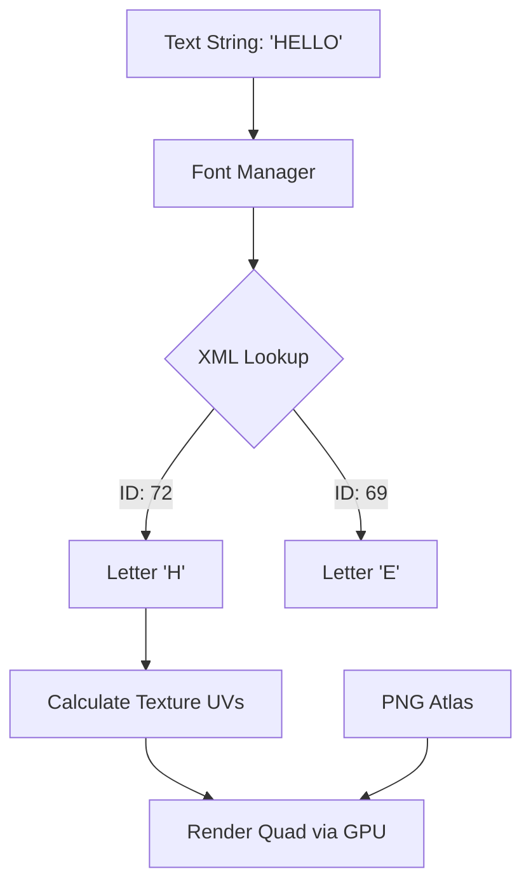

# assets — fonts

# Assets — Bitmap Fonts

The `assets/fonts/bitmap` module contains the metadata required to render stylized text using **Bitmap Fonts**. Unlike vector fonts (TTF/OTF), these fonts are pre-rendered into spritesheets (PNGs) and mapped via XML files to allow for high-performance rendering with custom effects (glows, gradients, and textures) that are difficult to achieve at runtime.

The module follows the **BMFont format**, a standard specification for bitmap font data.

## Module Structure

Each font consists of two components:
1.  **XML Descriptor:** Located in this directory (e.g., `chiller.xml`). Defines character coordinates and layout rules.
2.  **Texture Atlas:** A companion PNG file (e.g., `chiller_0.png`) referenced within the XML, containing the actual character glyphs.

## XML Schema Breakdown

The XML files are structured into four primary sections:

### 1. Font Info (`<info>`)
Defines the metadata used during the font generation process.
*   `face`: The name of the original typeface.
*   `size`: The font size in pixels.
*   `bold`/`italic`: Styling flags.
*   `padding`: Internal spacing within the glyph's box to account for effects like dropshadows.

### 2. Common Dimensions (`<common>`)
Provides global layout metrics.
*   `lineHeight`: The distance in pixels between each line of text.
*   `base`: The distance from the top of the line to the baseline.
*   `scaleW`/`scaleH`: The dimensions of the source texture atlas.

### 3. Character Mapping (`<chars>`)
Individual `<char>` entries map Unicode IDs to specific regions of the texture.
*   `id`: The character's integer ID (usually ASCII/Unicode).
*   `x`, `y`: Top-left coordinates in the texture atlas.
*   `width`, `height`: Dimensions of the glyph in the texture.
*   `xoffset`, `yoffset`: How much the cursor should move when drawing the glyph.
*   `xadvance`: How much the current position should advance after drawing the character.

### 4. Kerning (`<kernings>`)
Found in advanced fonts like `azo-fire.xml`. This section defines specific spacing adjustments between character pairs (e.g., "VA" or "Te") to improve legibility.

## Available Font Library

| File | Face Name | Size (px) | Notes |
| :--- | :--- | :--- | :--- |
| `arcade.xml` | Cosmic Avenger | 32 | Classic arcade aesthetic. |
| `atari-classic.xml` | AtariClassicChunky | 64 | Low-res retro style. |
| `atari-smooth.xml` | AtariClassicExtrasmooth | 64 | Anti-aliased retro style. |
| `azo-fire.xml` | AzoSansUber-Regular | 80 | Heavy sans-serif; includes extensive kerning. |
| `carrier_command.xml`| Carrier Command | 32 | Monospaced, tech-focused look. |
| `chiller.xml` | Chiller | 128 | High-detail, horror-themed font. |
| `clarendon.xml` | Superclarendon-Bold | 96 | Classic slab-serif. |

## Data Flow: From XML to Screen

The rendering engine parses these XML files to build a lookup table of "Glyph Regions." 

## Developer Guidelines

### Adding a New Font
1.  **Generate Assets:** Use a tool like **BMFont**, **Glyph Designer**, or **ShoeBox** to export a `.fnt` (rename to `.xml`) and a `.png`.
2.  **Reference PNG:** Ensure the `<page id="0" file="fontname_0.png" />` tag in the XML correctly points to the filename.
3.  **Placement:** Drop both the XML and the PNG into `assets/fonts/bitmap/`.
4.  **Scaling:** Since these are bitmaps, scaling them up significantly will cause pixelation. If you need a larger version of an existing font, it is better to generate a new set at a higher base `size`.

### Performance Considerations
*   **Batching:** All characters in a string using the same font can be drawn in a single draw call because they share one texture atlas.
*   **Kerning:** Fonts with large `<kernings>` sections (like `azo-fire.xml`) require more CPU cycles to calculate the layout than simple arcade fonts. Use them sparingly for long blocks of text.