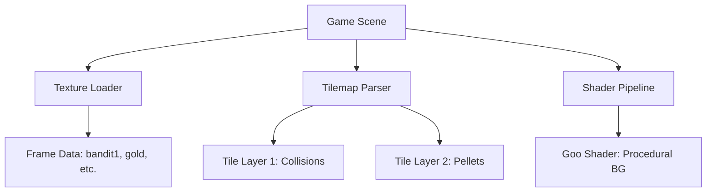

# assets — games

# Game Assets Module

The `assets/games/` module serves as a centralized repository for visual and structural assets used across various game templates and examples. This includes texture atlases, Tiled map data, GLSL shaders, and bitmap fonts.

## Directory Structure

The module is organized by game title, with each subdirectory containing the specific specialized assets required for that game's logic and rendering.

```text
assets/games/
├── bank-panic/           # Western-themed sprites and animations
├── breakout/             # Puzzles and brick-breaker elements
├── card-memory-game/     # Icon sets (fruits/food) for matching
├── coin-clicker/         # Animated coin rotations and particles
├── emoji-match/          # UI and board elements
├── flood/                # Color-matching blobs and monster icons
├── germs/                # Organic shaders, germ sprites, and fonts
├── lazer/                # Shmup/Space backgrounds and ships
└── pacman/               # Tiled maze maps and collision data
```

---

## Technical Component Breakdown

### 1. Texture Atlases (`.json`, `.tps`)
Most games utilize TexturePacker exported JSON files (usually in `RGBA8888` format). These files map logical frame names to specific coordinates on a master sprite sheet.

*   **Bank Panic**: Defines the `bandit` and `cowboy` states (Normal, Dead, Shot, Smoke). 
*   **Coin Clicker**: Contains a specific animation sequence (`coin_01` through `coin_07`) and a vanish sequence (`vanish_1` to `vanish_4`).
*   **Implementation Note:** In Phaser 3, these are typically loaded via:
    ```javascript
    this.load.atlas('bank-panic', 'assets/games/bank-panic/bank-panic.png', 'assets/games/bank-panic/bank-panic.json');
    ```

### 2. Tiled Maps (`.json`, `.tmx`)
The **Pacman** module uses Tiled Map Editor data to define the game board structure.

*   **`map.json` Structure:**
    *   **Tile Layer 1:** Defensive/Collision layer. Used for wall logic. 
    *   **Tile Layer 2:** Interactive layer. Contains `gid: 5` (pellets) and `gid: 6` (power pellets).
    *   **Image Layer:** Provides a visual high-fidelity `maze.png` background overlaying the collision tiles.

### 3. GLSL Shaders (`.js` wrappers)
The **Germs** module includes an organic background effect using a Fragment Shader.

*   **`goo.glsl.js`**: A procedural "goo" animation.
*   **Key Uniforms:** Requires `time` (float) and `resolution` (vec2).
*   **Parameters:** Developers can tweak `distortion`, `zoom`, `gooeyness`, and `wibble` variables within the `mainImage` function to change the viscosity and movement of the background.



### 4. Bitmap Fonts (`.xml`)
The **Germs** module provides `slime-font.xml`, a custom-styled font for UI elements.
*   **Usage:** Pairs with a texture sheet to render text without requiring standard system fonts.
*   **Configuration:** Defines `lineHeight` (80) and character mappings for alphanumeric and punctuation (`chars count="69"`).

---

## Integration Guide

### Loading Assets
When contributing a new game, ensure assets follow the established loading patterns:

| Asset Type | Primary Location | Loading Method (Phaser 3) |
| :--- | :--- | :--- |
| **Texture Atlas** | `[game]/[name].json` | `this.load.atlas(key, textureURL, atlasURL)` |
| **Tiled Map** | `pacman/map.json` | `this.load.tilemapTiledJSON(key, url)` |
| **Bitmap Font** | `germs/slime-font.xml` | `this.load.bitmapFont(key, textureURL, xmlURL)` |
| **Shaders** | `germs/goo.glsl.js` | Custom injection or `this.load.glsl()` |

### Asset Licensing
*   **Breakout Assets:** Sourced from Kenney (Puzzle Pack).
*   **Lazer Assets:** Created by Luis Zuno (@ansimuz).
*   **Pacman:** Derived from layout constants typical of the original arcade ROM.

## Contributing Requirements
1.  **Absolute Paths:** Always use relative paths from the root assets directory within code, but ensure the `.tps` (TexturePacker) files are updated if new frames are added.
2.  **Naming Convention:** Use descriptive frame names (e.g., `bandit1Dead`) rather than index-based names (`frame1`) to ensure code readability during animation creation.
3.  **Trim Management:** Most JSON atlases have `trimmed: true`. If adding hand-drawn sprites that require specific alignment, ensure the `spriteSourceSize` encompasses the original dimensions.