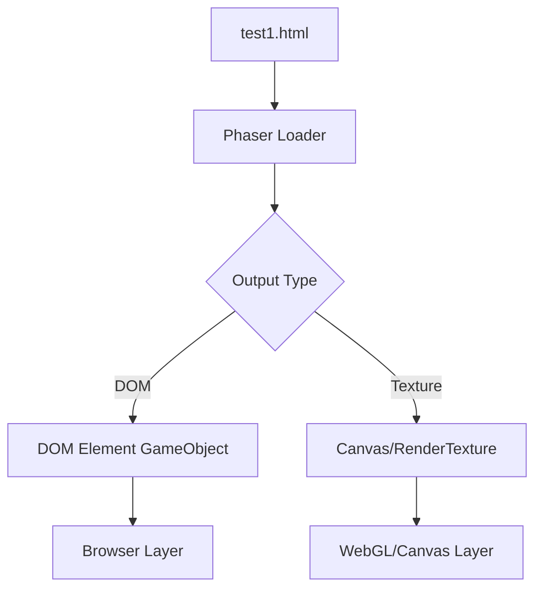

# assets — html

# HTML Test Asset Documentation

## Overview
The file `/assets/html/test1.html` serves as a static asset primarily used for testing and demonstrating the **HTML Loader** capabilities within a Phaser-based environment. It provides a visual template comprising CSS-styled containers, high-contrast typography, and code blocks to verify rendering fidelity when HTML content is embedded into a game engine's execution context.

## Content Structure
The document is divided into two primary visual blocks designed to test overflow, layout rendering, and CSS gradient support.

### 1. Header and Code Block
The top section utilizes a linear gradient (`red`, `orange`, `yellow`) and contains:
*   **Header:** A centered "Phaser *III*" title using inline styles for font size and weight.
*   **Code Snippet:** A `<pre>` block demonstrating the standard API pattern for loading HTML files in Phaser:
    ```javascript
    function preload ()
    {
        this.load.html('page', 'page.html', 512, 512);
    }
    ```
    This snippet acts as both documentation-within-the-asset and a string-rendering test for monospace fonts.

### 2. Footer Section
The bottom section mirrors the top with an inverted linear gradient (`yellow`, `orange`, `red`), containing the text "HTML Loader". This is used to verify that the loader correctly captures the full height of the document beyond the initial viewport or container.

## Technical Specifications

| Feature | implementation |
| :--- | :--- |
| **Styling** | Inline CSS (gradients, margins, padding, font-size) |
| **Path** | `/assets/html/test1.html` |
| **Primary Tag Use** | `<div>`, `<p>`, `<strong>`, `<em>`, `<pre>` |
| **Dimensions** | Flexible (designed for a ~512px width based on the internal code snippet) |

## Usage in Development

### Loading the Asset
When utilizing this asset within a Phaser loader flow, the file is typically ingested via the `LoaderPlugin.html` method. This converts the HTML/CSS content into a DOM element or a texture that can be manipulated in the scene.

```javascript
// Example usage in codebase
this.load.html('testContent', '/assets/html/test1.html');
```

### Rendering Flow
The following diagram illustrates how this asset is typically processed by the host application:



## Integration Notes
- **Inline Styles:** This module relies heavily on inline styles rather than external CSS files. This ensures that the asset remains self-contained and avoids issues with cross-origin CSS loading or relative path failures during testing.
- **Rendering Verification:** Developers should use this file to test if the rendering engine correctly handles `linear-gradient` and ensures that the `<pre>` tag preserves whitespace and indentation as expected.