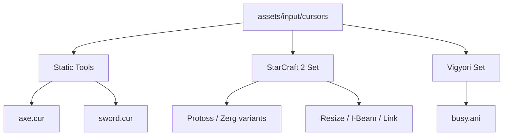

# assets — input

# Assets — Input (Cursors)

The `assets/input` module contains the graphical definitions for mouse pointers and interaction cursors used throughout the application. These assets provide visual feedback for state changes, such as race-specific themes (StarCraft 2), tool-specific pointers (Minecraft-inspired), and standard OS-level interactions (resize, I-beam, busy).

## Module Overview

The assets are primarily Windows Cursor files (`.cur`) and Animated Cursor files (`.ani`). Each cursor defines a **hotspot**—the specific pixel coordinate within the image that represents the actual point of interaction.

### Core File Types
*   **`.cur`**: Static cursor images.
*   **`.ani`**: Animated cursor sequences (e.g., the "busy" spinners).
*   **`.txt`**: Licensing and attribution metadata.

---

## Cursor Sets & Themes

The module is organized into sub-directories representing specific visual themes or functional sets.

### 1. General Tools
These cursors represent specific actions or "equipped" items, primarily following a Minecraft-inspired aesthetic.
*   `axe.cur`: Woodcutting or destructive actions.
*   `pen.cur`: Drawing or editing states.
*   `spade.cur`: Digging or landscaping.
*   `sword.cur`: Combat or aggressive interaction zones.

### 2. StarCraft 2 Set (`/sc2`)
A comprehensive set of cursors themed after StarCraft 2, including race-specific variations for Protoss and Zerg. This set covers standard UI interactions:

| File Pattern | Interaction Meaning |
| :--- | :--- |
| `SC2-cursor-[race].cur` | Default selection pointer for specific factions. |
| `SC2-cursor-busy-[race].cur` | Loading/Processing state. |
| `SC2-hyperlink.cur` | Clickable link (hand icon). |
| `SC2-ibeam.cur` | Text insertion/Input field focus. |
| `SC2-resize-*.cur` | Windows/Element resizing (Horizontal, Vertical, Diagonal). |
| `SC2-target-none.cur` | Targeting reticle when no valid target is selected. |

### 3. Vigyori Set (`/vigyori`)
A secondary theme containing simplified pointers and animated states.
*   `arrow.cur`: Standard pointer.
*   `busy.ani`: An animated "working" cursor.

---

## File Structure



---

## Implementation Notes for Developers

### Loading Cursors
When implementing these in code (e.g., via CSS or a Window manager), ensure you reference the correct relative path from the asset root.

**Example (CSS):**
```css
.woodcutting-zone {
    cursor: url('/assets/input/cursors/axe.cur'), auto;
}

.text-input-active {
    cursor: url('/assets/input/cursors/sc2/SC2-ibeam.cur'), text;
}
```

### Hotspots
The hotspots for these cursors are encoded within the binary `.cur` files. 
*   Standard pointers usually have a hotspot at `(0, 0)` (top-left).
*   Target reticles (like `SC2-target-none.cur`) typically have centered hotspots.
*   Tool cursors (like `sword.cur`) often have hotspots at the tip of the blade.

### Attribution & Licensing
The `assets/input/cursors/readme.txt` file identifies the **Minecraft Tools Cursor Set** created by NesManiac, which is released to the **Public Domain**. Ensure any new additions to this folder include a corresponding license update if they are not original works.