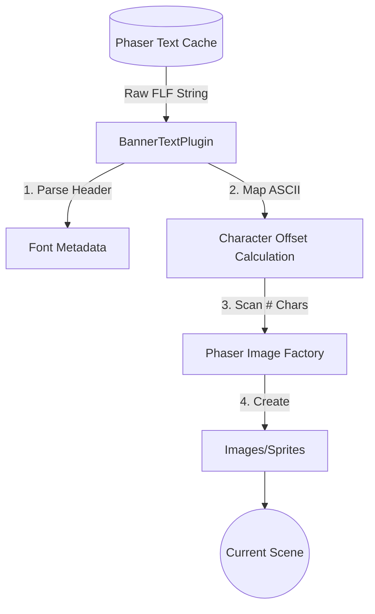

# assets — loader-tests

# Loader-Tests Asset Module

The `assets/loader-tests` module is a collection of specialized plugins, external scene files, and asset configurations designed to validate the Phaser 3 loader and plugin systems. It demonstrates how to handle non-standard assets like FIGlet fonts, complex CSS typography, and procedurally generated textures within the Phaser lifecycle.

## Core Plugins

The module includes three primary plugins that extend Phaser’s functionality.

### 1. BannerTextPlugin
A `ScenePlugin` that renders text using FIGlet (`.flf`) font data. It maps ASCII character codes to grid-based layouts within the font file and represents each "pixel" as a Phaser Image object.

*   **Key Methods:**
    *   `config(key)`: Parses the FLF header from the text cache. It extracts the font height and width to calculate character offsets.
    *   `createText(text, x, y, texture, frame)`: The main entry point. It iterates through the string, calculates the font offset for each char, and triggers sprite placement.
    *   `getCharacter(dx, dy, offset)`: Scans the raw text lines of the font file. If it finds a `#` character, it adds a Phaser Image at the corresponding spatial coordinates.

### 2. FractalScenePlugin
A `ScenePlugin` used to test real-time canvas texture manipulation. It renders a Julia Set fractal directly to a Phaser Canvas Texture.

*   **Execution Flow:**
    *   **Initialization:** Upon `create()`, it generates a `CanvasTexture` and sets up `ImageData` buffers.
    *   **Update Loop:** It hooks into the Scene's `postupdate` or `update` event via the EventEmitter to redraw the fractal every frame.
    *   **Rendering:** The `drawJulia()` method performs the core escape-time algorithm, writing RGBA values directly to the pixel array before calling `texture.refresh()`.

### 3. RandomNamePlugin
A `BasePlugin` (global scope) that provides utility functions for generating procedural strings. Unlike the Scene-level plugins, this is designed to be accessible across multiple scenes to test global plugin persistence.

---

## External Assets & Configuration

The module contains several non-code assets used to test specific loader types:

### FIGlet Fonts (`3x5.flf`)
A standard FIGlet font file used by `BannerTextPlugin`. The loader must treat this as raw text. The plugin expects the `flf2a` signature and specific metadata (height, length, comment lines) in the first line of the file.

### 80s Typography CSS (`80stypography.css`)
A complex CSS stylesheet utilizing `@import` for Google Fonts, `-webkit-background-clip: text`, and various `@keyframes` animations. This is used to test the Phaser `CSSLoader` and its ability to handle external font dependencies and hardware-accelerated text effects.

### Texture Packer Configurations (`.tps`)
The module includes several XML-based Texture Packer project files. These are critical for testing:
*   **Normal Maps:** Files like `Texture Packer Atlas with Normal Map.tps` demonstrate the configuration for packing diffuse and normal maps into synchronized atlases for 2D lighting.
*   **Multi-Atlases:** These files specify how large asset sets should be split across multiple image files while maintaining a single JSON data structure.

---

## Architectural Overview

The following diagram illustrates how the `BannerTextPlugin` interacts with the Phaser systems to turn raw text assets into game objects.



## Integration for Developers

### Loading a Plugin
To use these plugins in a test suite, they should be added during the Game or Scene configuration:

```javascript
// Example: Adding the BannerTextPlugin
const config = {
    plugins: {
        scene: [
            { key: 'BannerTextPlugin', plugin: BannerTextPlugin, mapping: 'bannerText' }
        ]
    }
};
```

### Using the External Scene
The `ExternalScene.js` file is a complete scene definition. To test the `SceneLoader`, point the loader to this file. Once loaded, Phaser will instantiate `ExternalScene`, which includes its own `preload` (loading a face and arrow) and an `update` loop (rotating the arrow).

### Testing Texture Atlases
When testing the loader with the provided `.tps` configurations, ensure the Loader is configured to handle the JSON hash/array format exported by Texture Packer. Use `this.load.multiatlas` when testing the "Multi Atlas" files to ensure correct frame spanning across multiple textures.