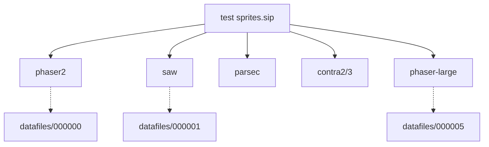

# assets — normal-maps

# Assets — Normal Maps

This module manages the dynamic lighting data for 2D sprites. It utilizes **SpriteIlluminator** (`.sip`) project files to define and export normal maps, allowing the game engine to compute real-time shadows and highlights on otherwise flat 2D textures.

## Overview

The core of this module is the `test sprites.sip` file, which tracks the source sprites and their corresponding hand-painted or generated normal map data. The data is stored in a compressed index format within the `datafiles/` directory.

### Key Components

*   **`test sprites.sip`**: The primary project file (XML/SIXML format). It maps sprite bodies to their normal map data blobs and defines global lighting parameters used during the authoring process.
*   **`datafiles/`**: A subdirectory containing the binary normal map data. Each file (e.g., `000001`, `000005`) corresponds to a specific raw normal map texture referenced by a sprite body in the project file.
*   **Standard Postfix**: The module is configured to use the `_n` postfix (e.g., `phaser2_n.png`) for published assets, adhering to the engine's lighting shader expectations.

## Project Configuration

The following global settings are defined in the project manifest and should be maintained for consistency across all lighting assets:

| Property | Value | Description |
| :--- | :--- | :--- |
| **Invert Y Axis** | `false` | Normal map green channel orientation. |
| **Light Height** | `32` | Default z-height for surface calculation. |
| **Publish Postfix** | `_n` | Appended to the filename upon export. |
| **Ambient Color** | `#808080` | Default baseline light levels for the project view. |

## Managed Sprite Bodies

The module currently tracks the following sprite associations. If you add a new sprite to the game that requires lighting, it must be added as a new `<body>` entry in the `.sip` file.

### Resource Mapping Reference

| Sprite Name | Source Path | Datafile ID |
| :--- | :--- | :--- |
| `phaser2` | `../sprites/phaser2.png` | `000000` |
| `saw` | `../sprites/saw.png` | `000001` |
| `parsec` | `../sprites/parsec.png` | `000002` |
| `contra2` | `../pics/contra2.png` | `000003` |
| `phaser-large` | `../sprites/phaser-large.png` | `000005` |

## Workflow for Contributors

### 1. Modifying Existing Normal Maps
To edit the lighting of an existing sprite (e.g., the `saw`), open `test sprites.sip` in SpriteIlluminator. The software will automatically resolve the binary data from `datafiles/000001`.

### 2. Adding New Sprites
When adding a new sprite to the lighting system:
1.  Import the PNG from the `../sprites/` or `../pics/` directory into the project.
2.  Paint or generate the normal map.
3.  On saving, the project will generate a new numbered file in the `datafiles/` folder and update the `<bodies>` list in the `.sip` file.

### 3. Publishing
When "Publishing" the project, ensure the files are output to the current directory (`.`). This will generate the final texture files with the `_n` postfix, which are then consumed by the engine's Resource Manager.

## Technical Notes
*   **Checksums**: The `.sip` file maintains a `<checksum>` for each source PNG. If a source sprite is modified externally, the lighting tool will flag that the base texture is out of sync.
*   **Transparency**: The `publish_transparent_background` flag is set to `true`, ensuring normal map data is only calculated for non-masked pixels.