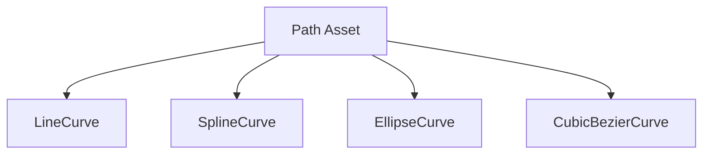

# assets — paths

# Path Assets Module

The `assets/paths` module contains a collection of JSON-defined vector path assets. These assets define complex 2D geometric paths composed of multiple segment types, intended for use in rendering, animation, or physics engines.

## Overview

Each file in this module represents a single `Path` object. A path is essentially a container for a sequence of one or more "curves" that define a continuous (or non-continuous) shape in 2D space.

## Data Structure

### The Path Object

The root of every path asset file is a `Path` object.

| Property | Type | Description |
| :--- | :--- | :--- |
| `type` | `string` | Must be `"Path"`. |
| `x` | `number` | The global X-coordinate anchor point for the path. |
| `y` | `number` | The global Y-coordinate anchor point for the path. |
| `autoClose` | `boolean` | If true, the renderer should automatically connect the end of the last curve to the start of the first. |
| `curves` | `array` | A collection of curve segment objects. |

### Supported Curve Types

The `curves` array supports several segment types, each with its own schema.

#### LineCurve
Defines a simple straight line between two points.
- **`points`**: `[x1, y1, x2, y2]`

#### SplineCurve
Defines a smooth curve passing through a series of interpolation points.
- **`points`**: `[x1, y1, x2, y2, ... xn, yn]`

#### CubicBezierCurve
Defines a cubic Bézier segment which uses two control points to influence the curve's shape between the start and end points.
- **`points`**: `[startX, startY, cp1X, cp1Y, cp2X, cp2Y, endX, endY]`

#### EllipseCurve
Defines an elliptical or circular arc.
- **`x`, `y`**: The center point of the ellipse.
- **`xRadius`, `yRadius`**: The radius on each axis.
- **`startAngle` / `endAngle`**: The start and end of the arc in degrees.
- **`clockwise`**: `boolean` indicating the direction of the sweep.
- **`rotation`**: The rotation of the ellipse itself.

## Architecture

The relationship between the path and its constituent curves is hierarchical:

## Example Assets

### `types-test.json`
This is a comprehensive test file illustrating every supported curve type in a single path. It demonstrates how disparate segment types (e.g., a `SplineCurve` followed by a `LineCurve`) can be chained together even if their coordinates do not perfectly align, leaving the behavior of gaps to the implementation's path-drawing logic.

### `waves.json`
A practical example of using mathematical repetition. This asset uses eight `EllipseCurve` segments with alternating `clockwise` values (true/false) and fixed start/end angles (180 to 360) to create a repeating "sinusoidal" wave pattern.

## Usage for Developers

When consuming these assets:
1.  **Coordinate Space**: Coordinates are absolute within the path definition, though the root `x` and `y` often signify the intended starting point or local origin.
2.  **Order Matters**: Curves are treated as a sequence. The endpoint of `curves[n]` is typically intended to be the start point of `curves[n+1]`.
3.  **Units**: All numeric values (radii, coordinates) are unitless and relative to the target canvas/world coordinate system. Angles are defined in degrees.