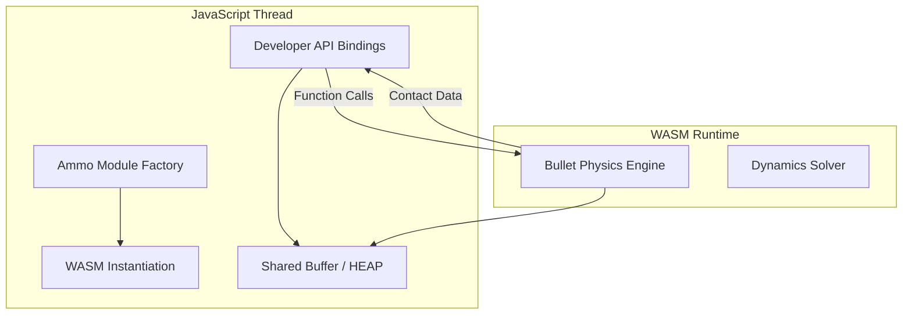

# assets — phaserbyexample

# Documentation: Ammo.js (WASM Physics)

This module provides the WebAssembly (WASM) implementation of the **Bullet Physics** engine (Ammo.js). It serves as the primary physics kernel for the application, handling high-performance 3D collision detection, rigid body dynamics, and constraints.

## Overview

The module consists of a large Emscripten-generated "glue" file (`ammo.wasm.js`) and its corresponding binary data (`ammo.wasm.wasm`). It facilitates low-level memory management and provides JavaScript bindings for the underlying C++ physics library.

### Key Responsibilities
- **WASM Lifecycle**: Handling the loading, compilation, and instantiation of the `.wasm` binary through `WebAssembly.instantiate` or `instantiateStreaming`.
- **Memory Management**: Managing a specialized `WebAssembly.Memory` instance shared between JavaScript and the WASM runtime.
- **Bridge API**: Exposing C++ Bullet classes (e.g., `btRigidBody`, `btDiscreteDynamicsWorld`) to JavaScript via the `Ammo` namespace.

---

## Architecture & Data Flow

The module follows a "Side-Module" architecture where JavaScript manages the lifecycle and I/O, while the WASM core handles heavy computation.

---

## Core Components

### 1. The Global Memory (Heap)
The bridge uses the `Ha(buffer)` function to map views onto the WASM memory buffer. Developers should be aware of these typed arrays when performing manual memory reads:
- `g.HEAP8` / `g.HEAPU8`: byte-level access.
- `g.HEAP32` / `g.HEAPU32`: pointer and integer data.
- `g.HEAPF32`: floating-point data (coordinates, rotation components).

### 2. Dynamics & Collision Foundations
The module exposes the standard Bullet hierarchy for simulating a physical world:
- **`btCollisionConfiguration` & `btCollisionDispatcher`**: Manages collision detection algorithms.
- **`btBroadphaseInterface`**: Handles the initial "rough" collision check (e.g., `btDbvtBroadphase`).
- **`btDiscreteDynamicsWorld`**: The main simulation container. Key method: `stepSimulation(timeStep, maxSubSteps)`.

### 3. Rigid Body System
The module provides comprehensive bindings for body creation:
- **`btRigidBody`**: The primary physical agent. Methods include `applyCentralForce`, `setLinearVelocity`, and `setWorldTransform`.
- **`btMotionState`**: Used to synchronize the physics simulation transforms with application-level graphics (e.g., Phaser/Three.js meshes).

### 4. Shape Definitions
Primitive and complex collision volumes:
- **Primitives**: `btBoxShape`, `btSphereShape`, `btCapsuleShape`, `btCylinderShape`, `btConeShape`.
- **Complex**: `btBvhTriangleMeshShape` (static geometry), `btConvexHullShape` (dynamic hulls), and `btHeightfieldTerrainShape`.

---

## Critical Execution Flows

### Module Initialization
The initialization follows a promise-like pattern within the `Ammo()` factory:
1. **Selection**: `Za()` attempts to find the WASM binary.
2. **Fetching**: `$a()` uses `fetch` or `XMLHttpRequest` depending on the environment (Node.js vs. Browser).
3. **Instantiation**: `g.asm` is assigned the exports of the instantiated WASM module.
4. **Binding**: `_emscripten_bind_*` variables are initialized, mapping JavaScript methods to WASM functions.

### Raycasting and Collision Testing
The module includes specialized callbacks for gathering physics data:
- **`ClosestRayResultCallback`**: Finds the nearest object hit by a line.
- **`AllHitsRayResultCallback`**: Returns all objects intersected by a ray.
- **`ContactResultCallback`**: Manages manual collision queries between two specific objects.

---

## Developer Implementation Notes

### Memory Safety
Since this is a WASM port of C++, **garbage collection does not apply to physics objects.**
- Objects created via `new Ammo.bt[ClassName]` must be manually destroyed when no longer needed using `Ammo.destroy(object)`.
- Failure to call `destroy()` will result in a memory leak within the WASm Heap, eventually leading to a crash.

### Performance
The `ammo.wasm.js` file includes optimized math functions like `Ra` (Math.cos) and `Sa` (Math.sin) and uses `mb()` (a high-resolution timer) for internal stepping calculations. To maintain performance:
- Batch `setWorldTransform` calls.
- Prefer `applyImpulse` over constant `setLinearVelocity` for natural movements.
- Use `btCompoundShape` for complex objects rather than many individual rigid bodies.

### Coordinate System
Ammo/Bullet uses a **Right-Handed** coordinate system. Ensure your visual meshes (Phaser 3D or similar) match this or apply a conversion within the `MotionState`.