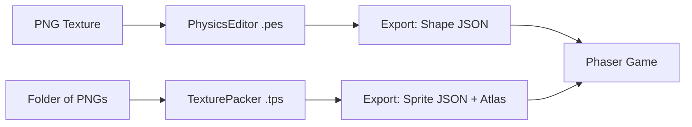

# assets — physics

# Assets — Physics

The **assets/physics** module contains physical body definitions and collision shapes used by the Phaser [Matter.js](https://brm.io/matter-js/) physics engine. These files define the non-rectangular hitboxes, mass properties, and material behaviors (friction/bounciness) required for complex sprites.

## Overview

The module consists of raw JSON definitions exported from specialized tools. These definitions map texture-relative coordinates to physical vertices, allowing the physics engine to simulate objects like bananas, birds, or mountain ranges accurately.

### Core Data Formats
- **`.json`**: The primary distribution format consumed by Phaser.
- **`.pes`**: Source project files for [PhysicsEditor](https://www.codeandweb.com/physicseditor).
- **`.tps`**: Project files for [TexturePacker](https://www.codeandweb.com/texturepacker).

---

## File Structure & Shape Catalog

### 1. `fruit-shapes.json` & `fruit-sprites.json`
Defines a set of interactive items. Note that objects often consist of multiple **fixtures** to create complex shapes:
- **`banana`**: A single complex polygon fixture.
- **`cherries`**: A compound body consisting of two circle fixtures (`cherry-left`, `cherry-right`) and a polygon `cherry-stem`.
- **`orange`**: A simple optimized circle fixture.
- **`ground`**: A large, `isStatic: true` body consisting of 34 distinct polygon fixtures to represent an uneven terrain.

### 2. `compound.json`
A specialized collection of shapes used for creating letters and organic characters:
- **`bird`**: A highly detailed 16-fixture polygon set.
- **`p`, `h`, `a`, `s`, `e`, `r`**: Individual letter-shaped collision bodies, allowing for physics-based text interactions.

### 3. `catstick.json`
Contains definitions for `catstick` (a hybrid circle + polygon body) and `tree1`.

### 4. `mountain.json`
Defines `mountains-tile`. This is a static body designed to match repeating background tiles, used for environmental collisions.

### 5. `supercar.json`
A simplified format compared to the others. Instead of the PhysicsEditor schema, it uses raw coordinate arrays under the key `shape`.

---

## Key Physics Parameters

Each shape definition supports standard Matter.js properties. When modifying `.pes` files or raw JSON, pay attention to:

| Property | Typical Value | Description |
| :--- | :--- | :--- |
| `isStatic` | `true` / `false` | If true, the object never moves (ground, mountains). |
| `density` | `0.1` | Affects the calculated mass based on shape area. |
| `restitution` | `0` to `0.1` | The "bounciness" of the object. |
| `friction` | `0.1` | Kinetic friction during movement. |
| `frictionAir` | `0.01` | Air resistance / drag. |
| `collisionFilter` | `mask: 255` | Determines which categories of objects this body reacts with. |

---

## Toolchain & Workflow

The workflow for this module is strictly external-to-internal. **Do not manually edit the JSON files** if a corresponding `.pes` file exists.



### Modifying Shapes
1. Open the relevant `.pes` file in **PhysicsEditor**.
2. Adjust the vertices or physical parameters (Friction, Restitution).
3. Export using the "Phaser (Matter.js)" data format.
4. Save the resulting JSON over the existing file in `/assets/physics/`.

---

## Usage in Phaser

To use these definitions, load them in your Scene's `preload` method and apply them when creating Matter Sprites.

### Loading
```javascript
function preload() {
    // Load the physics definitions
    this.load.json('shapes', 'assets/physics/fruit-shapes.json');
    // Load the corresponding texture atlas
    this.load.atlas('items', 'assets/physics/fruit-sprites.png', 'assets/physics/fruit-sprites.json');
}
```

### Application
```javascript
function create() {
    const shapes = this.cache.json.get('shapes');

    // Create a sprite and apply the complex shape from the JSON
    const banana = this.matter.add.sprite(400, 300, 'items', 'banana', {
        shape: shapes.banana
    });
    
    // For static environmental objects
    const ground = this.matter.add.sprite(300, 700, 'items', 'ground', {
        shape: shapes.ground
    });
}
```

### Important Notes on Positioning
- **Anchor Points**: By default, Matter.js bodies created from these JSONs are positioned relative to their center of mass.
- **Scaling**: If you scale a Sprite in Phaser (`setScale`), the Matter body will scale automatically, but define your shapes at "1x" resolution in PhysicsEditor for the best results.