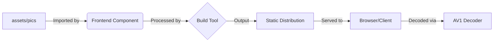

# assets — pics

# Assets — Pics Module

## Overview

The `assets/pics` module serves as a centralized repository for static visual assets used throughout the application. Unlike logic-based modules, this directory contains binary image files—specifically utilizing the **AVIF (AV1 Image File Format)**.

The primary file currently identified in this module is:
*   `equality-by-ragnarok.avif`

## Technical Specification

### Format: AVIF
The choice of AVIF over legacy formats (like JPEG or PNG) or even WebP is driven by several technical advantages:
*   **Superior Compression:** Provides significantly smaller file sizes at the same or better visual quality.
*   **Alpha Channel Support:** Allows for complex transparency, making it suitable for UI elements and layered compositions.
*   **High Dynamic Range (HDR):** Supports 10-bit and 12-bit color depths.
*   **Royalty-Free:** Based on the AV1 video codec.

### File Structure
The module is structured as a flat or categorized file store. Files are typically referenced by the frontend via relative or absolute paths during the build process.

## Integration & Execution Flow

As identified in the execution flow analysis, this module contains no executable code, internal calls, or logic. It is a **passive resource module**. 

The lifecycle of an asset in this module typically follows this path:

1.  **Storage:** The `.avif` file is stored in `assets/pics/`.
2.  **Reference:** A UI component (e.g., a React component or an HTML template) references the file path.
3.  **Bundling:** During the build step (Webpack, Vite, etc.), the bundler processes the file, often adding a content hash to the filename for caching purposes.
4.  **Delivery:** The web server serves the binary data with the `image/avif` MIME type.
5.  **Rendering:** The browser's hardware-accelerated AV1 decoder renders the image.



## Developer Guidelines

### Adding New Assets
When adding new images to this module, developers should adhere to the following:
1.  **Optimization:** Ensure images are pre-optimized before commit. While the AVIF format is efficient, unnecessary metadata (EXIF data) should be stripped.
2.  **Naming Convention:** Use `kebab-case` for filenames (e.g., `brand-logo-dark.avif`) to ensure cross-platform compatibility and URL friendliness.
3.  **Fallback Support:** While modern browsers support AVIF, ensure the application's `<picture>` tags provide fallback formats (like WebP or PNG) if the user base includes legacy environments.

### Usage Example
In a standard CSS or JS environment, assets from this module are typically invoked as follows:

```javascript
// Example referencing the asset in a JavaScript component
import equalityImage from '/assets/pics/equality-by-ragnarok.avif';

const ImageComponent = () => (
  
);
```

```css
/* Example referencing the asset in CSS */
.hero-section {
  background-image: url('/assets/pics/equality-by-ragnarok.avif');
}
```