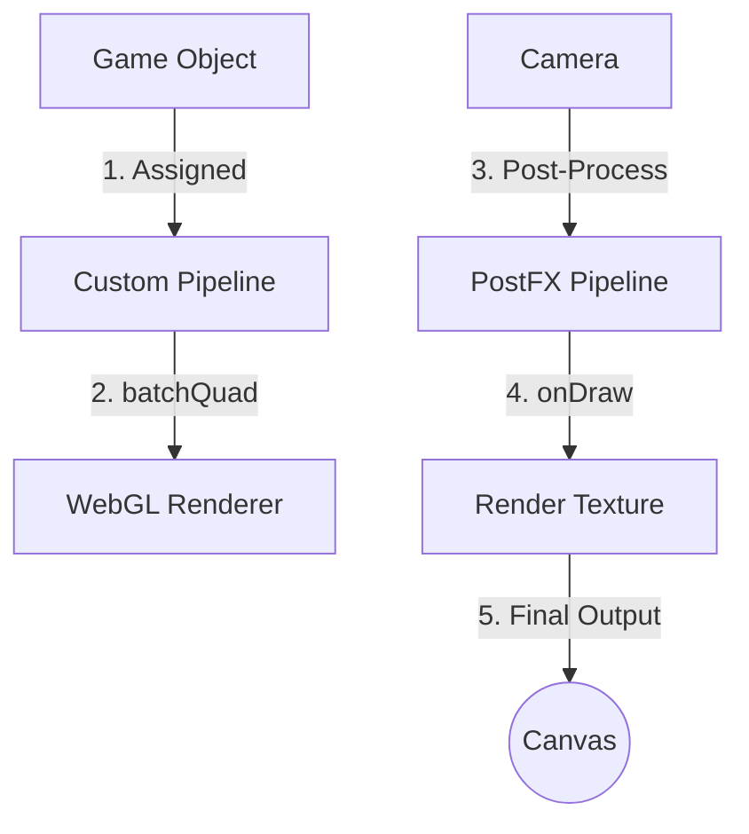

# assets — pipelines

# WebGL Pipelines Module

The `assets/pipelines` module provides a suite of custom WebGL pipelines for Phaser 3. These pipelines extend Phaser’s rendering capabilities by implementing custom GLSL shaders for both per-object rendering and full-screen post-processing effects.

## Overview

The module is categorized into three primary pipeline types based on how they interact with the Phaser renderer:

| Pipeline Type | Base Class | Primary Use Case |
| :--- | :--- | :--- |
| **MultiPipeline** | `Phaser.Renderer.WebGL.Pipelines.MultiPipeline` | Standard batch rendering for Sprites and Images. Handles multiple textures. |
| **SinglePipeline** | `Phaser.Renderer.WebGL.Pipelines.SinglePipeline` | Simplified rendering for single-texture objects. |
| **PostFX Pipeline** | `Phaser.Renderer.WebGL.Pipelines.PostFXPipeline` | Applied to Cameras or Game Objects as a post-render pass. |

---

## Technical Architecture

The following diagram illustrates the data flow for the two most common patterns used in this module: Direct Pipeline assignment and Post-Processing.



---

## Specific Pipeline Implementations

### Color and Grayscale Effects
These pipelines manipulate the fragment color data, often using matrix transformations for hue rotation.

*   **`GrayScalePipeline`**: A `MultiPipeline` that converts textures to grayscale. Use the `.gray` property (0.0 to 1.0) to mix between original color and luminance-based grayscale.
*   **`HueRotatePipeline`**: A standard `MultiPipeline` that rotates the hue of all batched objects based on a global `uTime` and `uSpeed`.
*   **`HueRotateAttributePipeline`**: An advanced implementation that allows **per-object speed control**. It overrides `batchQuad` and `batchVert` to pass an `inSpeed` attribute to the GPU, enabling multiple sprites to rotate colors at different rates within a single draw call.
*   **`MultiColorPipeline`**: A dual-purpose pipeline maintaining two internal shaders (`Gray` and `HueRotate`). It uses `onBind` to switch shaders based on `gameObject.pipelineData`, demonstrating how to manage multiple effects within one class.

### Deformation and Wave Effects
These pipelines use vertex or fragment coordinate manipulation to warp visuals.

*   **`Bend` / `BendPostFX`**: Uses a power function (`pow(height, 2.5)`) to create a "top-heavy" bending effect. Most intense at the top of the texture, effectively zero at the bottom.
*   **`BendWavesPostFX`**: Applies vertical oscillation using nested sine waves for a fluid, aquatic movement.
*   **`BendRotationWavesPostFX`**: A complex coordinate transformation that rotates and scales fragments based on sine/cosine paths, creating a psychedelic swirling effect.

### Screen and Post-Processing Effects
High-level effects designed for full cameras or final render passes.

*   **`BlurPostFX`**: A 9-tap Gaussian blur pass. It calculates a blur radius based on the game loop time for a pulsing focus effect.
*   **`PixelatedFX`**: Downsamples the rendering by floor-aligning texture coordinates to a fixed `pixelSize`.
*   **`ScalinePostFX`**: Simulates a CRT monitor with scanlines and a "magnetic" distortion follow-effect based on mouse coordinates (`uMouse`).
*   **`SwirlPostPipeline`**: Provides a localized "twist" distortion. Configurable via `x`, `y`, `radius`, and `strength`.

---

## Usage Patterns

### Applying a Standard Pipeline
To use `MultiPipeline` or `SinglePipeline` implementations, first register them in the Game Configuration or the Pipeline Manager:

```javascript
// In Scene create()
const renderer = this.renderer;
const pipeline = renderer.pipelines.add('HueRotate', new HueRotatePipeline(this.game));

const sprite = this.add.sprite(400, 300, 'logo');
sprite.setPipeline('HueRotate');
```

### Applying PostFX
PostFX pipelines are added to Cameras or specific Game Objects:

```javascript
// Applying to a camera
this.cameras.main.setPostPipeline(BlurPostFX);

// Applying to a single sprite
const sprite = this.add.sprite(400, 300, 'logo');
sprite.setPostPipeline(PixelatedFX);
```

### Handling Per-Object Data
In `MultiColorPipeline`, properties are pulled from `gameObject.pipelineData`. Ensure this object is populated before rendering:

```javascript
const sprite = this.add.sprite(400, 300, 'logo');
sprite.setPipeline('MultiColor');
sprite.pipelineData = { effect: 0, gray: 1.0 }; // Sets to Grayscale mode
```

---

## Developer Notes

1.  **Coordinate Systems**: Note that `ScalinePostFX` and `BendRotationWavesPostFX` contain internal logic to invert the Y-axis. This is to sync Phaser's coordinate system with WebGL's bottom-left origin.
2.  **Performance**: `HueRotateAttribute` is preferred over setting uniforms in a loop. By using an attribute (`inSpeed`), you prevent pipeline flushes, maintaining high batching efficiency.
3.  **Resolution Uniforms**: PostFX pipelines usually require `uResolution`. The `onDraw` or `onBoot` methods in these classes typically handle this by grabbing dimensions from the `renderer` or `renderTarget`.