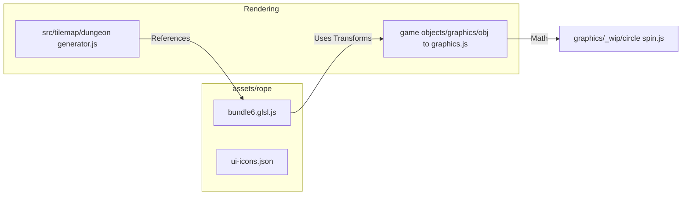

# assets — rope

# assets — rope

The **assets — rope** module is a collection of visual resources, primarily focusing on high-end fragment shaders and a comprehensive UI icon atlas. These assets provide the graphical foundation for environmental effects, procedural backgrounds, and the user interface.

## Module Overview

The module consists of two primary files:
1.  **`bundle6.glsl.js`**: A multi-entry fragment shader library containing diverse visual effects from raymarching to volumetric fog.
2.  **`ui-icons.json`**: A TexturePacker-compatible manifest for the `ui-icons.png` sprite sheet, defining the coordinates for menu buttons, backgrounds, and status icons.

## Shader Bundle (`bundle6.glsl.js`)

This file contains several self-contained fragment shaders. Each shader is separated by a metadata header (name, type, author).

### Key Shader Implementations

#### 1. Meta Balls
A Signed Distance Field (SDF) implementation of liquid-like spheres.
*   **Core Functions**: Uses `sphereSDF` and `smoothUnionSDF` to create organic blending between moving objects.
*   **Lighting**: Features a custom Blinn-Phong-style specular model via `addLight` and `normalToColor`.
*   **Scene Logic**: The `sceneSDF` function uses `mod` to create an infinite grid of balls, combined with `rotateX/Y/Z` transforms for dynamic motion.

#### 2. RayTracer
A recursive raytracer that supports classic reflection logic.
*   **Complexity**: Configured for a `raytraceDepth` of 6.
*   **Primitives**: Implements `shpere_intersect` and `plane_intersect`.
*   **Shadows**: Includes a `computeLightShadow` function that casts secondary rays toward a defined `lightPoint` (5, 5, 5).

#### 3. Moon Mist
A volumetric rendering shader.
*   **Algorithm**: Uses Fractional Brownian Motion (`fbm`) and a `noise` function to generate density.
*   **Raymarching**: The `volumetric` function performs 100 steps to accumulate light density, creating a "fog" or "mist" effect over a central sphere.

#### 4. UI-Specific Effects
*   **Road**: A pseudo-3D perspective road effect using `step` and `smoothstep` for lane markings.
*   **RGB Wave / Trippy Dots**: Mathematically driven 2D patterns using sine waves and complex conformal mappings (`perturbedNewton`, `infundibularize`).

## UI Icon Atlas (`ui-icons.json`)

This manifest describes the `ui-icons.png` texture atlas. The sprites are organized into functional groups and color-coded variants.

### Sprite Categories

| Group | Filenames | Purpose |
| :--- | :--- | :--- |
| **Backgrounds** | `pink-background`, `yellow-background`, `wood-background` | Panel and menu containers. |
| **Media Controls** | `play`, `pause`, `ffwd`, `forward`, `mute`, `music` | Playback and audio management. |
| **Navigation** | `menu`, `settings`, `ok`, `cancel`, `grid` | Core UI flow and confirmation. |
| **Social/Meta** | `user`, `trophy`, `shop`, `help`, `info` | Player profiles, rewards, and information. |

### Color Mapping Pattern
Most icons follow a dual-state naming convention:
*   **Standard**: (e.g., `play`) Typically used for default states.
*   **Pink Variant**: (e.g., `play-pink`) Used for active states, hover effects, or specific themed UI sections.

## Integration & Data Flow

According to the call graph, these assets are not just static files but are integrated into the procedural generation and transformation pipelines of the engine.

### Technical Notes for Developers
*   **Shader Uniforms**: All shaders in `bundle6.glsl.js` expect standard `uniform float time`, `uniform vec2 resolution`, and `uniform vec2 mouse`.
*   **Coordinate Spaces**: UI Frames in the JSON use the standard TexturePacker `frame` object (x, y, w, h). All dimensions are relative to the 605x1009 source image.
*   **Precision**: Shaders are capped at `precision mediump float` for compatibility with mobile GL ES environments.
*   **Transformation Helpers**: The GLSL bundle includes high-performance rotation matrices (`rotateX`, `rotateY`, `rotateZ`) derived from two-dimensional `mat2` rotations. These are frequently invoked by the scene raymarchers.