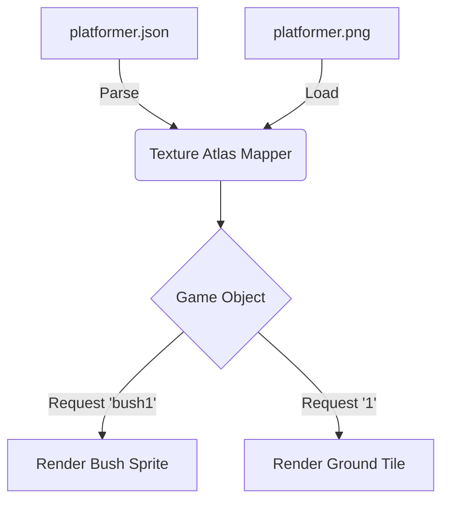

# assets — sets

# Assets — Sets Module

The `assets/sets` module contains the graphical definitions and metadata required to render the game's environment. It primarily focuses on the **Free Platformer Game Tileset**, providing a structured way for the game engine to slice a single sprite sheet into usable terrain tiles, platforms, and decorative props.

## Module Overview

This module follows the standard **TexturePacker** JSON (Hash) format. It defines the mapping between a source image (`platformer.png`) and individual sprite frames used within the game world.

### Key Files
- `platformer.json`: The metadata file defining sprite coordinates, dimensions, and pivot points.
- `license.txt`: Attribution for the original artwork (Game Art 2D).
- `platformer.png` *(Referenced)*: The actual atlas image containing all visual elements.

---

## Data Structure: platformer.json

The JSON metadata is divided into two main sections: `frames` and `meta`.

### 1. Sprite Categories
The `frames` object keys represent the identifiers used in code to retrieve specific textures.

#### Terrain Tiles (`"1"` through `"18"`)
These are standard 128x128 pixel blocks used for building the primary floor and wall geometry.
- **Indices 1-12**: Main ground blocks (slabs, corners, and edges).
- **Indices 13-17**: Thinner terrain segments or sub-blocks (heights ranging from 93px to 99px).
- **Index 18**: Specialty filler or transition tile.

#### Platforms (`"platform1"` to `"platform3"`)
Pre-composed horizontal segments designed for floating or moving platforms.
- `platform1`: Small (256x93)
- `platform2`: Medium (384x93)
- `platform3`: Large (512x93)

#### Environment & Props
Semantic naming is used for non-tiled decorative elements:
- **Foliage**: `bush1` through `bush4`, `tree1`, `tree2`, `mushroom1`, `mushroom2`.
- **Obstacles/Detail**: `rock`, `stump`, `crate`.
- **Information**: `sign1`, `sign2`.

### 2. Frame Attributes
Each frame entry (e.g., `"crate"`) contains:
- `frame`: The location and size of the sprite within the atlas (`x, y, w, h`).
- `spriteSourceSize`: The offset and size relative to the original un-trimmed image.
- `sourceSize`: The original dimensions (used for calculating scale and alignment).

---

## Technical Integration

### Consumption Pattern
A typical sprite loader (like Phaser, PixiJS, or a custom WebGL implementation) uses this module to generate a texture atlas.

### Metadata Details
- **App**: http://www.codeandweb.com/texturepacker
- **Format**: RGBA8888
- **Dimensions**: 1313 x 495 pixels
- **SmartUpdate**: A hash included in the `meta` object to detect if the atlas needs re-parsing during build steps.

## Licensing
The assets in this directory are sourced from the **Free Platformer Game Tileset** by Game Art 2D. Developers must ensure compliance with their [license terms](https://www.gameart2d.com/free-platformer-game-tileset.html) when redistributing or modifying these assets.