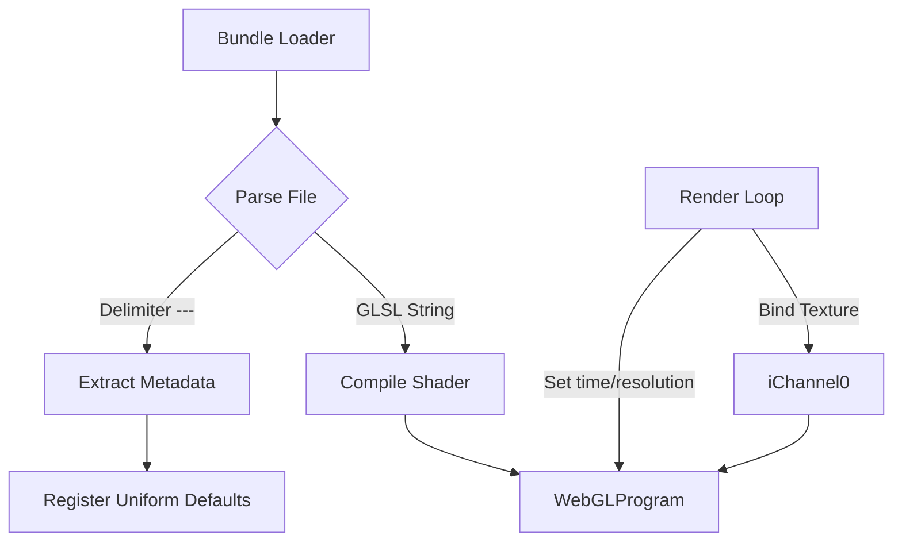

# assets — shaders

# Assets — Shaders

The `assets/shaders` module is a collection of GLSL fragment shaders used for post-processing effects, procedural backgrounds, and visual simulations. The module utilizes a "bundle" format where multiple shader programs are stored within single `.glsl.js` files, separated by metadata headers.

## Module Purpose
These shaders provide the visual "polish" and dynamic backgrounds for the application. They are designed to be hardware-accelerated via WebGL and typically operate on full-screen quads or as filters applied to specific texture inputs (`iChannel0`, `iChannel1`).

## The Bundle Format
Most files in this directory (e.g., `assets/shaders/blur-bundle.glsl.js`) follow a custom multi-part format. This allows the engine to parse a single file and register multiple named shader effects.

### Header Structure
Each shader within a bundle starts with a triple-dash delimiter followed by metadata:
```yaml
---
name: Shader Name
type: fragment
author: Source URL or Name
uniform.paramName: { "type": "1f", "value": 1.0 }
---
```
*   **name**: The unique identifier used to look up the shader in the asset manager.
*   **type**: Usually `fragment`.
*   **uniform.**: (Optional) Defines default values and types for custom uniforms, allowing the host application to automatically generate UI controls or set initial states.

## Standard Interface
To ensure compatibility across the variety of sourced shaders (ShaderToy, GLSLSandbox, etc.), the module assumes a standard set of uniforms and varyings:

| Name | Type | Description |
| :--- | :--- | :--- |
| `time` / `iTime` | `float` | Elapsed time in seconds for animations. |
| `resolution` | `vec2` | The dimensions of the viewport/canvas. |
| `mouse` | `vec2` | Normalized or pixel-space mouse coordinates. |
| `iChannel0..N` | `sampler2D` | Input textures (used for blurs, masks, or displacement). |
| `fragCoord` | `varying vec2` | Interpolated coordinates (often normalized `0.0` to `1.0`). |

### Shader Entry Points
Shaders in this module primarily use two patterns:
1.  **Standard GLSL**: A `void main()` function that writes directly to `gl_FragColor`.
2.  **ShaderToy Style**: A `void mainImage(out vec4 fragColor, in vec2 fragCoord)` function, which is often wrapped by a local `main()` to bridge compatibility.

## Shader Categories

### 1. Post-Processing & Filters
Located primarily in `assets/shaders/blur-bundle.glsl.js` and `assets/shaders/bundle4.glsl.js`.
*   **Radial Blur / Focalesque Blur**: Multi-tap blurs for depth-of-field or motion effects.
*   **Outline**: Generates a colored stroke around non-transparent pixels in `iChannel0`.
*   **Sobel Edge**: Traditional edge detection kernel based on luma gradients.
*   **Chunky**: A pixelation filter that quantizes UV coordinates based on the `pixelSize` uniform.

### 2. Procedural Backgrounds
Located primarily in `assets/shaders/bundle.glsl.js` and `assets/shaders/bundle2.glsl.js`.
*   **Plasma / Oldschool Plasma**: Classic sine-summation color cycling.
*   **Colorful Voronoi**: Cellular noise used for organic, crystalline backgrounds.
*   **Tunnel**: A mathematically projected texture tunnel using `atan` for angular mapping and `1.0/length` for depth.
*   **GridBack**: A complex animated structural grid using randomized tile orientation.

### 3. VFX & Simulations
*   **Fire (Buffers A, B, and Main)**: A multi-pass fluid-like fire simulation. It uses feedback loops (reading from its own previous frame via `iChannel` inputs) to create rising heat and flame effects.
*   **Ghosts**: Uses a random seed and signed distance functions (SDFs) to draw animated characters procedurally.

## Implementation Architecture

The following diagram illustrates how the host application typically interacts with these assets:



## Contributing New Shaders
When adding a new shader to a bundle:
1.  **Coordinate Space**: Ensure the shader handles `resolution` correctly. If the shader was ported from ShaderToy, remember that `fragCoord` in this module is often a `varying` (pre-normalized) rather than `gl_FragCoord.xy` (pixel space).
2.  **Performance**: Most shaders are set to `precision mediump float`. For complex raymarching (like `rolling-hills.frag`), use `precision highp float`.
3.  **Transparency**: If the shader is intended to be an overlay, ensure it respects the alpha channel of the input texture or sets `gl_FragColor.a` appropriately. For instance, the **Outline** shader specifically checks `tex.w > 0.0` to preserve the original object's transparency.