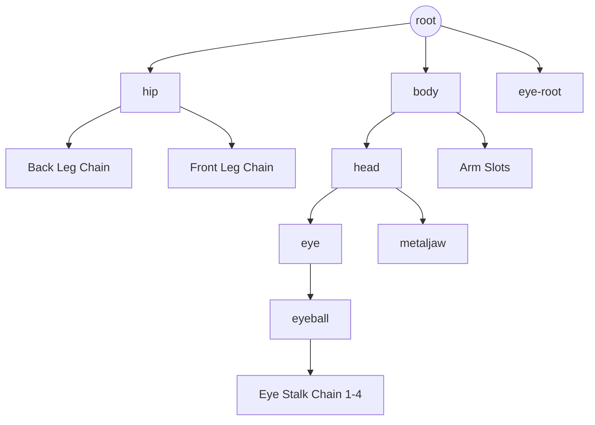

# assets — spine

# Assets — Spine: Alien Character (v3.8)

This module contains the skeletal animation data and texture mapping for the **Alien** character (Pro version). It is designed for use with the **Spine 3.8** runtime. The asset features a complex skeletal rig, weighted meshes for organic deformation, and high-fidelity effect animations including vertex-level transformations.

## Module Overview

The module consists of two primary files:
1.  **`alien-pro.atlas`**: A texture atlas definition mapping logical region names to coordinates on the `alien-pro.png` spritesheet.
2.  **`alien-pro.json`**: The core data file containing bone hierarchies, slot definitions, mesh vertex data, and animation timelines.

## Skeletal Architecture

The skeleton uses a hierarchical bone structure optimized for bipedal-style movement with additional organic appendages.

### Core Hierarchy
*   **`root`**: The global origin point.
*   **`hip`**: The parent for the lower body, controlling the `front` and `back` leg chains (`thigh` -> `shin` -> `foot`).
*   **`body`**: Attached to `root`, driving the upper torso.
*   **`head`**: Parented to `body`. It serves as the primary container for facial features and burst effects.
*   **`eye-stalk` chain**: A multi-segmented bone chain (`eye-stalk` 1 through 4) designed for fluid, tentacle-like motion or recoil.

### Transform Constraints
The rig utilizes Spine transform constraints to maintain logical positioning during complex movements:
*   **`eye`**: Constrained to the `head` bone to ensure the eye follows head rotation and translation.
*   **`jaw`**: Constrained to the `head`, controlling the `metaljaw` attachment.

## Visual Components

### Slot & Skin System
The module uses a single `default` skin. It maps the following key visual regions:
*   **Anatomy**: `head`, `body`, `front-shin`, `back-thigh`, etc.
*   **Mechanical**: `metaljaw`, `backarmor`.
*   **Effects**: `burst-bg`, `splat-fg`, `eye-splat`.

### Mesh Deformations
The `eye-stalk` and `head` (burst) attachments are defined as **Meshes** rather than simple regions. 
*   **`eye-stalk`**: Uses weighted vertices linked to bones 12, 13, 14, 15, and 16. This allows the stalk to bend smoothly as the bone chain moves.
*   **`burst` effects**: Utilize complex vertex arrays to simulate fluid or explosive expansion during animations.



## Animations

### `death`
The `death` animation is a highly complex sequence (approx. 2.17 seconds) that handles the character's destruction.

1.  **Effect Sequence**: It utilizes attachment swapping on the `head` and `splat` slots to create a frame-by-frame animation feel using `burst01`, `burst02`, and `burst03`.
2.  **Vertex Deformation (FFD)**: Significant vertex movement is recorded for the `eyeball`, stretching and squashing the mesh before it "bursts."
3.  **Two-Color Tinting**: The animation modifies both "Light" and "Dark" color channels on the `eyeball` and `burst-bg` to simulate biological glowing/fading.
4.  **Physics Simulation**: The `metaljaw` and `eye-root` are translated far outside the character's bounding box to simulate parts being blown away.

## Implementation Details

### Texture Filtering
The atlas is configured to use **Linear** filtering for both Minification and Magnification, ensuring smooth scaling.
*   **Format**: RGBA8888
*   **Repeat**: None

### Vertex Format
Meshes like `eye-stalk` contain vertex data indices that correspond to:
1.  Num bones contributing to the vertex.
2.  Bone index.
3.  Local X-coordinate.
4.  Local Y-coordinate.
5.  Weight.

### Event Triggers
The module includes a custom event:
*   **`squish`**: Intended to trigger sound effects or particle emitters when the character is compressed or impacted.

## Usage for Developers

To load this asset in a Spine-enabled environment (e.g., LibGDX, Unity, PixiJS):

```typescript
// Example: Pseudo-code for loading
const atlas = new spine.TextureAtlas(atlasRawData, textureLoader);
const atlasAttachmentLoader = new spine.AtlasAttachmentLoader(atlas);
const skeletonJson = new spine.SkeletonJson(atlasAttachmentLoader);
const skeletonData = skeletonJson.readSkeletonData(jsonRawData);

// Set initial animation
state.setAnimation(0, "death", false);
```

**Note on Versions**: This asset uses Spine **3.8**. Ensure your runtime version matches to prevent binary/JSON compatibility issues.