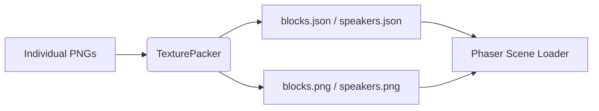

# assets — sprites

# Sprite Assets Module

The `assets/sprites` module contains texture atlases and configuration files used to manage 2D graphical assets. Instead of loading individual images, the project uses **Texture Atlases** (Sprite Sheets) to minimize draw calls and optimize memory usage.

## Overview

The assets are pre-packed using [TexturePacker](https://www.codeandweb.com/texturepacker). Each atlas consists of two primary files:
1.  **A PNG Image**: (e.g., `blocks.png`) containing all the visual data.
2.  **A JSON File**: (e.g., `blocks.json`) containing the coordinates (`frame`), dimensions, and names for each individual sprite within the sheet.

## Texture Atlases

### 1. Blocks Atlas
**Path**: `assets/sprites/blocks.json`  
This atlas contains environment elements, hazards, and enemy sprites. It is configured with a scale of `0.25`, meaning the source assets were likely high-resolution (512px range) downscaled to 128px for the game.

| Frame Name | Type | Dimensions (W x H) |
| :--- | :--- | :--- |
| `metal` | Block | 128 x 128 |
| `wooden` | Block | 128 x 128 |
| `redmonster` | Enemy | 128 x 128 |
| `yellowmonster` | Enemy | 128 x 128 |
| `bomb` | Hazard | 127 x 128 |
| `saw` | Hazard | 128 x 126 |
| `platform` | Platform | 128 x 32 |
| `platform-round` | Platform | 128 x 32 |
| `spikes` | Hazard | 128 x 32 |
| `tallspikes` | Hazard | 128 x 64 |

### 2. Speakers Atlas
**Path**: `assets/sprites/speakers/speakers.json`  
A specialized atlas for UI or environmental speaker objects. This atlas is composed of modular parts meant to be layered or assembled.

*   **Frames**: `bottom`, `middle`, `top-left`, `top-right`.
*   **Format**: JSON Hash/Array format, compatible with Phaser 3.

---

## Technical Workflow

### Data Architecture
The relationship between the source images and the game engine is managed via the `.tps` project file.



### Modification Guide
To modify these sprites:
1.  **Do not edit JSON manually**: The JSON files are machine-generated. Manual changes will be overwritten during the next export.
2.  **Use TexturePacker**: Open `assets/sprites/speakers/speakers.tps` to add, remove, or re-pack sprites.
3.  **Consistency**: Ensure `trimSpriteNames` remains `true` in the `.tps` settings to keep the frame references in code clean (i.e., referencing `metal` instead of `metal.png`).

---

## Implementation Reference

In a Phaser 3 environment, these assets are typicaly loaded in the `preload()` method of a Scene:

```javascript
// Loading the blocks atlas
this.load.atlas('blocks', 'assets/sprites/blocks.png', 'assets/sprites/blocks.json');

// Using a specific frame from the atlas
const player = this.add.sprite(100, 100, 'blocks', 'redmonster');

// Creating a platform using the round platform frame
const platform = this.add.image(400, 300, 'blocks', 'platform-round');
```

## Configuration (TPS)
The `speakers.tps` file defines the export settings for the speakers module:
*   **Algorithm**: Basic (Best)
*   **Padding**: 1px (Shape padding)
*   **Trim Mode**: None (Frames maintain their original size in the sheet)
*   **Pivot Points**: Defaulted to `0.5, 0.5` (center).