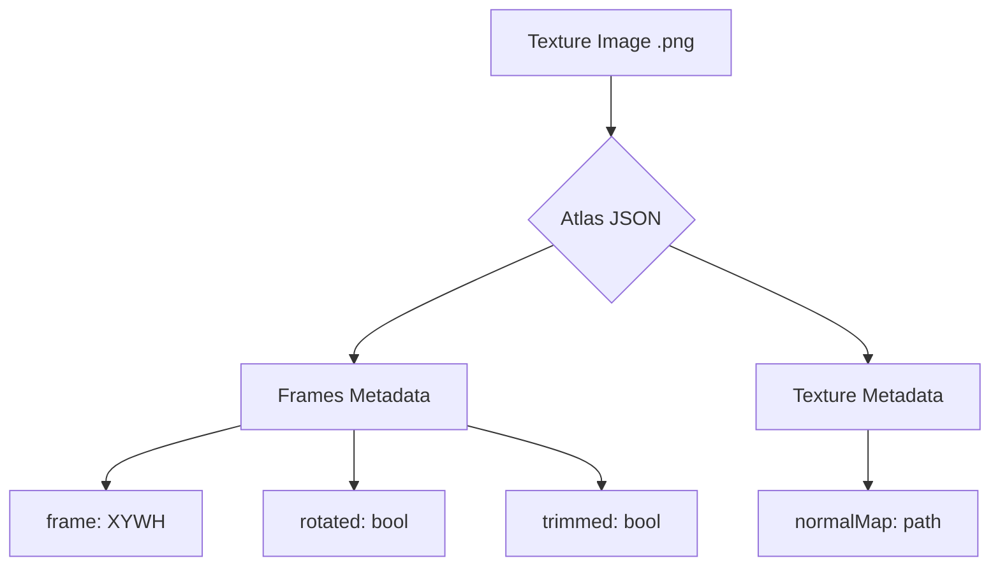

# assets — tests

# Module: Assets — Tests

The `assets — tests` module provides a standardized set of spritesheets, texture atlases, and tilemap data used specifically by the project's automated test suites and visual regression benchmarks. These assets are curated to test specific engine edge cases, such as 9-slice scaling, isometric projection, and normal mapping.

## Overview

Unlike production assets, these files prioritize technical variety—such as trimmed vs. untrimmed frames, rotated sprites, and specific tile offsets—to ensure engine stability across different rendering paths.

### Asset Categories

| Category | Primary Format | Purpose |
| :--- | :--- | :--- |
| **9slice** | JSON Hash (TexturePacker) | UI scaling, panel stretching, and border preservation tests. |
| **Columns** | JSON Hash / Array | Animated sprite sequences (gems) and grid-based logic. |
| **Fruit** | JSON (Multiple versions) | Lighting tests via normal maps (`veg_n.png`) and complex atlas packing. |
| **Grave** | JSON Hash | Multi-frame animation sequences for fire/flame effects. |
| **Iso** | Tiled JSON / TMX | Isometric tilemap rendering, depth sorting, and coordinate conversion. |

---

## Detailed Component Documentation

### 1. 9-Slice UI Assets (`9slice/`)
Contains descriptors for the `9slice.png` texture. This atlas is specifically broken down into edges and corners to test `9slice` or `n-patch` rendering components.

*   **Key Frames:** `topLeft`, `top`, `topRight`, `left`, `right`, `botLeft`, `bot`, `botRight`.
*   **Source Data:** `9slice.tps` (TexturePacker project) ensures consistency if the source image is updated.

### 2. Gems and Grids (`columns/`)
Used for verifying animation playback and sprite swapping. 
*   **`gems.json`**: Uses the `json` format with `scale9Enabled: false`. It contains multiple frames for `diamond`, `prism`, `ruby`, and `square` shapes.
*   **Usage Pattern:** Logic tests involving matching animations (e.g., `diamond_0000` through `diamond_0015`).

### 3. Lighting and Normal Mapping (`fruit/`)
The `veg2.json` file is a critical test case for the engine's lighting pipeline.
*   **Normal Maps:** It explicitly references `"normalMap": "veg_n.png"` within its metadata.
*   **Rotation:** includes `rotated: true` frames (e.g., `veg33`, `veg12`), which is a common source of bugs in custom shader implementations.

### 4. Isometric Tilemaps (`iso/`)
Contains Tiled-compatible exports used to test `Phaser.Tilemaps` or custom isometric renderers.
*   **Architecture:** Defines a `tileheight` of 32 but a physical `tileheight` of 64 within the tileset, providing a standard 2:1 isometric ratio.
*   **Tile Offsets:** Uses `tileoffset { "x": 0, "y": 16 }` to correctly align the isometric diamonds.

---

## Data Structures & Formats

### TexturePacker JSON (Phaser Format)
The atlases typically follow the `Hash` or `Array` format required by the Phaser loader.

### Tiled Integration (TMX/JSON)
Tilemaps in this module are provided in both `.tmx` (XML) and `.json` formats. 
*   **ZLib Compression:** The `.tmx` files use base64/zlib encoding for layer data.
*   **Terrain Sets:** `isometric-grass-and-water.json` includes terrain definitions for testing auto-tiling logic.

## Contribution Guide

When adding new assets for a bug fix or feature test:

1.  **Maintain TPS Files:** If the asset is a texture atlas, provide the `.tps` (TexturePacker) file so that others can re-generate the atlas or check export settings.
2.  **Use Absolute References:** Ensure that `image` paths in JSON files are relative to the JSON file itself (standard for loaders).
3.  **Minimalism:** Keep sprites small (e.g., 64x64) and atlases compact to keep the repository clone time low.
4.  **Format Verification:** If testing a specific loader (e.g., `CompressedTexture`), place the asset in a clearly named subdirectory.