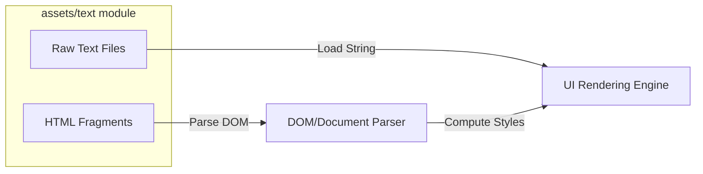

# assets — text

# Assets — Text Module

The `assets/text` module is a collection of static text and HTML/CSS fragments. These files serve as test data and template boilerplate for the system's rendering engine, UI components, and layout handlers.

Unlike active code modules, this directory contains **passive assets**. There is no execution logic within these files; they are intended to be loaded and processed by external modules such as a browser environment, a text renderer, or a DOM structural analyzer.

## Module Contents

The assets are categorized into two primary types: unformatted text and structured HTML fragments.

### 1. Plain Text Assets (`.txt`)

These files provide raw string data for testing typography, overflow behavior, and long-form content rendering.

| File | Primary Use Case | Features |
| :--- | :--- | :--- |
| `hibernation.txt` | Narrative Text Testing | Multi-paragraph sci-fi story; used for realistic text layout and font rendering tests. |
| `loremipsum.txt` | Stress/Load Testing | An exceptionally long repetitive "Lorem Ipsum" block used to test scrollbar performance and memory limits for large text buffers. |

### 2. HTML & CSS Assets (`.html`)

These fragments represent functional UI components. They utilize a mix of internal `<style>` blocks and inline CSS to define layouts.

#### `loginform.html`
A sophisticated, fully-styled login interface. 
- **DOM Elements**: Includes `username` (text), `password` (password), and a `Sign In` (submit) button.
- **CSS Patterns**: Demonstrates advanced styling, including `linear-gradient`, `box-shadow` (inset and standard), `transition` effects, and pseudo-classes like `:focus` and `:active`.
- **Layout**: Uses a fixed-dimension container (`298px` width) with absolute-style positioning for the internal elements.

#### `nameform.html`
A simple input form focused on accessibility and sizing.
- **DOM Elements**: A text field (`nameField`), a button (`playButton`), and a labeled checkbox (`over18`).
- **CSS Patterns**: Primarily tests high-visibility rendering through `font-size: 32px` on all elements.

#### `smallDiv.html`
A minimal HTML fragment.
- **Features**: Tests background color rendering (`lime`) and **UTF-8 emoji support** (rendering the 💾 character at `64px`).

#### `test.html`
A structural layout test file.
- **Features**: Tests the interaction between background images (`assets/pics/turkey-1985086.jpg`) and nested div positioning. It defines a large `1280x800` viewport with a centered `.mainbox`.

---

## Technical Patterns

### CSS Implementation
The HTML assets in this module follow specific styling patterns that a developer should be aware of when adding new test cases:

1.  **Direct Styling**: Most files avoid external stylesheets to remain self-contained. Styles are either in a `<style>` tag or injected via the `style` attribute.
2.  **Input States**: Elements like `input[type="submit"]:active` in `loginform.html` provide triggers for testing interaction-based state changes in the renderer.
3.  **Encoding**: All files are expected to be parsed as UTF-8, specifically to support the glyphs used in `smallDiv.html`.

## Integration points

While these files do not have an internal call graph, they are typically consumed by other modules via file-system I/O.

### Usage for Developers
When contributing to this module:
- **For Layout Testing**: Add a new `.html` file with the specific CSS property you wish to stress (e.g., `flexbox`, `grid`).
- **For Text Testing**: Ensure any new `.txt` files use standard line endings (`\n` or `\r\n`) as the consuming renderer might be sensitive to newline characters.
- **Asset Dependencies**: Note that `test.html` relies on a relative path to `assets/pics/`. Ensure that any new HTML assets requiring images follow this directory structure.