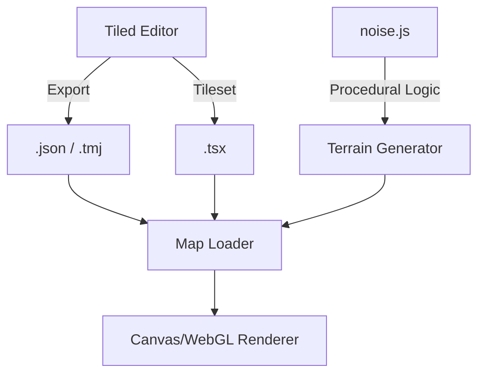

# assets — tilemaps

# Assets — Tilemaps Module

The **Assets — Tilemaps** module provides a comprehensive suite of map data, tileset definitions, and procedural generation utilities. It supports three primary map projections: **Orthogonal**, **Isometric**, and **Hexagonal**.

This module is designed to work with the [Tiled Map Editor](https://www.mapeditor.org/), providing both the source XML formats (`.tmx`, `.tsx`) and the engine-ready JSON exports.

## Core Components

### 1. Orthogonal Maps (MedievalRTS)
The MedievalRTS sub-module is a complete set of assets for real-time strategy environments.
*   **Tileset:** `medieval_tilesheet.tsx` (64x64 tiles with 32px spacing/margin).
*   **Animation:** Includes built-in support for animated tiles (e.g., ID 71 for water or spinner effects).
*   **Layering Convention:** Standardized layers for game logic:
    *   `Land`: Base terrain (Tile Layer).
    *   `Buildings`: Structural objects (Object Group).
    *   `Units`: Dynamic actors (Object Group).
    *   `Trees`/`Natural Resources`: Resource nodes (Object Group).

### 2. Isometric & Hexagonal Projections
The module includes advanced grid layouts for RPGs and strategy games:
*   **Isometric:** Found in `iso/isorpg.json`. It defines 64x32 tile dimensions, typical for 2.5D viewpoints.
*   **Hexagonal:** Found in `hex/` and `iso/tilemaps/`. Supports both `staggeraxis: y` and `staggerindex: odd` configurations.
*   **Staggered:** Specialized isometric-like layouts that use a staggered grid rather than a true diamond isometric projection.

### 3. Procedural Utility: `noise.js`
While primarily a data module, it includes a Perlin Noise implementation used by the engine for procedural terrain generation and visual effects.

**Key Functions:**
*   `seed(val)`: Initializes the permutation table for reproducible noise.
*   `perlin2(x, y)`: Generates 2D noise, ideal for heightmaps.
*   `perlin3(x, y, z)`: Generates 3D noise, often used for animated volumetric effects.
*   `fade(t)`, `lerp(t, a, b)`: Helper functions for mathematical interpolation.

---

## Technical Data Flow

The following diagram illustrates how the tilemap assets are consumed by a game engine (like Phaser):



---

## Integration Guide

### Working with Maps
When loading these assets into a project, developers should target the `.json` (or `.tmj`) files. The `.tmx` files are provided as source for editing in Tiled.

**Key Property Definitions:**
*   **GIDs (Global IDs):** Global IDs are used to identify specific tiles across different tilesets. For example, in `sample.json`, `gid: 35` refers to a specific building in the `medieval_tilesheet`.
*   **Object Groups:** Unlike Tile Layers (which are arrays of integers), Object Groups (like `Buildings`) provide precise `x`, `y` coordinates and metadata for spawning entities.

### Using the Noise Utility
The `noise.js` script is frequently used by external modules for camera effects (`shake`) and physics interpolation.

```javascript
// Example: Generating a simple procedural terrain height
const noise = new Noise(Math.random());
for (let x = 0; x < width; x++) {
    for (let y = 0; y < height; y++) {
        let value = noise.perlin2(x / 10, y / 10);
        // Use value to determine tile index
    }
}
```

## Credits & Licensing
*   **MedievalRTS Assets:** Created by [Kenney.nl](https://kenney.nl). Licensed under **CC0 (Public Domain)**. You may use these in personal and commercial projects without mandatory attribution.
*   **Isometric/Hex Assets:** Various test sets for engine compatibility. Check individual sub-directories for specific tileset PNG dependencies.