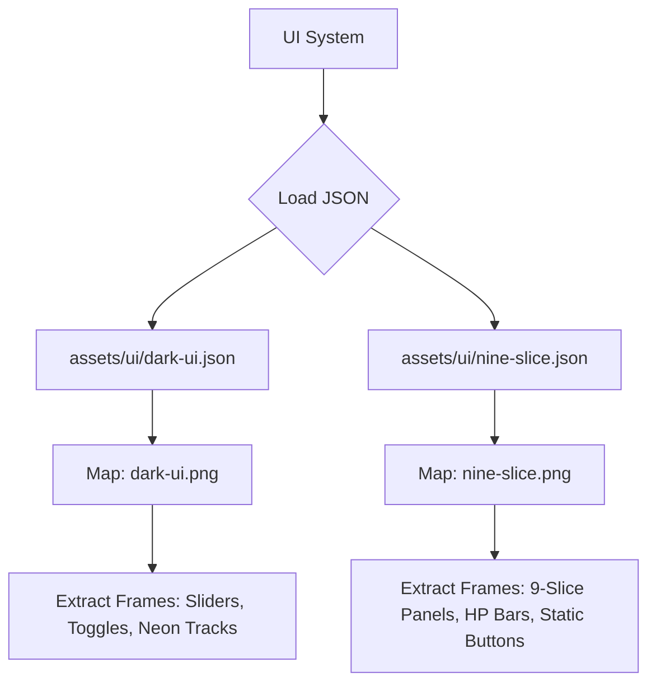

# assets — ui

# UI Asset Manifests

The `assets/ui` module contains the metadata for the game's user interface textures. These files are generated by **TexturePacker** and define how individual UI components (sprites) are laid out within larger atlas images.

The module consists of two primary manifests:
1.  `assets/ui/dark-ui.json`: High-contrast, neon-styled interactive components.
2.  `assets/ui/nine-slice.json`: Structural components designed for resizable panels and multi-colored buttons.

## Architecture Overview

The UI assets follow a standard texture atlas pattern where a single image file is paired with a JSON descriptor. 



## Module: dark-ui.json

This manifest maps to `dark-ui.png`. It is primarily used for interactive widgets requiring multiple states or color variations.

### Component Categories

*   **Progress Tracks & Sliders**: Includes a wide variety of color-coded tracks (`track-aqua`, `track-toxic`, `track-rainbow`, etc.) and their corresponding handles (`slider-red`, `slider-white`).
*   **Toggle Switches**: Supports state-based visuals with filenames like `toggle-on`, `toggle-off`, and specialized indicators like `toggle-on-dot`.
*   **Tactile Buttons**: Standard interaction states for specific dark-themed buttons: `button-active`, `button-down`, and `button-over`.
*   **Decorative Elements**: Includes `notches` for slider scales.

### Data Pattern
Each entry in the `frames` array specifies the `frame` (x, y, w, h) in the source image and the `sourceSize` for trimming calculations.

```json
{
    "filename": "track-toxic",
    "frame": { "x": 2, "y": 449, "w": 592, "h": 18 },
    "sourceSize": { "w": 592, "h": 18 }
}
```

## Module: nine-slice.json

This manifest maps to `nine-slice.png`. It contains assets intended for **Nine-Slice Scaling**, a technique that allows UI elements like panels and buttons to scale without distorting their corners.

### Component Categories

*   **Containers & Backgrounds**: Large structural elements like `PopupBackground400`, `LightBackground`, and `yellow_panel`.
*   **Multi-color Button Sets**: Standardized buttons available in Blue, Yellow, Green, Pink, and Red (e.g., `BlueButtonSml`, `RedButtonSml`).
*   **HUD Elements**: Specific gameplay UI components like `enemy_hp_bar`, `enemy_hp_fill`, and `hp_fill`.
*   **Checkboxes & Icons**: Decorative icons such as `pause_check_box` and `yellow_circle`.

### Specific Frame Groups
The naming convention identifies color families and button types:
*   **Blue Series**: `blue_button00` through `blue_button13`, including slider handles like `blue_sliderLeft`.
*   **Yellow Series**: `yellow_button00` through `yellow_button13`, including directional sliders.

## Implementation Notes

### Nine-Slice Usage
When implementing frames from `assets/ui/nine-slice.json`, developers should define the "safe zones" (corners) to prevent stretching. For example, `PopupBackground400` (400x275) typically requires a 10-20 pixel margin for its borders.

### Color Indexing
The `track-` assets in `dark-ui.json` are designed to be swapped programmatically to indicate different statuses (e.g., `toxic` for poison effects, `rainbow` for power-ups).

### Tooling
These files are versioned with `TexturePacker:SmartUpdate`. Any manual changes to the JSON will be overwritten if the assets are re-packed via the source `.tps` files. Always update the source images and re-export rather than editing the JSON directly.