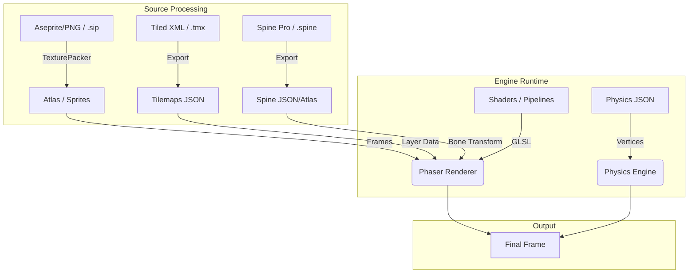

# assets

# Assets Module

The **assets** module serves as the comprehensive data repository for the application, housing the visual, auditory, and structural resources required to drive the game engine and UI. It transforms raw creative content (Aseprite projects, C++ physics libraries, high-fidelity textures) into optimized, engine-ready formats like JSON manifests, WASM binaries, and GPU-compressed textures.

## Asset Ecosystem

Rather than isolated files, these sub-modules form an integrated pipeline where metadata from one module often defines the behavior of binaries in another.

### 1. Visual & Animation Pipeline
The core rendering loop relies on a hierarchy of sprite and texture management:
*   **Source & Packing**: Raw art is processed via [Atlas](atlas.md) and [Sets](sets.md) to create optimized spritesheets.
*   **Animation**: [Animations](animations.md), [Spine](spine.md), and [Demoscene](demoscene.md) define the skeletal and frame-based logic for these sprites.
*   **Special Effects**: [Particles](particles.md), [Rope](rope.md), and [Shaders](shaders.md) utilize [Pipelines](pipelines.md) to apply WebGL effects and dynamic lighting via [Normal-Maps](normal-maps.md).
*   **Optimization**: Critical UI elements are handled via [Base64](base64.md) for zero-latency loading, while heavy textures use [Compressed](compressed.md) GPU formats.

### 2. World Building & Physics
Environment layout and interaction are defined through structured data:
*   **Mapping**: [Tilemaps](tilemaps.md) define the spatial grid, complemented by vector [Paths](paths.md) for movement.
*   **Simulation**: High-performance physics are powered by the [Phaserbyexample](phaserbyexample.md) (Bullet WASM) kernel and [Physics](physics.md) (Matter.js) vertex definitions.

### 3. Media & Interface
Standard assets for user engagement and feedback:
*   **Audio**: Manages everything from sampled [Audio](audio.md) spritemaps to emulated SID chip music.
*   **Typography**: high-performance text rendering is achieved through [Fonts](fonts.md) (Bitmap) and [Text](text.md) templates.
*   **UX**: Interaction visual state is managed in [Input](input.md) (cursors) and [UI](ui.md) (nine-slice manifests).

## Integration Workflow

The following diagram illustrates how raw source files are synthesized into the runtime environment:

## Specialized Modules
*   **[Games](games.md)**: Contains project-specific asset bundles for standalone templates like "Bank Panic" or "Breakout."
*   **[Loader-Tests](loader-tests.md) & [Tests](tests.md)**: Provide specialized assets (FIGlet fonts, 9-slice stress tests) to validate engine stability and loading performance.
*   **[HTML](html.md)**: Templates for testing the rendering of DOM-based content within the canvas-based engine.