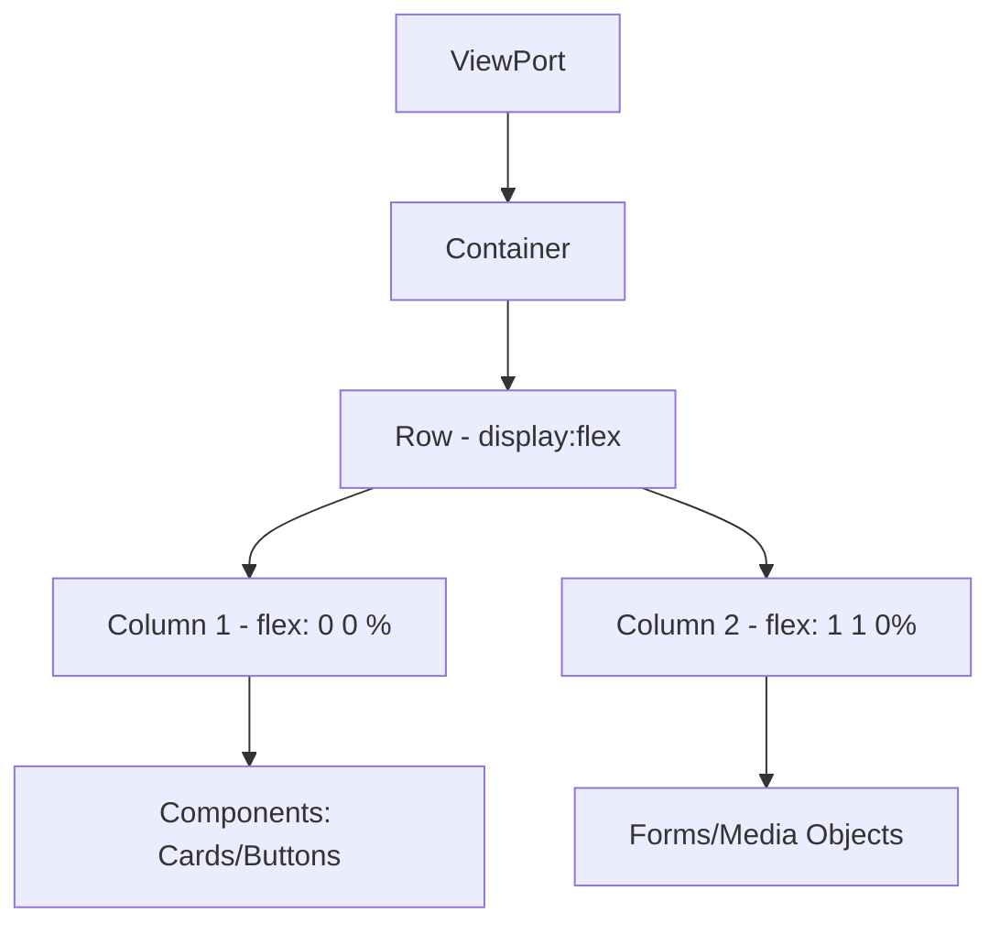

# css — css

# Module: css/bootstrap-flex.css

## Overview
The `bootstrap-flex.css` module is a comprehensive UI framework based on **Bootstrap v4.0.0-alpha.5**. Unlike standard Bootstrap 4 builds of that era, this specific module is compiled with **Flexbox enabled**, replacing traditional float-based layouts with a more robust flexible box model for the grid system and various components.

It serves as the foundational styling layer for the application, handling everything from CSS normalization (via Normalize.css v4.2.0) to complex UI components like Modals and Carousels.

---

## Architectural Layers

The module is structured into several functional layers that cascade from global resets to specific component styles:

### 1. Base & Normalization
*   **Normalization:** Incorporates `normalize.css` to ensure cross-browser consistency.
*   **Box Sizing:** Globally sets `box-sizing: border-box` to all elements, ensuring padding and borders do not affect element width.
*   **Typography:** Defines a native font stack for optimal performance:
    `-apple-system, BlinkMacSystemFont, "Segoe UI", Roboto, "Helvetica Neue", Arial, sans-serif`.

### 2. Flexbox Grid System
The grid is the core of this module. It uses a 12-column system driven by `display: flex`.

#### Breakpoints
The system responds to five specific tiers:
*   **Extra Small (xs):** Default (up to 575px)
*   **Small (sm):** `min-width: 576px`
*   **Medium (md):** `min-width: 768px`
*   **Large (lg):** `min-width: 992px`
*   **Extra Large (xl):** `min-width: 1200px`

#### Key Classes
*   `.container` & `.container-fluid`: Page-level wrappers.
*   `.row`: The flex container. Uses `flex-wrap: wrap`.
*   `.col-{tier}-{1-12}`: Fixed-width columns.
*   `.col-{tier}`: Auto-layout columns (`flex-grow: 1`) that expand to fill available space.
*   `.offset-{tier}-{0-11}`: Increases the left margin of a column.

### 3. Typography & Utilities
*   **Headings:** Standard `<h1>` through `<h6>` tags and matching `.h1` through `.h6` classes.
*   **Display Headings:** `.display-1` through `.display-4` for larger, more stylized titles.
*   **Alignment:** Support for `.text-left`, `.text-center`, and `.text-right`.
*   **Contextual Colors:** Utility classes for state: `.tag-primary`, `.tag-success`, `.tag-info`, `.tag-warning`, `.tag-danger`.

---

## Components

The module provides several pre-styled UI patterns. Major components include:

### Buttons (`.btn`)
Supports various styles and sizes:
*   **Themes:** `.btn-primary`, `.btn-secondary`, `.btn-success`, `.btn-danger`, etc.
*   **Outlines:** `.btn-outline-primary`, etc., which have no background until hovered.
*   **Sizing:** `.btn-lg` and `.btn-sm`.

### Forms (`.form-group`)
Provides styles for text inputs, checkboxes, and radio buttons.
*   **Validation States:** Uses classes like `.has-success`, `.has-warning`, and `.has-danger` on a parent element to style the `.form-control` and `.form-control-feedback`.
*   **Custom Controls:** `.custom-control`, `.custom-checkbox`, and `.custom-radio` provide cross-browser consistent inputs using SVG background images.

### Cards (`.card`)
A flexible content container that replaces the "Panels" and "Wells" of previous Bootstrap versions.
*   **Sub-components:** `.card-block`, `.card-header`, `.card-footer`, `.card-img-top`.
*   **Layouts:** `.card-deck` and `.card-group` use flexbox to align cards of equal height.

### Navigation (`.nav`, `.navbar`)
*   **Flex-based Nav:** `.nav-inline`, `.nav-tabs`, and `.nav-pills`.
*   **Navbar:** A complex header component utilizing `.navbar-toggleable-{tier}` classes to determine when the navigation should collapse into a mobile view.

---

## Technical Flow: Layout Rendering
When the browser parses this module, the layout is typically calculated as follows:

---

## Usage for Developers

### Contributing or Modifying
1.  **Flexbox Logic:** When adding new components, prioritize `display: flex` over `float`. The module provides internal utility classes like `.media`, which already uses flexbox for alignment (`.media-middle`, `.media-bottom`).
2.  **Specificities:** Beware of high specificity in validation states (e.g., `.has-success .form-control`).
3.  **Alpha Status:** As v4.0.0-alpha.5, certain classes (like `.tag` instead of `.badge` used in later versions) are specific to this build.

### Deployment
This is a comprehensive build. It includes `print` media queries at the top to optimize page appearance for physical printing (removing navbars, simplifying tables). It should be included as the first stylesheet in the `<head>` of the application.