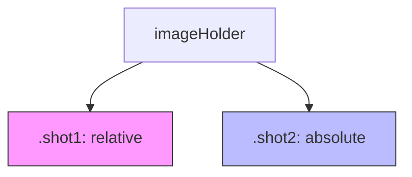

# css-new

# CSS-New Module Documentation

The `css-new` module provides the visual styling and layout definitions for the application's user interface. It implements a "Dark Purple" (synthwave-inspired) aesthetic, focusing on grid-based file exploration, navigation breadcrumbs, and specialized "labs" environments for interactive components.

## Core Visual Theme

The module uses a consistent color palette and transparency model to create depth:

*   **Primary Backgrounds**: `#2a0845` (Deep Purple), `#331053` (Dark Violet), and `#6441A5` (Glossy Purple).
*   **Translucency**: Frequent use of `rgba(255, 255, 255, 0.1)` for overlays and containers to create a "glass" effect.
*   **Accents**: Cyan (`#30ddba`) for hovers and linear gradients (`#e570e7` to `#79f1fc`) in lab environments.

---

## Component Breakdowns

### 1. File & Folder Grid (`index.css`)
The primary layout uses a responsive CSS Grid system to display assets.

*   **`#folderList`**: Implements a `repeat(auto-fill, minmax(200px, 1fr))` grid. This ensures the UI adapts to various screen widths while maintaining a minimum card size of 200px.
*   **`.card`**: The primary data container. 
    *   Uses `flex-direction: column` to push `.card-text` to the bottom.
    *   Contains an `.imageHolder` which manages layered images (`.shot1` and `.shot2`) for potential hover effects or overlays.
    *   **Hover State**: Updates the background to a faint red tint (`rgba(255, 0, 0, 0.1)`) and adds a `1px solid white` outline.

### 2. Navigation & Breadcrumbs (`index.css`, `list.css`)
The breadcrumb system provides spatial context and houses global search functionality.

*   **`#breadcrumb`**: A fixed-position header (`position: fixed`) with a high `z-index: 2` to remain visible during scrolling.
*   **Search Integration**:
    *   **`.search`**: A relative container inside the breadcrumb.
    *   **CSS-Only Icons**: Uses `.search-icon-circle` and `.search-icon-rectangle` to draw a magnifying glass without external image assets.
    *   **`#search-results`**: An absolute-positioned dropdown (`position: absolute; right: -60px`) that displays dynamic search matches with relevancy metadata.

### 3. Lab & Interactive Styling (`labs.css`)
Used for demonstration or experimental pages (e.g., Phaser game engine integrations).

*   **`#nav`**: Features a distinctive `linear-gradient(135deg, #e570e7 0%,#79f1fc 100%)` for navigation buttons.
*   **`#phaser-example > canvas`**: Specifically styles Phaser canvas elements with a heavy `20px` black box shadow to make the game viewport stand out from the dark background.
*   **`#feedback`**: A standardized form container for user input within experimental modules.

---

## Technical Layout Patterns

### Layered Image Rendering
The module supports a specific "two-shot" image pattern within cards:


*Purpose*: This allows `.shot2` to overlay `.shot1` perfectly, enabling transitions or badge overlays without shifting the document flow.

### Grid vs. List Views
The module provides two distinct layout modes for the same data:

| Feature | Grid View (`index.css`) | List View (`list.css`) |
| :--- | :--- | :--- |
| **Strategy** | `display: grid` | `float: left` |
| **Card Width** | Dynamic (`minmax 200px`) | Fixed `50%` |
| **Container** | `.container #folderList` | `.entry` |
| **Background** | `#2a0845` | `#6441A5` |

---

## Usage Guidelines for Developers

### Adding New Cards
When injecting cards via JavaScript, ensure the following structure is maintained to benefit from the existing styles:

```html
<div class="card">
    <div class="imageHolder">
        
    </div>
    <div class="card-text">
        <a href="...">Item Name</a>
    </div>
</div>
```

### Modifying the Search Dropdown
The `#search-results` container has a `max-height: 492px` and `overflow: auto`. If adding more complex metadata to search results, use the `.relevancy` or `.path` classes to ensure the text scales down to `12px` and matches the `#777777` muted color scheme.