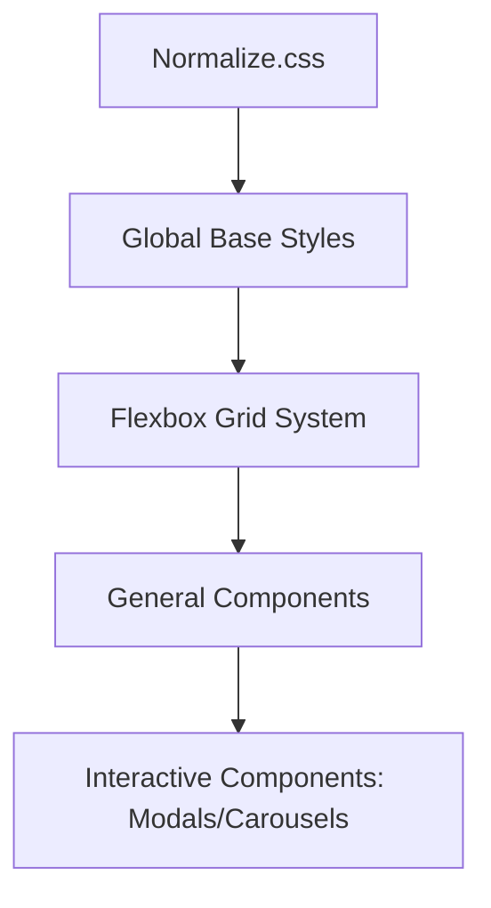

# css

# Module Group: css

The `css` module group provides the stylistic foundation and layout architecture for the application. It centralizes the visual design tokens, global resets, and the flexbox-based grid system used to build responsive user interfaces.

### Core Architecture
The group is anchored by a customized Bootstrap framework that prioritizes flexibility and modern layout techniques over legacy float-based designs. By consolidating resets and component styles here, the application ensures visual consistency across all pages and interactive elements.

### Key Functional Areas
*   **Foundation & Normalization:** Establishes a consistent baseline across different browsers by utilizing `Normalize.css` to eliminate cross-browser inconsistencies.
*   **Flexbox Layout Engine:** Replaces standard grid systems with a flexible box model, enabling more complex and reliable alignment for the application’s structural containers.
*   **UI Component Library:** Provides global styling for reusable interface elements, ranging from simple typography and buttons to complex interactive structures like Modals and Carousels.

### Sub-modules
| Module | Description |
| :--- | :--- |
| [bootstrap-flex.css](bootstrap-flex.css.md) | A Flexbox-enabled build of Bootstrap v4.0.0-alpha.5 that serves as the engine for global layouts and UI components. |

### Visual Layout Flow
The following diagram illustrates how the CSS layers within this module group build upon each other to create the final UI:

