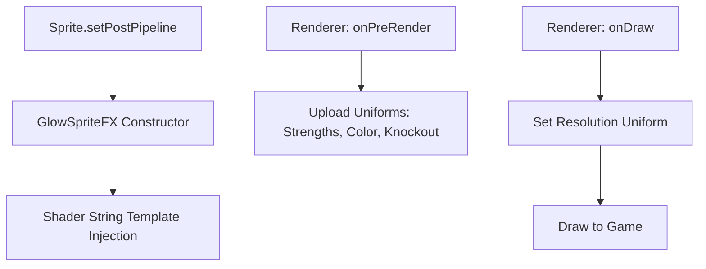

# fx

# GlowSpriteFX Module Documentation

The `GlowSpriteFX` module provides a WebGL post-processing pipeline designed to create "glow" effects—both internal and external—around Sprites. It is implemented as a `SpriteFXPipeline`, a specialized shader pipeline in Phaser 3 for applying effects to individual Game Objects.

## Overview

The effect works by sampling the alpha channel of the texture in a circular pattern around each pixel. It calculates the proximity of a pixel to the edge of the texture's opaque areas and applies a configurable `glowColor` based on that proximity.

### Key Features
- **Inner and Outer Glow**: Independent control over how much the glow bleeds inside or outside the sprite's edges.
- **Dynamic Color**: Support for real-time color changes via a hex property or RGBA array.
- **Knockout Mode**: A specialized mode that renders only the glow, effectively hiding the original sprite texture.
- **Static Quality Tuning**: Shader complexity is determined at instantiation, allowing for performance vs. visual fidelity trade-offs.

---

## Technical Architecture

`GlowSpriteFX` extends `Phaser.Renderer.WebGL.Pipelines.SpriteFXPipeline`. Unlike standard pipelines where uniforms are the primary means of configuration, `GlowSpriteFX` uses **Shader Template Injection** for its core performance parameters (`quality` and `distance`).

### Lifecycle & Execution Flow

---

## Class: GlowSpriteFX

### Constructor
`new GlowSpriteFX(game, quality, distance)`

| Parameter | Type | Default | Description |
| :--- | :--- | :--- | :--- |
| `game` | `Phaser.Game` | N/A | The Phaser Game instance. |
| `quality` | `number` | `0.1` | Controls the step size of the circular sampling. A higher value (e.g., 1.0) creates a smoother glow but is more GPU-intensive. |
| `distance` | `number` | `10` | The maximum distance (in pixels) the glow extends from the edge. This is baked into the shader loop. |

> **Note:** Because `quality` and `distance` are used to modify the fragment shader source code before compilation, they cannot be changed after the pipeline is created. Use the `strength` properties for runtime adjustments.

### Runtime Properties

The following properties can be modified at any time to update the effect:

*   **`outerStrength` (number)**: The intensity of the glow emanating outwards from the sprite's edge. Default is `4`.
*   **`innerStrength` (number)**: The intensity of the glow bleeding inwards from the sprite's edge. Default is `0`.
*   **`knockout` (boolean)**: If `true`, the original texture is not rendered; only the computed glow is visible. Useful for "ghost" or "outline-only" effects.
*   **`glowColor` (number[])**: An array of four floats `[r, g, b, a]` representing the glow color. Values are normalized between `0` and `1`.
*   **`color` (number)**: A getter/setter for the `glowColor`. It accepts/returns a 24-bit integer (e.g., `0xff0000` for red), automatically handling the conversion to the internal normalized array.

---

## Shader Logic

The fragment shader (`GLOW_FS`) performs two nested loops:
1.  **Angle Loop**: Iterates around the pixel based on the `SIZE` (derived from `quality`).
2.  **Distance Loop**: Integrated as `DIST`. Samples outwards to find the alpha density.

The "glow" is determined by the `alphaRatio`, which represents the sum of sampled alpha values divided by the maximum possible alpha for that distance.

### Uniforms
The pipeline automatically manages the following uniforms via `onPreRender` and `onDraw`:
- `uMainSampler`: The source texture.
- `outerStrength` / `innerStrength`: Multipliers for the calculated alpha ratio.
- `glowColor`: The RGBA vector for the glow.
- `resolution`: The dimensions of the target, used to calculate pixel-perfect offsets (`px`).
- `knockout`: Toggles the final mix logic.

---

## Performance Considerations

- **Texture Samples**: The number of texture samples per pixel is approximately `(2π / SIZE) * DIST`. 
    - High `distance` + High `quality` = High GPU cost.
- **Batching**: Like all SpriteFX pipelines, applying this to multiple sprites may break the renderer's batching if the pipeline settings (like `glowColor`) are unique to each sprite or if they are assigned as unique instances.
- **Resolution**: The shader calculates `px` based on the resolution uniform, ensuring the glow distance remains consistent regardless of the sprite's scale on screen.