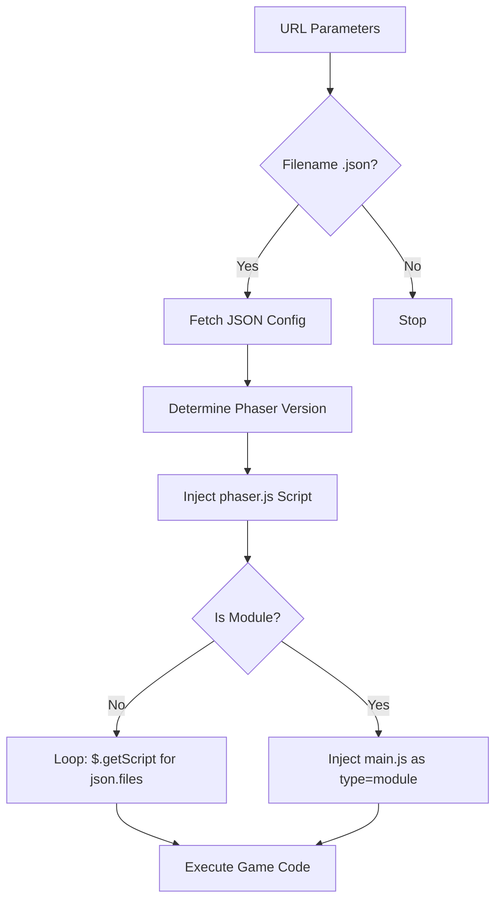

# js — js

# Phaser Labs: Core JS Infrastructure

This module constitutes the client-side infrastructure for the **Phaser Labs** example runner. It manages the environment setup, dynamic loading of Phaser framework versions, and provides the UI components necessary for both the site interface and real-time example manipulation.

## Core Components

### 1. Example Bootloader (`boot.js`)
The `boot.js` script is the entry point for running any Phaser example. It is responsible for environment detection, versioning, and the sequential loading of example scripts.

**Key Responsibilities:**
*   **Parameter Parsing:** Uses `getQueryString` to extract `src` (the example path), `v` (Phaser version), and `force` modes.
*   **Version Management:** Dynamically determines which Phaser build to load. It defaults to a `dev` build but can be overridden by a specific version string in the URL or the example's `.json` configuration.
*   **Dynamic Script Injection:**
    *   If the example configuration defines `module: true`, it injects `main.js` as an ES Module.
    *   Otherwise, it iterates through the `files` array defined in the example's JSON and uses `$.getScript` to load them sequentially to ensure dependency order.

### 2. UI Framework (`bootstrap.js`)
A customized bundle of **Bootstrap v4.0.0-alpha.5**. This provides the interactive elements for the gallery's wrapper (e.g., the code viewer, search results, and feedback forms).

**Main Components Integrated:**
*   **Modals:** Used for feedback forms and alert dialogs.
*   **Collapse/Tabs:** Used in the sidebar and code-toggle interfaces.
*   **Util:** A shared internal utility set for handling `transitionEnd` events and generating unique IDs (`getUID`).
*   **Requirements:** Requires **jQuery** (v1.9.1 to < v4) and **Tether** (for Tooltips/Popovers).

### 3. Real-time Controls (`datgui.js`)
The module includes the `dat.gui` library, which is the standard tool used within Phaser examples to provide a visual interface for tweaking variables.

**Structure:**
*   `dat.gui.GUI`: The main class used to create the control folders and rows.
*   **Controllers:** Includes specialized handlers for `Boolean`, `Color`, `Function`, `Number`, and `String` types.
*   **Color Math:** Internal utilities for converting between `RGB`, `HSV`, and `HEX` spaces during live updates.

---

## Execution Flow: Loading an Example

When a user navigates to an example URL, the following flow occurs within `boot.js`:



---

## Internal Utilities & API Patterns

### Query String Handling
The module relies on a global `getQueryString(key, default)` helper (defined in `getQueryString.js`) to determine the state of the runner.
*   `src`: The path to the example JSON.
*   `v`: Specific Phaser version (e.g., `3.55.2`).
*   `force`: Bypasses certain version checks.

### Bootstrap Component Initialization
Components follow the standard Bootstrap 4 jQuery interface. For example, to manually trigger a modal:
```javascript
$('.modal').modal('show');
```
Internal logic uses `Util.getSelectorFromElement` to bridge data attributes (like `data-target`) to functional programming logic.

### Sequential Loading Pattern
In `boot.js`, non-module examples are loaded using a recursive `loadScript` function to prevent race conditions:
```javascript
var loadScript = function () {
    var src = queue.shift();
    $.getScript(folder + src, function() {
        if (queue.length) { 
            loadScript(); 
        }
    });
};
```

---

## Development Notes

### Dependencies
*   **jQuery:** Essential for both `boot.js` and `bootstrap.js`.
*   **Tether:** Must be available in the global scope before `bootstrap.js` is parsed if Tooltips or Popovers are used.
*   **Build Directory:** The `boot.js` script expects Phaser builds to be located at `./build/` relative to the root, named as `{version}.js`.

### Environment Detection
`boot.js` checks `window.location.hostname`. If it detects `labs.phaser.io`, it assumes `remote` mode and adjusts how versions are fetched (potentially pulling from CDN rather than local `build/`).