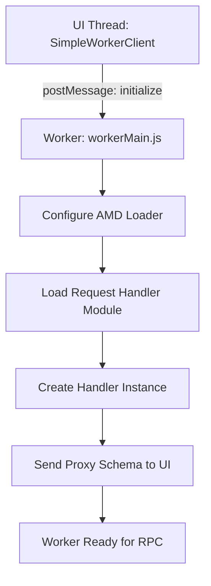

# js — vs

# VS Worker Infrastructure (`vs/base/worker/workerMain.js`)

## Overview
The `vs/base/worker/workerMain` module serves as the entry point and foundational orchestration layer for Web Workers within the VS Code/Monaco Editor ecosystem. It provides a specialized AMD (Asynchronous Module Definition) loader, a robust RPC (Remote Procedure Call) protocol for thread communication, and a suite of high-performance utilities for offloading heavy computations (like diffing, link detection, and JSON parsing) from the UI thread.

## Key Architectural Components

### 1. The Multi-Environment AMD Loader
The module includes a custom, lightweight AMD loader designed to operate across Web Workers, Node.js, and Electron environments.
- **`ModuleManager`**: Manages module resolution, dependency cycles, and factory execution.
- **`ScriptLoader`**: Dynamically switches loading strategies. In a Web Worker, it uses `importScripts()`; in Node.js, it uses `fs.readFile` and `vm.runInThisContext`.
- **`Configuration`**: Handles base URLs, path mappings, and environment-specific flags (e.g., `isBuild`).

### 2. SimpleWorker: The RPC Bridge
The `SimpleWorker` system provides a seamless way to call functions across thread boundaries using a proxy-based protocol.

- **`SimpleWorkerServer`**: Hosted inside the worker. It listens for messages, resolves the requested module, and executes methods on a "request handler" object.
- **`SimpleWorkerClient`**: Resides in the UI thread. It generates a "Proxy" object that looks like the worker-side class but returns `TPromise` for every method call.
- **Protocol**: Uses a JSON-based messaging format:
    - `req`: Request ID (sequence).
    - `method`: The function name to execute.
    - `args`: Arguments passed to the function.
    - `res` / `err`: The result or serializable error returned.

### 3. Core Text & Geometry Models
Since workers often process document changes, this module includes "mirror" versions of VS Code's geometric primitives:
- **`Position` & `Range`**: Basic structures for line/column coordinates.
- **`Selection`**: Extends `Range` with directionality (LTR/RTL).
- **`CharacterClassifier`**: A high-performance bit-masking utility used for rapid character identification during parsing.

## Execution Flow: Initialization



## Key Utilities & Patterns

### Asynchronous Orchestration
- **`TPromise` (WinJS Promise)**: The module uses a specialized promise implementation (based on WinJS) that supports **cancellation**.
- **`CancellationToken`**: Integrated throughout the worker logic to allow the UI thread to abort long-running worker tasks (e.g., a massive diff operation) immediately.
- **`Delayer` & `Throttler`**: Used to prevent the worker from being overwhelmed by rapid consecutive requests (like "type-to-search" or "on-change" validation).

### Text Analysis & Diffing
The module embeds heavy-duty algorithms intended to keep the UI responsive:
- **`LcsDiff`**: Implements the Longest Common Subsequence algorithm for calculating changes between text versions.
- **`DiffComputer`**: A wrapper around `LcsDiff` that optimizes for line-based and char-based changes.
- **`LinkComputer`**: A state-machine-based scanner for identifying IRIs/URIs within raw text.

### Error Handling
- **`transformErrorForSerialization`**: Errors in JavaScript cannot be natively passed through `postMessage`. This utility converts `Error` objects into a plain JSON format (preserving name, message, and stack) so they can be re-constituted as Error objects in the UI thread.

## Developer Usage

### Offloading a task to a Worker
When contributing to a worker-based feature (like a new language service), you typically don't edit `workerMain.js` directly. Instead, you create a worker class and register it via `SimpleWorkerClient`.

```javascript
// Inside your Worker-side module
export class MyWorker {
    static create() { return new MyWorker(); }
    
    doHeavyWork(data) {
        // This runs in the worker thread
        return performComputation(data);
    }
}
```

### Communication Constraints
1. **Serialization**: Only JSON-serializable data can be passed to worker methods. Functions or complex class instances (with methods) will be lost.
2. **Global Scope**: In the worker, `self` is the global object, not `window`. DOM APIs are unavailable.
3. **Paths**: Always use absolute paths or configured AMD aliases, as the worker's base URL may differ from the main page.

## Internal Module Dependencies
| Module | Responsibility |
| :--- | :--- |
| `vs/base/common/uri` | Standardized URI handling across threads. |
| `vs/base/common/lifecycle` | `Disposable` pattern to prevent memory leaks in long-lived workers. |
| `vs/editor/common/core/uint` | Math utilities for 32-bit unsigned integers (optimization). |
| `vs/base/common/functional` | Utilities like `once` and `not` for higher-order logic. |