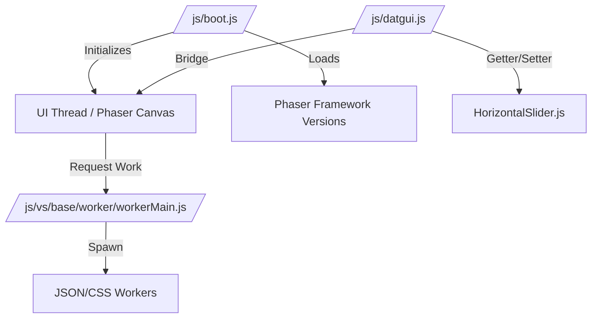

# js

# JS Infrastructure Module

The **js** module provides the foundational client-side architecture for the Phaser Labs environment. It integrates a high-performance code editing experience with a dynamic game engine execution layer, allowing for real-time development and manipulation of Phaser examples.

## Architecture & Synergy

The module is divided into two primary subsystems that work in tandem to create a seamless "sandbox" experience:

*   **The Execution Layer ([js/js](js-js.md)):** Managed by the Core JS Infrastructure, this layer handles the lifecycle of Phaser examples. It uses `boot.js` to resolve environment parameters, manage Phaser versioning, and bootstrap the game canvas.
*   **The Editor Layer ([js/vs](js-vs.md)):** Utilizes the Monaco/VS Code worker infrastructure to provide a rich IDE experience. It offloads language-specific computations (like JSON, CSS, and HTML parsing) to background threads via `workerMain.js`, ensuring the UI thread remains responsive for game rendering.

## Key Workflows

### 1. Example Bootstrapping
When an example is loaded, the system coordinates across modules:
1.  **Parameter Parsing:** `/js/boot.js` identifies the source code and required Phaser version.
2.  **Environment Setup:** The UI is initialized via `/js/bootstrap.js`, and search capabilities are enabled by `/js/phaserSearch.js`.
3.  **Execution:** The code is injected into the environment, and the `boot.js` sequentially loads dependencies to start the Phaser instance.

### 2. Live Interaction & Manipulation
The environment supports real-time state changes through a unified UI bridge:
*   **Property Control:** `/js/datgui.js` acts as an intermediary, mapping UI slider movements to internal state changes.
*   **State Sync:** Changes flow from UI components (like `HorizontalSlider.js`) through `datgui.js` setters (`setValue`/`getValue`) to update the running game logic instantly.

### 3. Background Processing
To maintain 60FPS game performance, the editor infrastructure offloads non-essential tasks:
*   **Worker Delegation:** High-latency tasks like code diffing or IntelliSense (provided by modules like `/js/language/json/jsonWorker.js`) are handled by the VS Worker Infrastructure.
*   **Thread Communication:** The custom AMD loader and RPC protocol in `/js/vs/base/worker/workerMain.js` facilitate data exchange between the editor's background workers and the primary Phaser execution thread.

## Component Map

| Component Category | Key Files | Purpose |
| :--- | :--- | :--- |
| **Example Runner** | `/js/boot.js` | Entry point, environment detection, and version loading. |
| **Worker Core** | `/js/vs/base/worker/workerMain.js` | Orchestrator for background task threading and RPC. |
| **UI Interaction** | `/js/datgui.js`, `/js/phaserSearch.js` | Real-time manipulation and navigation tools. |
| **Language Services**| `/js/language/` (JSON, CSS, HTML) | Background modules for code syntax and validation. |

