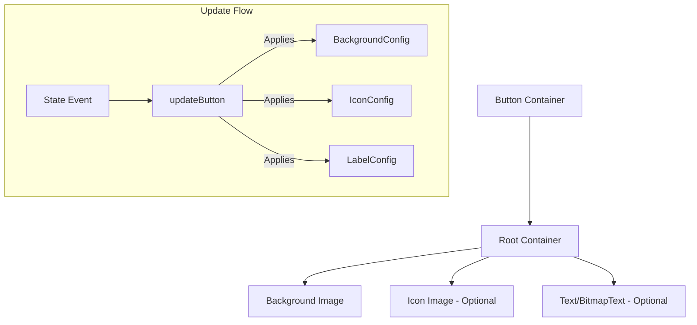
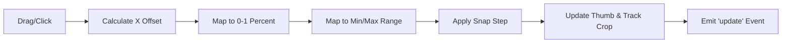

# libs

# UI Library Module

The `libs/ui` module provides a set of high-level, state-aware UI components built on top of the Phaser 3 Container class. These components are designed to decouple visual state configuration (frames, tints, sounds) from game logic.

## Button

The `Button` class is a comprehensive interactive component that manages visual and auditory feedback across five distinct states.

### State Management
A button exists in one of five states, defined by constants:
- `OUT` (0): Default idle state.
- `OVER` (1): Pointer is hovering over the button.
- `DOWN` (2): Pointer is actively pressing the button.
- `UP` (3): Pointer was released while over the button.
- `DISABLED` (4): Button is non-interactive and displays "disabled" visuals.

Each state can independently override the background frame, icon frame, text label properties, and sound effects.

### Visual Hierarchy
The Button is a `Phaser.GameObjects.Container` containing a `this.root` container, which organizes three primary layers:
1.  **Background (`this.button`)**: An `Image` representing the button body.
2.  **Icon (`this.icon`)**: An optional `Image` centered or offset relative to the background.
3.  **Label (`this.label`)**: An optional `Text` or `BitmapText` object.



### Usage Pattern
The configuration object allows for deep nesting or simple string shorthand. If a state (like `over` or `down`) is passed a string, it is interpreted as the `frame` key for the background.

```javascript
const btn = new Button({
    scene: this,
    texture: 'atlas',
    out: 'btn_blue_up',
    over: 'btn_blue_hover',
    down: 'btn_blue_down',
    label: {
        text: 'PLAY',
        font: 'mainFont',
        size: 24
    }
});
```

### Key Methods
- `setDisabled(value)`: Toggles interactivity. When disabled, it automatically switches to the `DISABLED` state visuals and stops event listeners.
- `setLabel(text, state)`: Updates the text. If `state` is null, it updates the text across all defined states.
- `setSound(state, key, config, marker)`: Dynamically assigns sound effects to specific state transitions.
- `setButtonTint/setIconTint/setLabelTint`: WebGL-only feature to apply multi-corner tints to specific components of the button.

---

## HorizontalSlider

The `HorizontalSlider` provides a draggable input for selecting values within a range. It uses a dual-track system (Empty and Full) to visualize progress via cropping.

### Components
- **Track**: Consists of `trackEmpty` (bottom layer) and `trackFull` (top layer). `trackFull` is dynamically cropped using a `Phaser.Geom.Rectangle` based on the slider's percentage.
- **Slider (Thumb)**: The interactive handle. Can be an `Image` or a hidden `Rectangle` if the user intends to handle the thumb visuals differently.
- **Notches**: An optional static `Image` layer often used for scale markings.

### Coordinate Mapping
The slider internally manages three types of values:
1.  **Current**: The actual value between `min` and `max`.
2.  **Percent**: A 0.0 to 1.0 representation of the value.
3.  **Position**: The pixel X-coordinate of the thumb, clamped between `sliderLeft` and `sliderRight`.

### Interaction Modes
1.  **Dragging**: The user can click and drag the `slider` thumb.
2.  **Track Jump**: If `track.enableJump` is true, clicking anywhere on the track moves the slider to that position. This movement can be instant or animated via `jumpDuration` and `jumpEase`.

### Internal Value Flow


### Key Methods
- `setSlider(percent, duration, ease)`: Sets the slider position based on a 0-1 value, with optional tweening.
- `setSliderByValue(value, duration, ease)`: Sets the slider position based on the defined `min`/`max` range.
- `getValue()`: Returns the current percentage (0-1).
- `getCurrentValue()`: Returns the actual value within the range.

---

## Core Utilities (Internal)

The module utilizes several internal helper functions for configuration parsing:
- `GetTint`: Handles various tint formats (Single hex, array of 2, or array of 4 for corners).
- `SetTransform`: Applies `offsetX`, `offsetY`, `scale`, and `angle` from a config object to a target state object.
- `SetSound`: Merges `defaultSound` with provided `SoundConfig` and `SoundMarker` data.
- `GetValue`: A safely typed property extractor used to prevent null pointer exceptions when parsing complex config objects.