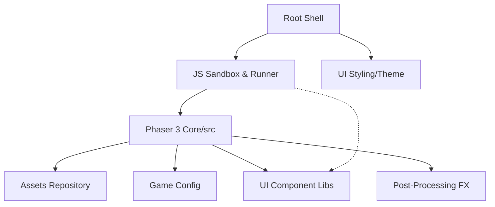

# phaserjs-example-GitNexus — Wiki

# Welcome to the Phaser 3 Labs Repository

Welcome to the central documentation for the **Phaser 3 Labs** ecosystem. This project serves as the high-performance orchestration layer and delivery system for thousands of Phaser 3 examples. It provides a specialized environment where developers can browse, edit, and execute code samples in real-time across various hardware and platform constraints.

## System Architecture

The repository is built on a "Shell" architecture. The [Root](root-module.md) orchestrates the entire experience, managing the transition between the browsing interface and the active execution environment. The visual identity of this shell is defined by the [CSS Infrastructure](css-module.md) and the newer [Dark Purple/Synthwave theme](css-new-module.md), which provides a grid-based navigation system for exploring labs.

At a high level, the system is split between the **Infrastructure** (the editor and runner), the **Engine** (the Phaser 3 core), and the **Resources** (assets and components).

## Core Modules

### The Infrastructure Layer
The engine execution is driven by the [JS Infrastructure](js-module.md), which implements a high-performance code editor and a dynamic execution layer. This allows for real-time manipulation of examples, where scripts are injected into specialized runner environments managed by the shell.

### The Engine Core
The heart of the project is the [src](src-module.md) module, which contains the Phaser 3 engine itself. It manages the full lifecycle of a game—from the [Renderer](src-renderer.md) and [Scale Manager](src-scalemanager.md) to [Physics simulations](src-physics.md) and [Scene management](src-scenes.md).

### Components & Visuals
To streamline development, the project includes custom high-level components:
*   **[libs/ui](libs-module.md)**: A state-aware UI library providing complex components like the `Button` class, which handles visual and auditory feedback independently of game logic.
*   **[fx](fx-module.md)**: Specialized WebGL effects, such as the `GlowSpriteFX` pipeline, used for real-time post-processing.
*   **[assets](assets-module.md)**: A comprehensive data repository that transforms raw content (textures, audio, and WASM binaries like Physics engines) into engine-ready formats.

## Key Developer Flows

1.  **Sandbox Execution**: When a user selects an example, the [JS Infrastructure](js-module.md) fetches the source, configures the [Game Environment](src-game-config.md), and triggers the [Loader](src-loader.md) to pull optimized binaries from the [assets](assets-module.md) module.
2.  **UI Interaction**: High-level components in [libs](libs-module.md) frequently interact with the [src game objects](src-game-objects.md) and [audio systems](src-audio.md) to provide a consistent feedback loop (e.g., buttons triggering state changes and sound effects).
3.  **Simulation & Logic**: The system relies on a heavy interplay between [src physics](src-physics.md) and [game objects](src-game-objects.md), often referencing [asset manifests](assets-module.md) to initialize complex entities like Spine animations or tilemaps.

## Getting Started

To begin working with the labs:
1.  Navigate to the [Root](root-module.md) to understand the delivery infrastructure.
2.  Explore the [JS Infrastructure](js-module.md) to see how the code runner operates.
3.  Consult the [src](src-module.md) documentation for deep dives into specific engine systems like Physics, Input, or Rendering.