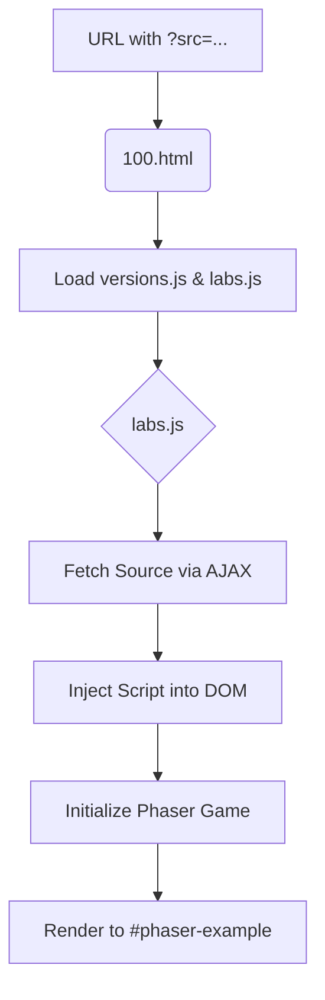

# Root — 100.html

# Documentation: 100.html

## Overview

`100.html` serves as a baseline, full-window runner for Phaser 3 examples within the Labs environment. Use this module when you need a clean, edge-to-edge container for rendering game instances without the surrounding Labs UI chrome (navigation, code editors, or sidebars).

It is designed to be lightweight, providing the necessary DOM structure and global scripts to initialize a Phaser game instance via `labs.js`.

---

## Core Components

### 1. DOM Structure
The document contains a single functional entry point:

- `<div id="phaser-example"></div>`: This is the target container for the Phaser `Game` instance. Most Phaser configurations in this environment use the `parent` property set to `'phaser-example'`.

### 2. Styling
The module applies "100%" (full-viewport) styling to ensure the canvas can occupy the entire screen:
- **Viewport:** Set to `width=device-width` with a `shrink-to-fit=no` meta tag to prevent mobile scaling issues.
- **CSS:** Resets margins and sets `body`/`html` to `100vw` and `100vh`.
- **Canvas Default:** Forces a black background (`#000000`) for the `<canvas>` element to prevent flickering before Phaser's internal background color is applied.

---

## Script Dependencies

The module loads a specific sequence of scripts required to bootstrap an example:

| Script | Purpose |
| :--- | :--- |
| `versions.js` | Manages and injects the specific version of the Phaser library being tested. |
| `getQueryString.js` | Utility script to parse the URL parameters (used to identify which source file to load). |
| `jquery-3.1.1.min.js` | Used by `labs.js` for DOM manipulation and AJAX source fetching. |
| `labs.js` | **The Orchestrator.** This script reads the query string, fetches the corresponding `.js` example code, and executes it within the context of this page. |

---

## Execution Flow

While `100.html` contains no internal JavaScript logic, it triggers the following lifecycle:

1.  **Environment Setup**: The browser loads CSS and the global dependencies (`versions.js`, `jquery`).
2.  **State Initialization**: `getQueryString.js` populates global parameter objects.
3.  **Source Injection**: `labs.js` executes, identifying the `src` parameter from the URL.
4.  **Game Boot**: The fetched example script is injected into the document. It targets `<div id="phaser-example">` to mount the Phaser Canvas.



## Usage for Developers

To run an example using this module, navigate to the file via the Labs server and provide the source path in the query string:

```text
http://localhost:8080/100.html?src=src/physics/arcade/gravity.js
```

**Note:** If you are debugging layout issues, ensure the code in your example script does not conflict with the `100vw/100vh` constraints defined in this module's `<style>` block.