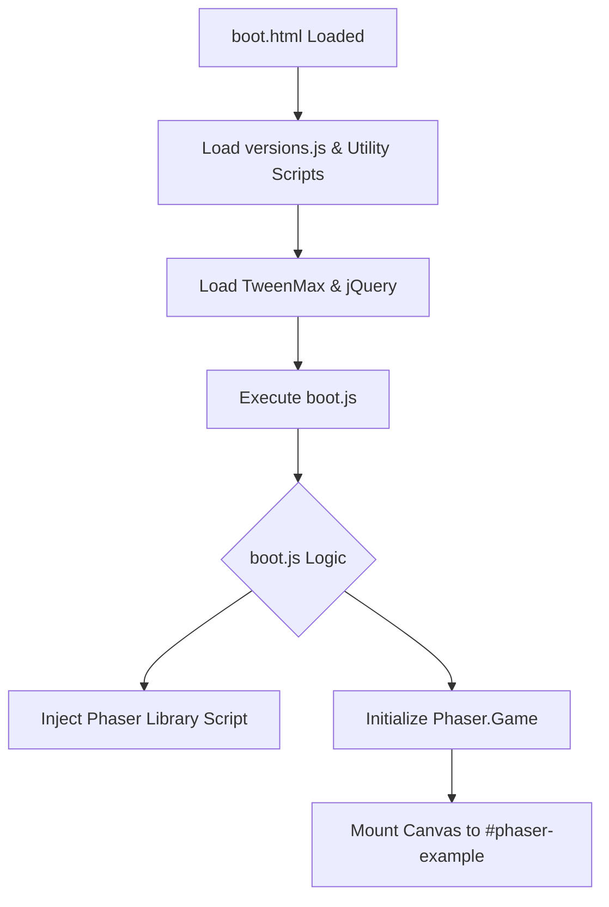

# Root — boot.html

# Module: Root — boot.html

The `boot.html` file serves as the primary entry point and host environment for the Phaser 3 Game Runner. It is a lightweight HTML5 wrapper designed to initialize the DOM, load essential dependencies, and provide a mounting point for the Phaser game canvas.

## Purpose

This module acts as the "loader" for the development and preview environment. Its main responsibilities include:
1.  **Environment Setup**: Defining the viewport and basic styles to ensure the game renders correctly on various devices.
2.  **Dependency Management**: Loading core libraries (Phaser versioning, GSAP, jQuery) required before the game engine starts.
3.  **DOM Provisioning**: Creating the `#phaser-example` container where the Phaser `Game` instance will be injected.

## Key Components

### DOM Elements
-   **`#phaser-example`**: The target div. Phaser is typically configured to use this ID as its parent container in the `GameConfig`.
-   **`#loading`**: A simple fallback element displayed to the user while script assets are being fetched.

### External Dependencies
The file loads several scripts in a specific order to ensure variable availability:

| Script | Purpose |
| :--- | :--- |
| `versions.js` | Manages and injects information regarding the specific Phaser builds available for testing. |
| `getQueryString.js` | Utility script for parsing URL parameters, likely used to determine which example or Phaser version to load. |
| `jquery-3.1.1.min.js` | Used for general-purpose DOM manipulation and event handling within the runner UI. |
| `TweenMax.min.js` | The GSAP engine, often used for out-of-engine UI animations or as a fallback for complex motion. |
| `boot.js` | **The Entry Logic.** This script consumes the data from the previous utilities to dynamically load the Phaser library and start the game engine. |

## Execution Flow

The browser processes `boot.html` linearly. Because these scripts are included in the `<head>` without `async` or `defer` tags, the browser maintains a strict execution order.



## Styling and Layout
The module uses a minimal CSS block to ensure the game takes up the necessary space without browser-default interferes:
```css
body {
    margin: 0;
}
```
This ensures that the Phaser canvas, set to any specific width/height or "Scale Manager" mode, is aligned flush with the top-left of the viewport.

## How to use/modify
-   **Adding Plugins**: To add a global plugin (like a physics debugger or UI library) that needs to be available before the game starts, add a `<script>` tag before `boot.js`.
-   **Changing Containers**: If you rename the `#phaser-example` ID, you must update the corresponding reference in the `GameConfig` located within the runner's initialization logic (usually found in `boot.js` or the specific example source).