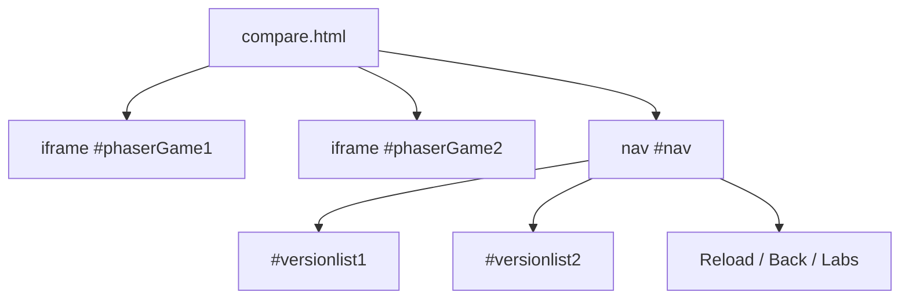

# Root — compare.html

# Phaser 3 Comparison Tool (`compare.html`)

The `compare.html` module provides a side-by-side environment designed for regression testing and visual comparison of Phaser 3 examples across different engine versions. It allows developers to simultaneously run two instances of the same code logic, each linked to a different Phaser build, to identify bugs or performance changes.

## Overview

The page functions as a "Split View" container. It utilizes two `<iframe>` elements to isolate the execution context of each Phaser instance, preventing global namespace collisions between different versions of the engine.

### Key Layout Components

*   **Game Viewports:** Two 800x600 iframes (`#phaserGame1` and `#phaserGame2`) positioned side-by-side.
*   **Version Labels:** Text headers (`#label1`, `#label2`) that identify which build is currently running in each iframe.
*   **Navigation Bar (`#nav`):** A controls footer that includes:
    *   Action links for reloading, navigating back, or viewing the source.
    *   **Version Selectors:** Dynamic dropdowns or spans (`#versionlist1`, `#versionlist2`) used to swap Phaser builds on the fly.

## Technical Architecture

The module acts as a shell that coordinates several scripts to manage its state.

### DOM Structure

### Dependencies
The module relies on the following external resources:
*   **`js/versions.js`**: Provides the list of available Phaser builds (e.g., `3.50.0`, `3.60.0-beta`).
*   **`js/getQueryString.js`**: Parses URL parameters to determine which file and versions to load initially.
*   **`js/labs-compare.js`**: The primary controller. This script populates the version lists, handles iframe source injection, and manages the UI state.
*   **`js/jquery-3.5.1.min.js`**: Used by the controller script for DOM manipulation and event handling.

## Execution Flow

While `compare.html` is a static structure, it orchestrates the following flow upon being loaded:

1.  **Initialization**: The browser parses the CSS and initializes the iframes as empty containers.
2.  **Parameter Extraction**: `getQueryString.js` reads the URL (e.g., `compare.html?src=src\path\to\example.js&v1=3.55.2&v2=dev`).
3.  **Controller Bootstrapping**: `labs-compare.js` uses the extracted parameters to:
    *   Update the text in `#label1` and `#label2`.
    *   Set the `src` attribute of each iframe to a specialized loader path that bundles the requested version with the example code.
    *   Populate the `#versionlist` elements with available choices from `versions.js`.
4.  **Ready State**: Once the internal scripts within the iframes have loaded the engine builds, the `#loading` paragraph is hidden, and both games begin rendering.

## Styling and Layout
The module uses `css/labs.css` for general aesthetics, but overrides specific styles for the comparison layout:
*   The game containers are fixed at 800x600 to ensure a consistent comparison area.
*   An invisible input `#clippy` is included, typically used by the controller to copy-to-clipboard the current comparison URL for sharing.
*   The system includes a hook for Spector.js (`#phaser-spectorjs`) to facilitate WebGL debugging and frame analysis inside the iframes.

## Usage for Developers

To use this tool, navigate to the URL with appropriate query parameters:
*   `f`: The path to the JavaScript example file.
*   `v1`: The first version string.
*   `v2`: The second version string.

The labels and version lists will automatically synchronize with the active selection, allowing for rapid toggling between builds to pin down engine regressions.