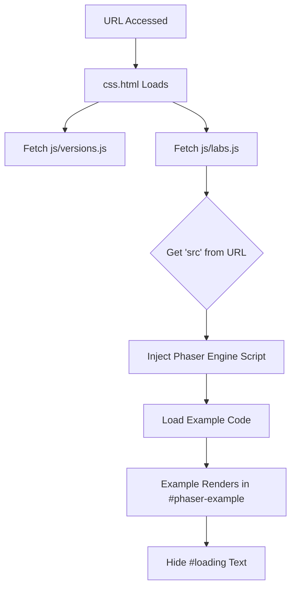

# Root — css.html

# Module Documentation: `css.html`

The `css.html` file serves as a **host environment** (or "shell") for running Phaser 3 examples within the Phaser 3 Labs ecosystem. It provides the necessary DOM structure, global styles, and script dependencies required to load, render, and interact with individual code examples.

## Overview

Unlike a standard standalone index file, `css.html` is designed to be dynamic. It sets up a persistent UI (navigation, loading states) and relies on the `labs.js` controller to inject and execute Phaser scripts based on URL parameters. It is specifically configured to prioritize a flexible, CSS-based layout for the game canvas.

## Key Components

### 1. The Game Container
*   **`<div id="phaser-example"></div>`**: This is the primary injection point. Most Phaser 3 examples are configured to look for this ID to append the game canvas.
*   **Canvas Styling**: The internal `<style>` block ensures the game canvas scales to fill the viewport while maintaining its aspect ratio:
    ```css
    canvas {
        width: 100%;
        height: 100%;
        object-fit: contain;
    }
    ```

### 2. UI & Navigation (`#nav`)
The bottom navigation bar provides developer tooling for the current example:
| Link ID | Purpose |
| :--- | :--- |
| `backlink` | Returns the user to the example browser/folder view. |
| `editlink` | Likely opens the current example in an online editor (e.g., Sandbox). |
| `iframelink` | Generates a direct link to the iframe-only view. |
| `viewlink` | Switches to the viewing mode. |
| `sourcelink` | Links directly to the source code of the specific example. |

### 3. Loading State
*   **`<p id="loading">`**: A simple text indicator shown while the build of Phaser (defined in `versions.js`) is being fetched and initialized.

## Technical Dependencies

The module aggregates several critical libraries and local utilities:

*   **`js/versions.js`**: Managed versioning of the Phaser engine (allows switching between Stable, Dev, and Beta builds).
*   **`js/getQueryString.js`**: Utility for parsing the URL (e.g., `?src=src\actions\place.js`) to determine which example to load.
*   **`js/labs.js`**: The **core orchestrator**. It reads the query strings, loads the requested script, and hides the `#loading` text once the Phaser instance is ready.
*   **`js/datgui.js` & `js/TweenMax.min.js`**: Global inclusions of standard tools used across many Phaser examples for debugging UI and complex animations.
*   **`js/jquery-3.1.1.min.js`**: Used primarily by the `labs.js` logic for DOM manipulation and event handling safely across browsers.

## Execution Flow

The following diagram illustrates how `css.html` transitions from a static file to a running example:



## Integration Notes for Developers

### Adding New Scripts
If an example requires a specific library not included here, it is generally injected dynamically by `labs.js` or included within the example file itself. `css.html` is reserved for **global utilities** shared by the majority of the suite.

### Responsive Design
The `object-fit: contain` property on the canvas is critical. It allows the game to scale up or down to fit the browser window without distorting the internal game resolution defined in the Phaser `GameConfig`.

### Query Parameters
The behavior of this page is dictated by the `labs.js` interpretation of the URL. Typically:
- `?src=path/to/script.js` : Loads the specific Phaser code.
- `?v=3.xx.x` : Forces a specific Phaser version (handled by `versions.js`).