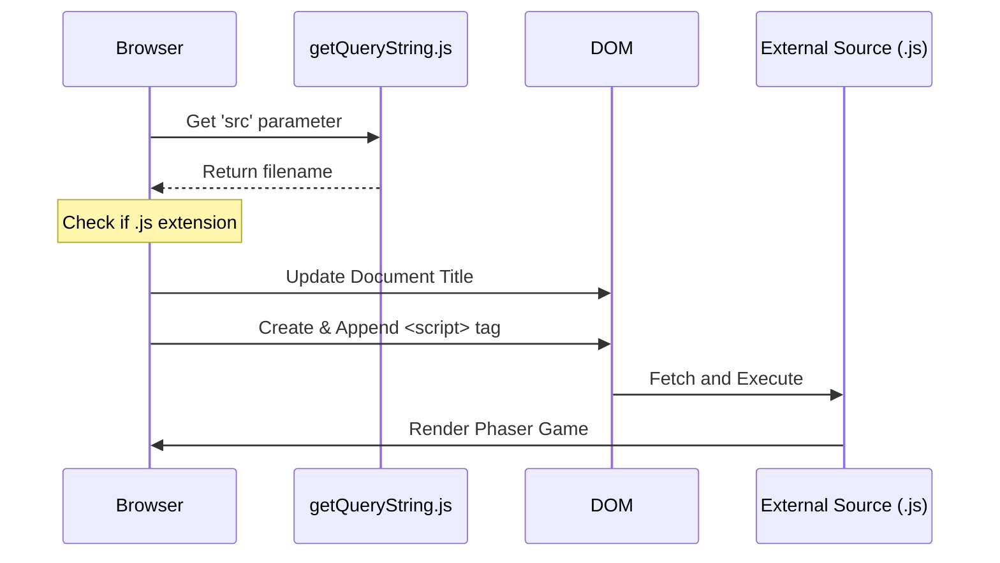

# Root — debug.html

# `debug.html` — Local Development Runner

The `debug.html` file serves as a lightweight, browser-based test runner and sandbox for the Phaser 3 development environment. It is designed to load specific JavaScript source files dynamically via URL parameters, providing a consistent environment for debugging examples or core engine features.

## Purpose

The primary role of this module is to provide a "blank canvas" that:
1.  Bootstraps the internal Phaser development build (`dev.js`).
2.  Provides debugging UI elements (input fields) for real-time variable monitoring.
3.  Injects external JavaScript files dynamically based on query strings.
4.  Implements a throttled logging system to prevent browser hangs during high-frequency execution (e.g., inside an `update` loop).

## Core Mechanisms

### Dynamic Script Injection
The runner identifies the target logic to execute by parsing the `src` query parameter.

*   **Logic Location**: Inside the `$(document).ready()` block.
*   **Process**:
    1.  Calls `getQueryString('src')` to extract the file path.
    2.  Validates that the file ends in `.js`.
    3.  Updates the `document.title` for easier tab identification.
    4.  Appends a new `<script>` tag to the `<body>`, triggering the loading and execution of the target file.

**Example Usage:**
`http://localhost:8080/debug.html?src=examples/sprite/move.js`

### Throttled Logging (`window.log`)
To prevent the console from being flooded—which can cause significant performance degradation in game development—this module overrides standard logging behavior with a global `window.log` function.

```javascript
window.logIndex = 0;
window.logLimit = 300;

window.log = function () {
    if (window.logIndex < window.logLimit) {
        window.logIndex++;
        console.log.apply(this, arguments);
    }
}
```
Developers should use `log()` instead of `console.log()` for values tracked inside the game loop to ensure the console stops recording once the `logLimit` is reached.

### Debug Input Fields (`v1` - `v6`)
The HTML contains six text inputs with IDs `v1` through `v6`. These are intended for "Live Monitoring." Instead of logging every frame, a developer can assign values to these inputs directly from their test script:

```javascript
// Example usage in a test file
document.getElementById('v1').value = player.x;
document.getElementById('v2').value = player.y;
```

## Dependencies

The module loads several critical assets required for the Phaser environment:

| Script | Purpose |
| :--- | :--- |
| `getQueryString.js` | Helper utility to parse URL parameters. |
| `jquery-3.1.1.min.js` | Used for DOM ready state and basic manipulation. |
| `build/dev.js` | The main Phaser 3 library build. |
| `TweenMax.min.js` | GSAP library, often used for external animation testing alongside Phaser. |

## Execution Flow

The following diagram illustrates how `debug.html` initializes the environment:



## Styling and Layout
*   **`#phaser-example`**: This `div` is the intended parent container for the Phaser Game instance. Most test scripts are authored to look for this specific ID when initializing the `Phaser.Game` config.
*   **CSS**: Minimalist styling; removes body margins to ensure game canvas alignment is predictable.