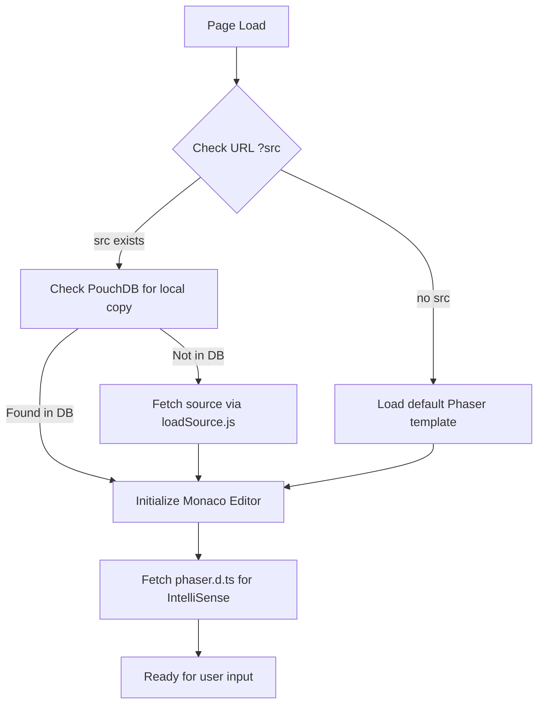

# Root — edit.html

# Root — edit.html

The `edit.html` module provides a browser-based Integrated Development Environment (IDE) specifically designed for Phaser 3 development. It features a side-by-side view with a code editor using the Monaco engine (the core of VS Code) and a live-preview iframe.

## Component Overview

The application splits the viewport into three functional areas:
1.  **Toolbar/Navbar**: Controls for launching, running, saving, and downloading code.
2.  **Monaco Editor (`#editor`)**: Left-pane code editor with Phaser 3 syntax highlighting and IntelliSense.
3.  **Sandbox Iframe (`#sandboxed`)**: Right-pane environment (`frame.html`) that executes the code.

## Execution Flow

The module follows a specific initialization sequence to ensure the editor is populated with the correct source before the user begins interaction.



## Key Dependencies

The module relies on several external utilities and libraries:
*   **Monaco Editor**: Loaded via `loader.js`. Handles the code interface.
*   **PouchDB**: For local client-side storage of work-in-progress scripts.
*   **fileSaver.js**: Enables the "Download" functionality.
*   **loadSource.js**: Logic for fetching example source files from the server.
*   **getQueryString.js**: Parser for `src` and `v` (version) parameters.

## Core Functionality

### 1. Editor Initialization (`loadEditor`)
The `loadEditor(source, filename)` function initializes the Monaco editor. A significant feature here is the dynamic loading of TypeScript definitions for Phaser:

```javascript
// Provides autocompletion and type checking for Phaser 3
fetch('https://raw.githubusercontent.com/photonstorm/phaser/master/types/phaser.d.ts')
    .then(response => response.text())
    .then(text => {
        monaco.languages.typescript.javascriptDefaults.addExtraLib(text, 'ts:/public/definitions/phaser.d.ts');
    });
```

### 2. Sandbox Communication
The editor communicates with the live preview (`#sandboxed`) using the `window.postMessage` API. This avoids page refreshes when updating the running game.

*   **Running Code**: When the "Run" button is clicked, a `'reload'` message is sent to the iframe.
*   **Providing Source**: The iframe (frame.html) sends a `'getCode'` request back to `edit.html`. The editor responds by sending the current code block as a string.

### 3. Persistence (PouchDB)
The module uses a local database named `phaser3-examples`. 
- **Loading**: On document ready, the app checks the DB for a record matching the `src` filename. If found, it loads that version instead of the server file.
- **Saving**: The `save.onclick` handler creates or updates a document containing the code array and a version increment.

### 4. External Launching
The `launch.onclick` handler opens `view.html` in a new window. It passes the current `src` and `phaserVersion` via query parameters, allowing the user to view the result in a clean, full-screen environment separate from the editor.

## UI Controls

| Element | ID | Description |
| :--- | :--- | :--- |
| **Launch** | `launch` | Opens the current example in `view.html`. |
| **Run Code** | `run` | Signals the sandbox iframe to reload and re-fetch the latest code from the editor. |
| **Save** | `save` | Commits changes to the local PouchDB instance. |
| **Download** | `download` | Triggers a file download of the editor contents using `fileSaver.js`. |
| **Filename** | `filename` | Input field to specify the name of the file being downloaded. |

## Developer Notes

-   **Iframe Origin**: The iframe points to `frame.html`. Ensure `frame.html` is configured to handle the `message` event listener to receive code updates.
-   **Layout**: The `editor.layout()` call is attached to `window.onresize` to ensure the Monaco editor scales correctly when the browser window is resized.
-   **Version Management**: The global `phaserVersion` variable is derived from the `versions.js` configuration and determines which Phaser engine build is used in the sandbox.