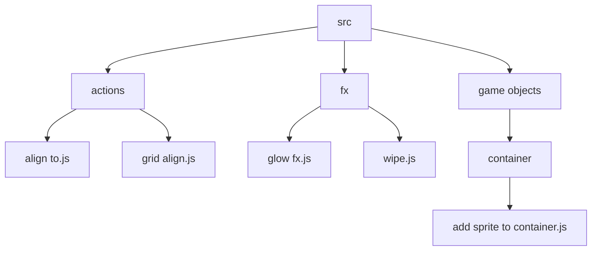

# Root — examples.json

# Root — examples.json

The `examples.json` file serves as a hierarchical manifest and directory index for the project's example library. It is a structured data representation of the file system, typically used by a front-end "Example Browser" or "Lab" to facilitate navigation, searching, and identification of code samples without requiring direct server-side file system access at runtime.

## Schema Overview

The file follows a recursive tree structure where each node represents either a directory or a specific JavaScript example file.

### Node Properties

| Property | Type | Description |
| :--- | :--- | :--- |
| `path` | `string` | The relative path from the root directory to the resource. |
| `name` | `string` | The display name for the directory or file. |
| `children` | `array` | (Directories only) A collection of child nodes. |
| `birthtimeMs` | `number` | The timestamp (in milliseconds) of when the file was created. |

## Structural Organization

The module is categorized by functional domains. This allows developers to find specific implementation patterns by navigating the relevant sub-folder.

### Core Categories
The root `./src/` directory contains several key sub-directories:

*   **`actions`**: Helper functions for manipulating groups of objects (aligning, rotating, spreading).
*   **`animation`**: Demonstrations of the animation manager, including Aseprite integration and timeline events.
*   **`audio`**: Implementations for Web Audio and HTML5 Audio, including spatial audio and audio sprites.
*   **`camera`**: Advanced camera logic like multi-camera setups, shaders, and follow behaviors.
*   **`fx`**: Visual post-processing effects (Blur, Bloom, Displacement, Glow, etc.).
*   **`game objects`**: Detailed implementations of specific object types like `Blitter`, `Container`, `BitmapText`, and `Sprite`.
*   **`bugs`**: A dedicated repository of regression tests and specific issue reproductions, often named by GitHub issue ID (e.g., `6812 timeline.js`).

### Metadata: birthtimeMs
The inclusion of `birthtimeMs` is critical for the example runner's "New" or "Recently Updated" filtering logic. By comparing the `birthtimeMs` against a threshold, the UI can programmatically highlight new features added to the codebase.

## Directory Flow

The following diagram illustrates the typical traversal path a developer or automated tool takes when interacting with this module.

## Developer Usage

### Search and Indexing
For developers building search tools, the `path` and `name` properties should be indexed. Because the structure is nested, a recursive search function is required to flatten the tree for global search functionality.

### Adding New Examples
When adding a new example to the codebase, this JSON file must be regenerated. It is likely produced by a build script or CLI tool that scans the `src` directory and outputs this manifest to ensure the UI remains in sync with the physical file system.

### Handling Truncation or Depth
The structure supports deep nesting (e.g., `src\game objects\bitmaptext\static\...`). Developers should ensure their UI components can handle varying depths of recursion when rendering tree-view menus based on this data.