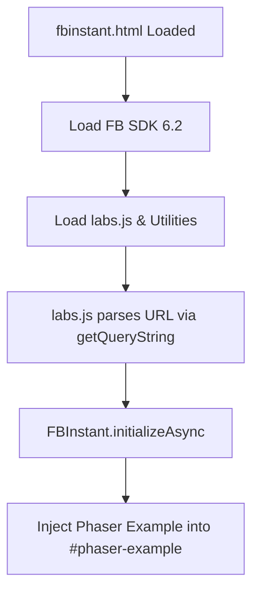

# Root — fbinstant.html

# Module Documentation: Root — fbinstant.html

## Overview
The `fbinstant.html` file serves as the specialized entry point and host environment for running Phaser 3 examples within the **Facebook Instant Games (FBIG)** framework. It provides the necessary DOM structure and script dependencies required to initialize the Facebook Instant Games SDK (version 6.2) alongside the Phaser 3 engine and various development "Lab" utilities.

## Purpose
This module is designed to:
1.  **Initialize the FBIG Environment**: Loads the official Facebook Instant Games SDK.
2.  **Provide a Sandbox**: Sets up the "Labs" environment (Phaser’s example runner) specifically tuned for FBIG testing.
3.  **Manage Dependencies**: Bundles common animation (TweenMax), UI (Dat.GUI), and utility libraries (jQuery) required by the Phaser test suite.

## Technical Structure

### Content Security and Metadata
The document defines standard viewport settings to ensure the game scales correctly on mobile devices within the Facebook Messenger/Gaming app:
*   `viewport`: Set to `width=device-width, initial-scale=1, shrink-to-fit=no`.
*   `Content-Type`: UTF-8.

### External Dependencies
The module orchestrates several scripts essential for the Phaser 3 Labs ecosystem:

| Script / Asset | Purpose |
| :--- | :--- |
| `fbinstant.6.2.js` | The core Facebook Instant Games SDK. Must be loaded before any game logic. |
| `labs.js` | The main driver for Phaser examples; handles example loading and Phaser instantiation. |
| `versions.js` | Manages different versions of the Phaser engine for compatibility testing. |
| `getQueryString.js` | Utility to parse URL parameters, likely used by `labs.js` to determine which example to load. |
| `TweenMax.min.js` | GSAP library used for complex animations within certain examples. |
| `datgui.js` | Provides the debug UI for tweaking parameters in real-time. |

### DOM Architecture
The HTML structure is minimal, delegating the rendering surface to Phaser:
```html
<body>
    <div id="phaser-example"></div>
</body>
```
*   **`#phaser-example`**: This is the target container where the `Phaser.Game` instance is injected.

## Execution Context

While `fbinstant.html` is a static file, it sets up an environment where the following flow typically occurs:



## Integration Details

### Facebook Instant Games SDK
By including `https://connect.facebook.net/en_US/fbinstant.6.2.js`, the module exposes the `FBInstant` global object. For a developer to successfully run a game through this module, the logic within the loaded example must:
1.  Call `FBInstant.initializeAsync()`.
2.  Load assets via Phaser's loader.
3.  Call `FBInstant.setLoadingProgress(percentage)` during the boot phase.
4.  Call `FBInstant.startGameAsync()` to transition from the loading screen to the game.

### Labs CSS
The file references `css/labs.css`, which provides the styling for the "Labs" wrapper, ensuring the game canvas occupies the correct dimensions and the debug tools (Dat.GUI) are positioned appropriately relative to the FBIG overlay.

## Developer Usage
To test a Phaser example in the FBIG context, developers typically navigate to this page with specific query parameters that `labs.js` and `getQueryString.js` use to identify the source code to execute.

**Note:** Because this module relies on the FBIG SDK, it may fail to fully initialize if viewed in a standard desktop browser without a mock FBIG environment or the Facebook Embedded Player.