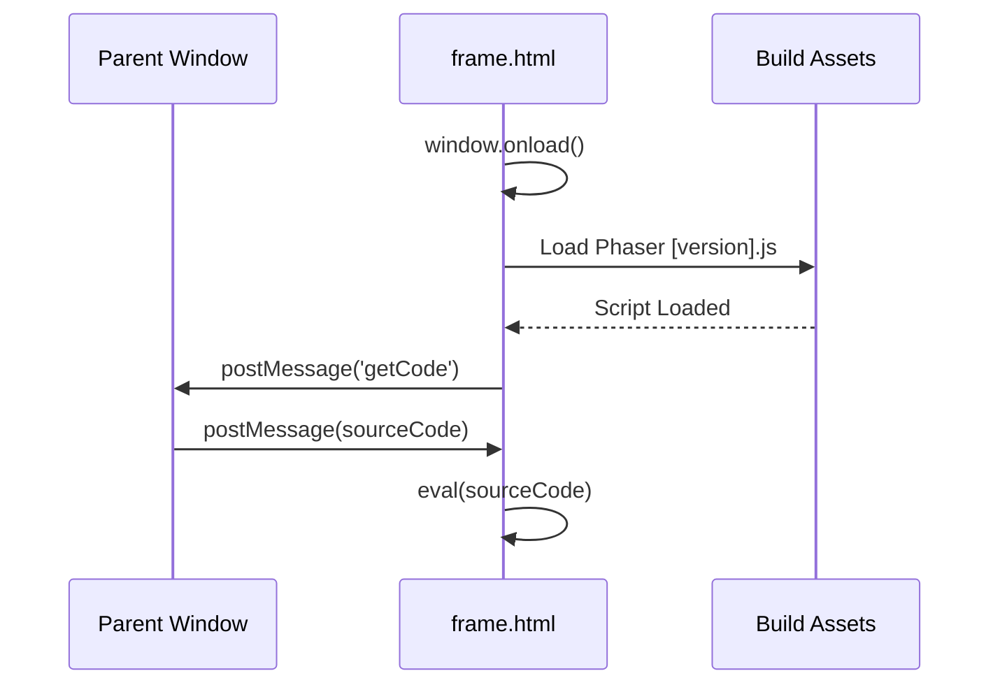

# Root — frame.html

# Root — `frame.html` Documentation

## Overview

The `frame.html` module acts as the isolated execution environment (the "sandbox") for Phaser code within the application. It is designed to run inside an `<iframe>`, providing a clean slate for user-generated scripts while maintaining a communication bridge with the parent window (the editor/UI).

Its primary responsibilities are:
1.  **Dynamic Phaser Loading**: Loading a specific version of the Phaser framework based on query parameters.
2.  **Code Injection**: Receiving and executing JavaScript code from the parent window.
3.  **Lifecycle Management**: Responding to health checks (`ping`) and reset commands (`reload`).

---

## Bootstrapping Process

When the iframe is loaded, it performs a sequenced handshake with the parent window to ensure the environment is ready before code execution begins.

1.  **Initialization**: Sets a local `_isAlive` flag to `true`.
2.  **Version Selection**: Uses `getQueryString.js` to extract the `v` parameter. If not found, it defaults to the latest version defined in `versions.js`.
3.  **Script Injection**: Dynamically creates a `<script>` tag pointing to `./build/[version].js`.
4.  **Ready Signal**: Once the Phaser engine script has finished loading (`phaserScript.onload`), it sends a `getCode` message to `window.top`.

---

## Communication Protocol

The module listens for messages via the `window.onmessage` API. It acts as a slave to the parent window, responding to the following commands:

### 1. Health Check (`ping`)
*   **Input**: The string `'ping'`.
*   **Output**: Returns the boolean `_isAlive` to the sender.
*   **Purpose**: Allows the parent window to verify that the iframe has initialized and the script is responsive.

### 2. State Reset (`reload`)
*   **Input**: The string `'reload'`.
*   **Action**: Clears the console and triggers `window.location.reload()`.
*   **Detail**: It explicitly overrides `window.onbeforeunload` to an empty function to prevent "Confirm Navigation" dialogs from blocking the reload.

### 3. Code Execution
The module supports two modes of execution based on the content of the data received:

| Logic | Execution Method | Description |
| :--- | :--- | :--- |
| **Standard Script** | `eval(event.data)` | Used for traditional Phaser scripts. |
| **ES Module** | `<script type="module">` | Triggered if the code starts with the comment `// #module`. This creates a new script tag and appends it to the body. |

---

## Key Components & Dependencies

### Internal Elements
-   **`

`**: The default mount point for Phaser Game instances. Most sandbox examples are configured to look for this specific ID.
-   **`_isAlive`**: A internal boolean flag used to track if the window context is active.

### External Script Dependencies
These scripts must be present in the `./js/` directory relative to the frame:
-   `versions.js`: Provides the list of available Phaser versions.
-   `getQueryString.js`: Utility to parse URL parameters.
-   `datgui.js`: Included by default to allow users to quickly add UI controls to their sandbox examples.

---

## Error Handling

The code execution (both `eval` and module injection) is wrapped in a `try...catch` block. If the user's code contains syntax errors or runtime exceptions:
1.  The error is caught.
2.  A `console.warn(e)` is issued within the iframe context.
3.  Because the sandbox clears the console on `reload`, it ensures a clean log for every new execution attempt.