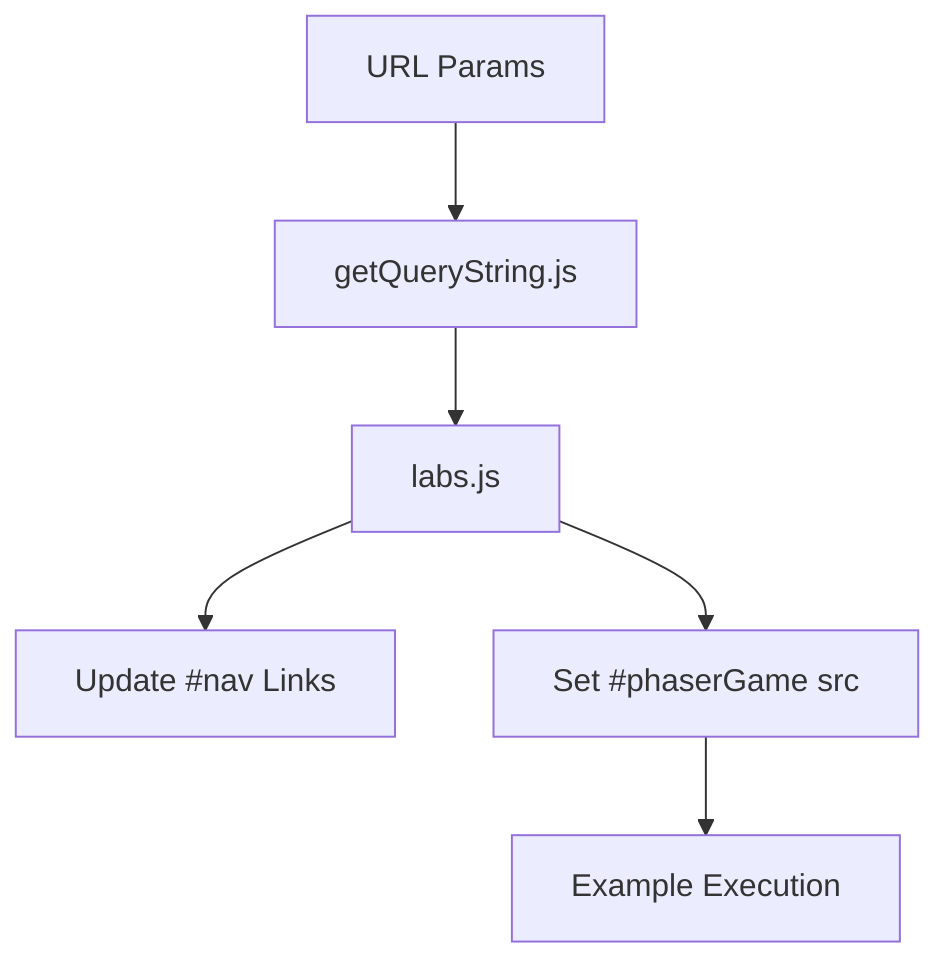

# Root — iframe.html

# Root — iframe.html

The `iframe.html` file serves as the primary host container for rendering Phaser 3 examples within an isolated environment. It provides a standardized wrapper that manages the lifecycle of the example, navigation controls, and integration with the Phaser Labs ecosystem.

## Purpose

The main objective of `iframe.html` is **isolation**. By loading specific Phaser examples into an internal `<iframe>`, the system ensures that:
1.  Example code doesn't pollute the global scope of the main labs interface.
2.  CSS and styling from the example do not leak into the UI controls.
3.  The example can be easily reloaded or pointed to different source files via URL parameters.

## Component Overview

### 1. The Sandbox (`#phaserGame`)
The core of the document is the `<iframe>` element with the ID `phaserGame`. 
- **Default Constraints**: It is styled with a default resolution of `1024x768` and a red border for visibility.
- **Dynamic Content**: This iframe’s `src` is typically manipulated by `labs.js` based on the query string parameters extracted at runtime.

### 2. Navigation Interface (`#nav`)
A fixed navigation bar at the bottom (or top depending on CSS) provides developer-centric tools for interacting with the currently loaded example:
- **Backlink**: Navigates back to the example browser.
- **Editlink**: Likely triggers an IDE view (like Monaco or a simple text area).
- **Viewlink**: Toggles display modes (e.g., swapping between `div` layouts).
- **CSSlink**: Toggles scaling (labeled "100%" in the source).
- **Sourcelink**: Direct access to the raw source code of the example.

## Dependencies and Execution Flow

The document loads several utility scripts that orchestrate the environment:

| Script | Responsibility |
| :--- | :--- |
| `versions.js` | Manages Phaser version selection metadata. |
| `getQueryString.js` | Parses the URL to determine which example file to load. |
| `jquery-3.1.1.min.js` | Used for DOM manipulation and event handling within the lab UI. |
| `datgui.js` | Provides the optional debug UI often seen in Phaser examples. |
| `TweenMax.min.js` | GSAP library used for UI transitions. |
| `labs.js` | **Main Controller**. This is the logic layer that connects the UI links to the `phaserGame` iframe state. |

### Architecture Diagram

The flow of data from the URL to the rendered frame is handled as follows:



## Styling and Layout

The module relies on `css/labs.css` for general layout. However, it includes an internal style block specifically for the iframe:

```css
#phaserGame {
    width: 1024px;
    height: 768px;
    border: 1px solid red;
}
```

This ensures that even if the external stylesheet fails to load, the game container maintains a predictable aspect ratio for the Phaser canvas to initialize within.

## Integration Note for Contributors

When modifying the lab UI:
- **Navigation Updates**: If adding a new control button, ensure it is placed within the `#nav` div and hooked in `js/labs.js`.
- **Iframe Manipulation**: Avoid direct manipulation of the `<iframe>` contents from this parent page to prevent Cross-Origin Resource Sharing (CORS) issues; instead, communicate via URL parameters or postMessage if the example is hosted on a different subdomain.