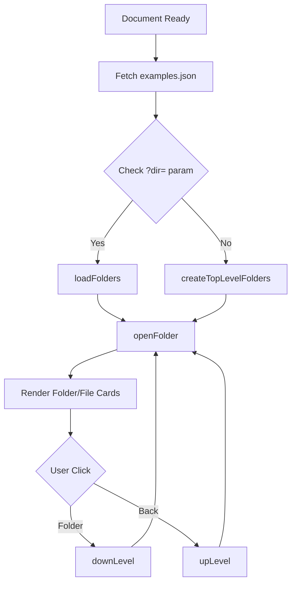

# Root — index.html

# Root — index.html

The `index.html` module serves as the primary entry point and "Explorer" interface for the Phaser 3 Examples collection. It provides a visual, folder-based navigation system, breadcrumbs, and integrated search to help developers browse thousands of code examples.

## Purpose

The module acts as a client-side directory browser. It consumes a manifest of the available examples (`examples.json`) and dynamically renders a grid of folders and files. It enables deep-linking to specific directories via URL parameters and manages state transitions between directory levels without full page reloads.

## Core Navigation Logic

The application uses several global state variables to track the user's position within the example hierarchy:

*   `data`: The full JSON object containing the entire directory tree.
*   `folder`: Points to the current directory's children array.
*   `trail`: A stack (array) of previous `folder` objects, used for navigating back "Up".
*   `well`: An array of strings representing the path components (e.g., `['actions', 'inc-x']`).

### Navigation Flow



## Key Components & Functions

### Directory Traversal
- **`downLevel(index, filename)`**: Moves deeper into the tree. It pushes the current `folder` to the `trail` and the current name to the `well`, then updates the UI.
- **`upLevel()`**: Pops from the `trail` and `well` to return to the parent directory.
- **`loadFolders(param)`**: Parses a URL directory string (e.g., `?dir=actions/inc-x/`) and programmatically triggers `downLevel` calls to recreate the state on page load.

### UI Rendering
The UI is built using Bootstrap "cards" generated via jQuery:
- **`createFolder(index, filename, filepath)`**: Creates a card with a folder icon. Clicking it triggers `downLevel`.
- **`createFile(index, filename, filepath)`**: Creates a card for an individual example. 
    - The image source is dynamically calculated by replacing `src/` with `screenshots/` and `.js` with `.png`.
    - Main link goes to `view.html`.
    - Text link goes to `edit.html`.
- **`createBootFile()`**: Handles special directories containing a `boot.json`, redirecting the user to `boot.html`.
- **`createBackFolder()`**: Generates the "Back" UI element present in any sub-directory.

### State Persistence
- **`getURLWell()`**: Generates a query string based on the current `well` and search query.
- **`history.pushState()`**: Called within `openFolder()` to update the browser's address bar so that the current view is bookmarkable.

## Integration Points

- **`examples.json`**: The source of truth for the directory structure.
- **`js/phaserSearch.js`**: Provides the global `PHASER.search.initialize()` logic and handles filtering examples.
- **`view.html` / `edit.html` / `100.html`**: The destination pages when a user clicks on an example file.
- **`screenshots/`**: The directory where the module expects to find PNG thumbnails corresponding to every `.js` example.

## Developer Notes

### Special Implementation Details
- **Scale Manager Exception**: Any file inside the `scalemanager/` directory is routed to `100.html` instead of the standard `view.html`.
- **Underscore Filtering**: Files or folders starting with an underscore (`_`) or named `archived` are hidden from the UI.
- **Image Preloading**: `createFile` implements a simple CSS-based hover/loading effect by layering a "loading" image behind the actual screenshot.

### Search Template
The module uses a basic Micro-templating pattern for search results:
```html
<script type="text/template" id="result-row-template">
    <!-- Renders individual search result rows -->
</script>
```
The logic for populating this template resides in `js/phaserSearch.js`.