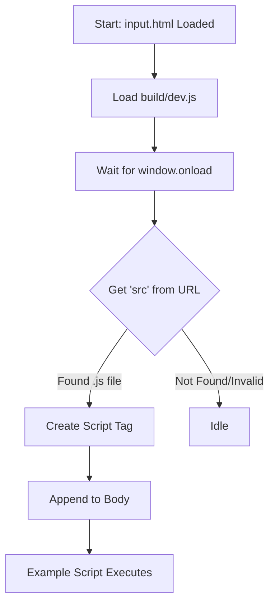

# Root — input.html

# Module Documentation: input.html

## Overview

`input.html` serves as a dynamic **development runner** and test harness for Phaser 3 examples and development scripts. Instead of having a unique HTML file for every test case, this module provides a generic shell that loads specific JavaScript game files via URL parameters.

## Purpose

The primary goal of this module is to provide a consistent environment for executing Phaser 3 code. It includes the necessary library dependencies and a predefined DOM container, then dynamically injects the target logic based on the browser's query string.

## Key Components

### 1. The Game Container
The module defines a specific `div` used as the mount point for Phaser games:
```html
<div id="phaser-example"></div>
```
Most scripts loaded by this runner expect this ID to exist to attach the Canvas/WebGL element.

### 2. External Dependencies
The environment is initialized with two critical resources:
*   **`getQueryString.js`**: A utility script providing the `getQueryString()` helper function.
*   **`build/dev.js`**: The main Phaser 3 library build used for development.

### 3. Execution Logic (Dynamic Script Injection)
The entry point logic is contained within the `window.onload` event. It follows this execution flow:

1.  **Parameter Extraction**: It retrieves the value of the `src` parameter from the URL.
2.  **Validation**: It checks if the filename ends with the `.js` extension.
3.  **Injection**: It creates a new `<script>` element, sets its source to the extracted filename, and appends it to the document body.

```javascript
window.onload = function ()
{
    var filename = getQueryString('src');

    if (filename.substr(-3) === '.js')
    {
        var s = document.createElement('script');
        s.type = 'text/javascript';
        s.src = filename;
        document.body.appendChild(s);
    }
};
```

## Execution Flow



## Usage for Developers

To use this runner to view an example (e.g., `examples/bounce.js`), navigate to the file in your browser using the `src` parameter:

`http://localhost:8080/input.html?src=examples/bounce.js`

### Styling Note
The body is styled with a default `64px` margin. This is often used to ensure the game canvas is not flush against the browser edges during layout testing.

### Adding New Tests
When writing a new script to be loaded by `input.html`, ensure your `Phaser.Game` configuration targets the expected container:
```javascript
const config = {
    parent: 'phaser-example',
    // ... rest of config
};
```