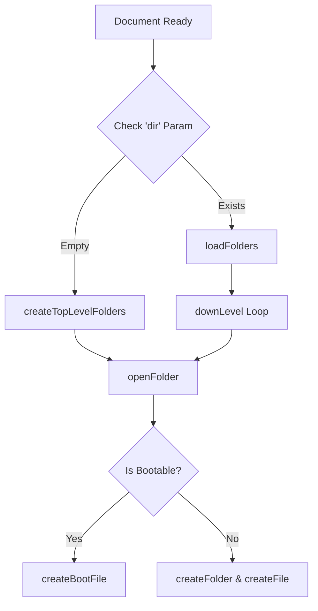

# Root — list.html

# Phaser 3 Examples Explorer (`list.html`)

The `list.html` module serves as the primary entry point and file browser for the Phaser 3 examples repository. It provides a web-based interface for navigating a hierarchical structure of code examples, rendering directories as cards and individual script files as interactive thumbnails.

## Core Functionality

The module operates as a single-page application (SPA) that manages state via URL query parameters and a JSON manifest.

1.  **Data Loading**: On initialization, it fetches `examples.json`, which contains the full recursive tree structure of the `src` directory.
2.  **Navigation**: Users can drill down into folders or navigate back up. The state is maintained through two primary stacks:
    *   `trail`: Stores the previous directory arrays to allow "up" navigation.
    *   `well`: Stores the names of the folder path to generate URLs and breadcrumbs.
3.  **Dynamic Rendering**: Based on the current folder's content, the UI generates folder cards, file thumbnails, or a "Play Game" launcher if a `boot.json` is detected.

## State Management & Navigation Flow

The application uses the `dir` query string (e.g., `list.html?dir=animation/sprite-sheets/`) to determine the starting directory.



### Navigation Methods

- **`downLevel(index, filename, skipOpen)`**: Transitions deeper into the hierarchy. It pushes the current folder onto the `trail` and the name onto the `well`.
- **`upLevel()`**: Pops the last state from the `trail` and `well`. If at the root, it resets to top-level folders.
- **`openFolder()`**: The primary rendering loop. It clears the `#folderList`, adds a "Back" button if applicable, then iterates through the current `folder` array to render children.

## UI Components

### Folders and Files
- **`createFolder(...)`**: Renders a card for subdirectories. Clicking a folder executes a URL change to `list.html?dir=...`.
- **`createFile(...)`**: Renders a thumbnail for `.js` files. These link to `100.html?src=...`, which is the actual example runner.
- **`createBootFile(...)`**: A special handler for directories containing a `boot.json`. This signals a multi-file example or a "game" template and links to `boot.html`.

### Asset Mapping
The module uses a convention-based mapping to find screenshots for the code examples:
```javascript
const imgPath = filepath
  .replace(/^src/, 'screenshots')
  .replace(/\.json$/, '.png')
  .replace(/\.js$/, '.png');
```
This assumes that for every example in `src/path/to/example.js`, a corresponding thumbnail exists at `screenshots/path/to/example.png`.

## Integration Points

- **`examples.json`**: The source of truth for the file tree. This file must be pre-generated (usually by a side-car script) for the explorer to work.
- **`getQueryString.js`**: A utility used to parse the `dir` parameter from the URL.
- **`100.html`**: The destination for single-script examples.
- **`boot.html`**: The destination for complex/bootable examples.
- **History API**: The module uses `history.pushState` within `openFolder` to ensure that clicking "Back" in the browser works intuitively, despite the page not performing a full reload when navigating folders.

## Developer Notes
- **Internal Filtering**: Any file or folder starting with an underscore (`_`) or named `archived` is ignored by the rendering logic in `createFile` and `createFolder`.
- **Breadcrumbs**: The `#breadcrumb` element is updated dynamically as the user moves through the tree, using the `addBreadcrumb` and `removeBreadcrumb` helpers.